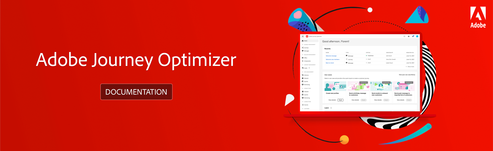

# Adobe Journey Optimizer Documentation {#cjm-documentation}

 

## Get started

* [What is Journey Optimizer?](using/get-started.md)   Discover key features and how to get started

* [Design an email content](using/design-emails.md)  Design a new email or import an existing HTML content

* [Send messages](using/building-journeys/journeys-message.md)   Learn how to add push and email messages in your customer journeys

* [Create your first journey](using/building-journeys/journeys-uc.md)  Learn how to build and execute a journey

* [Configure [!DNL Journey Optimizer]](using/configuration/get-started-configuration.md)  Learn key steps to configure Journey Optimizer

* [Grant access to [!DNL Journey Optimizer]](using/administration/permissions-overview.md)   Learn how to define and manage the permissions assigned to [!DNL Journey Optimizer] users

* [Decision management](using/offers/get-started/starting-offer-decisioning.md)   Create offers and deliver the best offer and experience to your customers

## Additional Resources

* [Adobe Experience Platform Guide](https://experienceleague.adobe.com/docs/experience-platform/landing/home.html)
* [Adobe Experience Platform access overview](https://experienceleague.adobe.com/docs/experience-platform/access-control/home.html)
* [Adobe Experience Platform developers resources](https://www.adobe.com/experience-platform/documentation-and-developer-resources.html)
