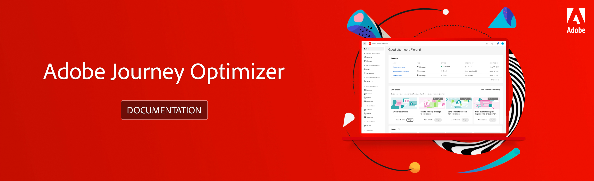

# Adobe [!DNL Journey Optimizer] Documentation {#cjm-documentation}

 

<table style="table-layout:fixed">
<tr>
  <td>
    
<strong>Get started</strong>
    

    

    <em></em>
    

    

      <a href="using/get-started.md">What is [!DNL Journey Optimizer]?</a>
    

    
Discover key features and how to get started
    

    

      <a href="using/release-notes.md">Release notes</a>
    

    
Discover new capabilities, latest improvements and fixes
    

    

      <a href="using/design-emails.md">Design an email content</a>
    

    

    Design a new email or import an existing HTML content
    

    

      <a href="using/building-journeys/journeys-message.md">Send messages</a>
    

    
Learn how to add push and email messages in your customer journeys
    

    

    <a href="using/building-journeys/journeys-uc.md">Create your first journey</a>
    

    
Learn how to build and execute a journey
    

    

    <a href="using/configuration/get-started-configuration.md">Configure [!DNL Journey Optimizer]</a>
    

    
Learn key steps to configure [!DNL Journey Optimizer]
    

    

    <a href="using/administration/permissions-overview.md">Grant access to [!DNL Journey Optimizer]</a>
    

    
Learn how to define and manage the permissions assigned to [!DNL Journey Optimizer] users
    

    

    <a href="using/offers/get-started/starting-offer-decisioning.md">Decision management</a>
    

    
Create offers and deliver the best offer and experience to your customers
    

    

    
<strong>Additional resources</strong>
    

    

    

    

    <li>
      <a href="https://helpx.adobe.com/legal/product-descriptions/adobe-journey-optimizer.html" target="_blank">Adobe Journey Optimizer product description</a>
    </li>
    

    

    <li>
      <a href="https://experienceleague.adobe.com/docs/experience-platform/landing/home.html" target="_blank">Adobe Experience Platform documentation</a>
    </li>
    

      

      <li>
      <a href="https://experienceleague.adobe.com/docs/experience-platform/access-control/home.html" target="_blank">Adobe Experience Platform access overview</a>
    </li>
    

      

      <li>
      <a href="https://www.adobe.com/experience-platform/documentation-and-developer-resources.html" target="_blank">Adobe Experience Platform developers resources</a>
    </li>
    

  </td>
   <td>
   
<strong>Direct links to key resources</strong>
    

    

    <em></em>
    

    
JOURNEY MANAGEMENT

    <li>
      <a href="using/building-journeys/journey-gs.md">Journeys</a>
    </li>
    <li>
      <a href="using/create-message.md">Messages</a>
    </li>
    

    
DECISION MANAGEMENT

    <li>
      <a href="using/offers/get-started/starting-offer-decisioning.md">Offers</a>
    </li>
     <li>
      <a href="using/offers/offer-library/key-steps.md">Components</a>
    </li>
    

    
CONTENT MANAGEMENT

    <li>
      <a href="using/assets-essentials.md">Assets</a>
    </li>
    

    
DATA MANAGEMENT

    <li>
      <a href="using/get-started-schemas.md">Schemas</a>
    </li>
     <li>
      <a href="using/get-started-datasets.md">Datasets</a>
    </li>
        <li>
      <a href="using/get-started-queries.md">Queries</a>
    </li>
     <li>
      <a href="https://experienceleague.adobe.com/docs/experience-platform/ingestion/quality/monitor-data-ingestion.html" target="_blank">Monitoring</a>
    </li>
    

    
CONNECTIONS

    <li>
      <a href="using/get-started-sources.md">Sources</a>
    </li>
    

    
CUSTOMER

    <li>
      <a href="using/segment/about-segments.md">Segments</a>
    </li>
     <li>
      <a href="using/get-started-profiles.md">Profiles</a>
    </li>
    <li>
      <a href="using/get-started-identity.md">Identity</a>
    </li>
    

    
ADMINISTRATION

    <li>
      <a href="using/configuration/about-data-sources-events-actions.md">Configurations</a>
    </li>
    <li>
      <a href="using/configuration/get-started-configuration.md">Channels</a>
    </li>
     <li>
      <a href="using/administration/sandboxes.md">Sandboxes</a>
    </li>
  </td>
</tr>
</table>
