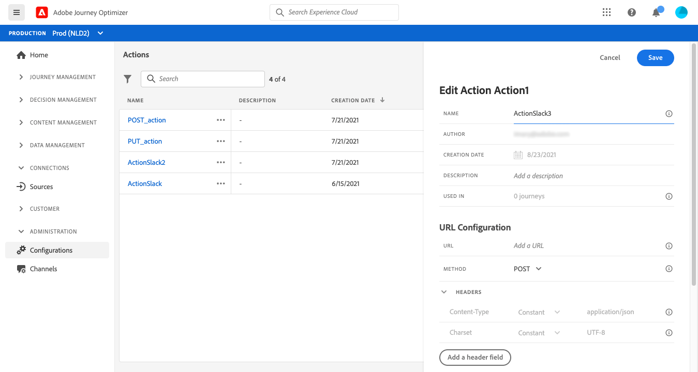
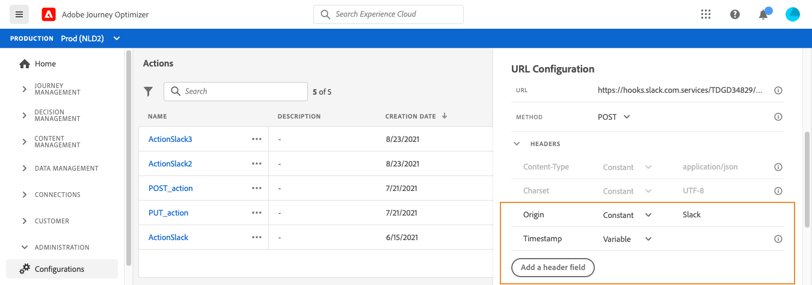
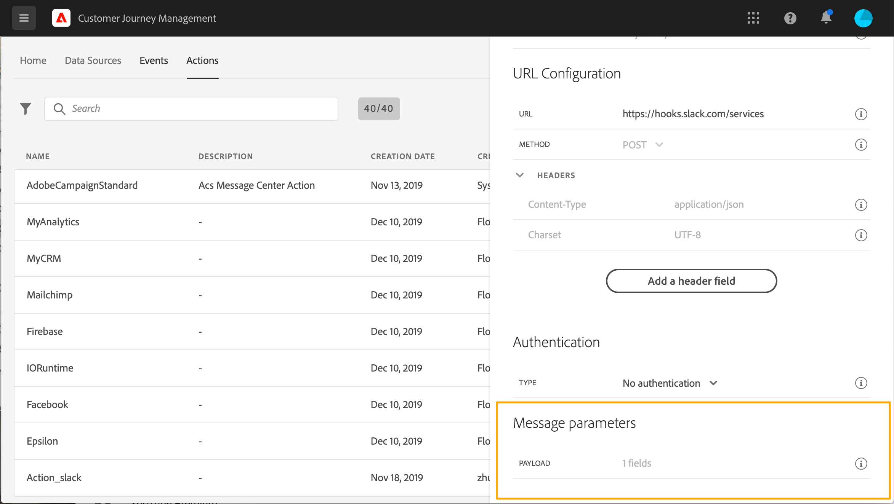
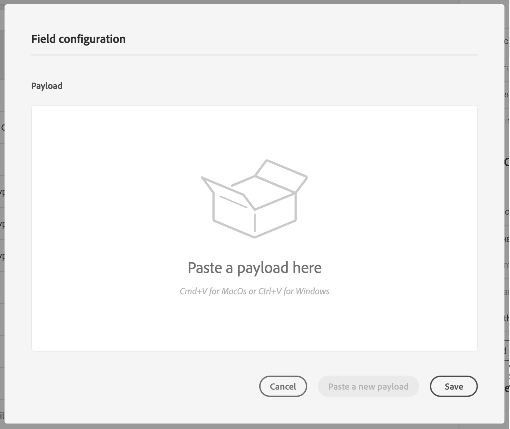
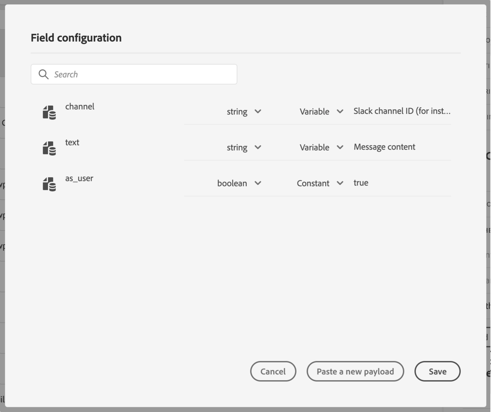
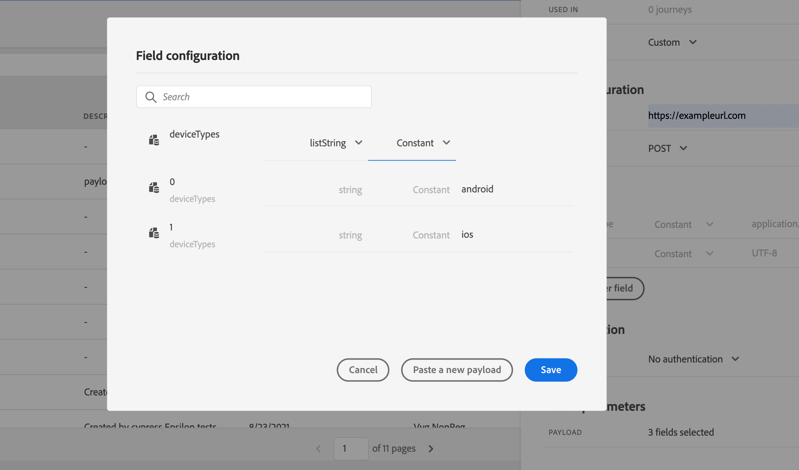
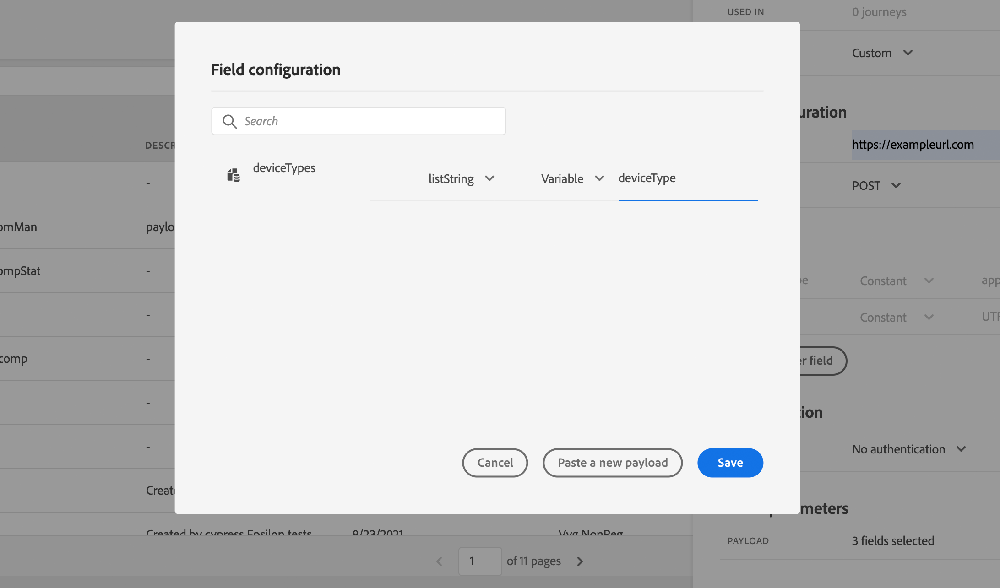

# Configure an action {#configure-an-action}

If you're using a third-party system to send messages or if you want journeys to send API calls to a third-party system, this is where you configure its connection to journeys. The custom action defined by technical users will then be available in the left palette of your journey, in the **[!UICONTROL Action]** category (see [this page](../building-journeys/about-journey-activities.md#action-activities). Here are a few examples of systems that you can connect to with custom actions: Epsilon, Facebook, Adobe.io, Firebase, etc.
Limitations are listed in [this page](../building-journeys/limitations.md).

Here are the main steps required to configure a custom action:

1. In the ADMINISTRATION menu section, select **[!UICONTROL Configurations]**. In the  **[!UICONTROL Actions]** section, click **[!UICONTROL Manage]**. Click **[!UICONTROL Create Action]** to create a new action. The action configuration pane opens on the right side of the screen.

    

    <!-- Mettre à jour les captures de cette page avec le champ Path quand disponible -->

1. Enter a name for your action.

    >[!NOTE]
    >
    >Do not use spaces or special characters. Do not use more than 30 characters.

1. Add a description to your action. This step is optional.
1. The number of journeys that use this action is displayed in the **[!UICONTROL Used in]** field. You can click the **[!UICONTROL View journeys]** button to display the list of  journeys using this action.
1. Define the different **[!UICONTROL URL Configuration]** parameters. See [this page](../action/about-custom-action-configuration.md#url-configuration).
1. Configure the **[!UICONTROL Authentication]** section. This configuration is the same as for data sources.  See [this section](../datasource/external-data-sources.md#section_wjp_nl5_nhb).
1. Define the **[!UICONTROL Action parameters]**. See [this page](../action/about-custom-action-configuration.md#define-the-message-parameters).
1. Click **[!UICONTROL Save]**.

    The custom action is now configured and ready to be used in your journeys. See [this page](../building-journeys/about-journey-activities.md#action-activities).

    >[!NOTE]
    >
    >When a custom action is used in a journey, most parameters are read-only. You can only modify the **[!UICONTROL Name]**, **[!UICONTROL Description]**, **[!UICONTROL URL]** fields and the **[!UICONTROL Authentication]** section.

## URL configuration {#url-configuration}

When configuring a custom action, you need to define the following **[!UICONTROL URL Configuration]** parameters:


1. Specify the URL of the external service.

    If the URL is static, enter the URL in the **[!UICONTROL URL]** field.

    >[!NOTE]
    >
    >For security reasons, we strongly recommend that you use the HTTPS scheme for the URL. We don't allow the use of Adobe addresses that are not public and the use of IP addresses.

    If the URL includes a dynamic path, specify this information:

    1. In the **[!UICONTROL URL]** field, enter the static part of the URL, that is, the scheme, the host, and the port.

        Example: `https://xxx.yyy.com:8080`

    1. In the **[!UICONTROL Path]** section, turn on the toggle and click the pencil icon.

    1. In the pop-up window, specify the dynamic path, then click **[!UICONTROL OK]**.

        To concatenate fields and plain text strings, use the Plus sign (+). Enclose plain text strings in single quotation marks (').

        Example of dynamic path configuration: `The campaign_id of fieldgroup14 + '/messages'`

        Example of concatenated URL: `https://xxx.yyy.com:8080/`\<campaign ID\>`/messages`

    <!-- Ajouter une capture quand le champ Path sera disponible. Exemple ici : https://xd.adobe.com/view/fc70786f-d965-451d-9e77-5e17e2dd8384-a923/screen/2f32e6ae-3c22-4093-82be-158d0b3c52d8/ -->

1. Select the call **[!UICONTROL Method]**: it can be either **[!UICONTROL POST]** or **[!UICONTROL PUT]**.
1. In the **[!UICONTROL Headers]** section, define the HTTP headers of the request message to be sent to the external service:
   1. To add a header field, click **[!UICONTROL Add a header field]**.
   1. Enter the key of the header field.
   1. To set a dynamic value for the key-value pair, select **[!UICONTROL Variable]**. Otherwise, select **[!UICONTROL Constant]**.

        For example, for a timestamp, you can set a dynamic value.

   1. If you have selected **[!UICONTROL Constant]**, then enter the constant value.

       If you have selected **[!UICONTROL Variable]**, then you will specify this variable when adding the custom action to a journey. [Learn more](../building-journeys/using-custom-actions.md).

       

   1. To delete a header field, point to the header field and click the **[!UICONTROL Delete]** icon.

    The **[!UICONTROL Content-Type]** and **[!UICONTROL Charset]** header fields are set by default. You cannot modify or delete these fields.

    After you have added the custom action to a journey, you can still add header fields to it if the journey is in draft status. If you do not want the journey to be affected by configuration changes, duplicate the custom action and add the header fields to the new custom action.

    >[!NOTE]
    >
    >Headers are validated according to field parsing rules. [Learn more](https://tools.ietf.org/html/rfc7230#section-3.2.4).

## Define the action parameters {#define-the-message-parameters}



In the **[!UICONTROL Action parameters]** section, paste an example of the JSON payload to send to the external service.



>[!NOTE]
>
>Field names in the payload cannot contain a "." character. They cannot start with a "$" character.

You will be able to define the parameter type (e.g.: string, integer, etc.).

You will also have a choice between specifying if a parameter is a constant or a variable:

* Constant means that the value of the parameter is defined in the action configuration pane by a technical persona. The value will be always the same across journeys. It will not vary and the marketer won’t see it when using the custom action in the journey. It could be for example an ID the third-party system expects. In that case, the field on the right of the toggle constant/variable is the value passed.
* Variable means the value of the parameter will vary. The marketer using this custom action in a journey will be free to pass the value he wants or to specify where to retrieve the value for this parameter (e.g. from the event, from the Adobe Experience  Platform, etc.). In that case, the field on the right of the toggle constant/variable is the label the marketer will see in the journey to name this parameter.



You can pass a collection in custom action parameters. For the moment only simple collections are supported. More complex collection fields (arrays of objects) are not supported. 

To pass a collection field, paste an example of the JSON payload containing the collection. Here is an example of a payload:

```
{
    "deviceTypes": [
        "android",
        "ios"
    ]
}
```

1. Paste the JSON example in the **[!UICONTROL Action parameters]** section of the custom action.



2. Set the field type. The following field types are supported for collections: string, integer, decimal, boolean, dateTime, dateTimeOnly, dateOnly, listString, listInteger, listDecimal, listBoolean, listDateTime, listDateTimeOnly, listDateOnly, listObject

3. Define the collection field as a variable 

4. Define the variable label which will be displayed in the journey.



**Related topics**

[Use custom actions](../building-journeys/using-custom-actions.md)
