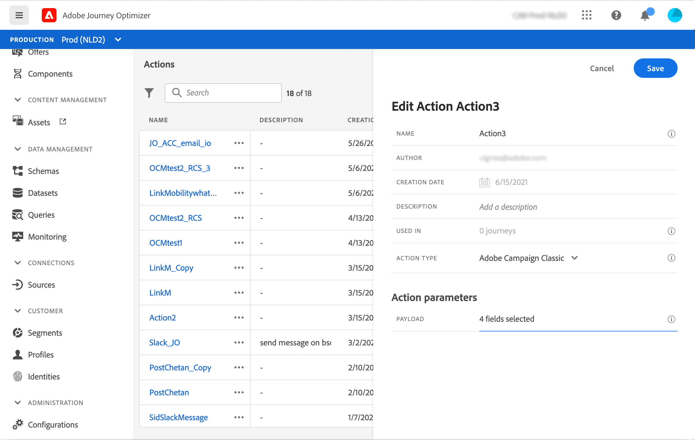

# Integrate with Adobe Campaign v7/v8 {#integrating-with-adobe-campaign-classic}

This integration is available for Adobe Campaign Classic v7 starting 21.1 release, and Adobe Campaign v8. It allows you to send emails, push notifications and SMS using Adobe Campaign Transactional Messaging capabilities.

The connection between the Journey Optimizer and Campaign instances is setup by Adobe at provisioning time.

An end-to-end use case is presented in this [section](../building-journeys/campaign-classic-use-case.md).

For each action configured, an action activity is available in the journey designer palette. Refer to this [section](../building-journeys/using-adobe-campaign-classic.md).

## Important notes

* You need to configure one action on the canvas per template you wish to use. You need to configure one action in Journey Optimizer for each template you wish to use from Adobe Campaign.

* We recommend that you use a dedicated Message Center instance that is hosted for this integration to avoid impacting any other Campaign operations that you may have going on. The marketing server can be hosted or on-premise. The build required is 21.1 Release Candidate or greater. 

* There is no validation that the payload or Campaign message is correct.

* You cannot use a Campaign action with a segment qualification event.

## Prerequisites

In Campaign, you need to create and publish a transactional message and its associated event. Refer to the [Adobe Campaign documentation](https://experienceleague.adobe.com/docs/campaign-classic/using/transactional-messaging/introduction/about-transactional-messaging.html#transactional-messaging).

You can build your JSON payload corresponding to each message following the pattern below. You will then paste this payload when configuring the action in Journey Orchestration (see below)

Here is an example:

```
{
    "channel": "email",
    "eventType": "welcome",
    "email": "Email address",
    "ctx": {
        "firstName": "First name"
    }
}
```

* **channel**: the channel defined for your Campaign transactional template
* **eventType**: the internal name of your Campaign event
* **ctx**: variable based on the personalization you have in your message. 

## Configuring the action

In Journey Optimizer, you need to configure one action per transactional message. Follow these steps:

1. Create a new action. Refer to this [section](../action/action.md).
1. Enter a name and description.
1. In the **Action type** field, select **Adobe Campaign Classic**.
1. Click in the **Payload** field and paste an example of the JSON payload corresponding to the Campaign message. Contact Adobe to get this payload.
1. Adjust the different fields to be static or variable depending on if you want to map them on the Journey canvas. Certain fields, such as channel parameters for email address and personalization fields (ctx), you likely want defined as variables for mapping in context of the journey.
1. Click **Save**.




