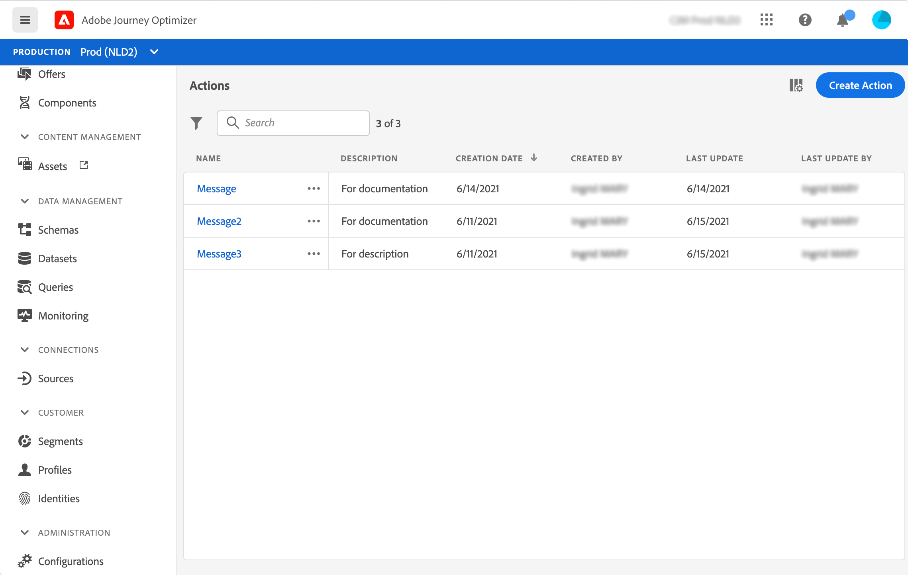

# Set up your actions {#about_actions}

>[!CONTEXTUALHELP]
>id="jo_actions"
>title="About actions"
>abstract="This is where you define the connection to the system that will send messages. The actions defined here will then be available in the left palette of your journey, in the Action category. "

Actions are connections through which you deliver personalized, real-time experiences to customers such as push notifications, email, SMS, or any other means of digital engagement you use in your business.

Customer Journey Manegement comes with built-in message capability. Refer to [this section](../get-started-content.md).

If you're using a third-party system to send messages such as Epsilon, Facebook, Adobe.io, Firebase, etc, you need to add and configure a custom action. Refer to [this page](../action/about-custom-action-configuration.md).

Custom actions enable you to configure connection of a third-party system to send messages or API calls. An action can be configured with any service from any provider that can be called through a REST API with a JSON-formatted payload.

>[!CAUTION]
>
>The configuration of custom actions must be performed by a **technical user**.

The actions are available in the left palette of your journey, in the **[!UICONTROL Action]** category. See [this page](../building-journeys/about-journey-activities.md#action-activities).

In the list of **Actions**, you can press c to create a new journey, action, data source or event. For more information on shortcuts, see [this section](../user-interface.md#cjm-accessibility).

To view the action list or configure a new action, click **[!UICONTROL Admin]** / **[!UICONTROL Actions]** in the left menus. The list of actions is displayed. See [this page](../user-interface.md) for more information on the interface.

