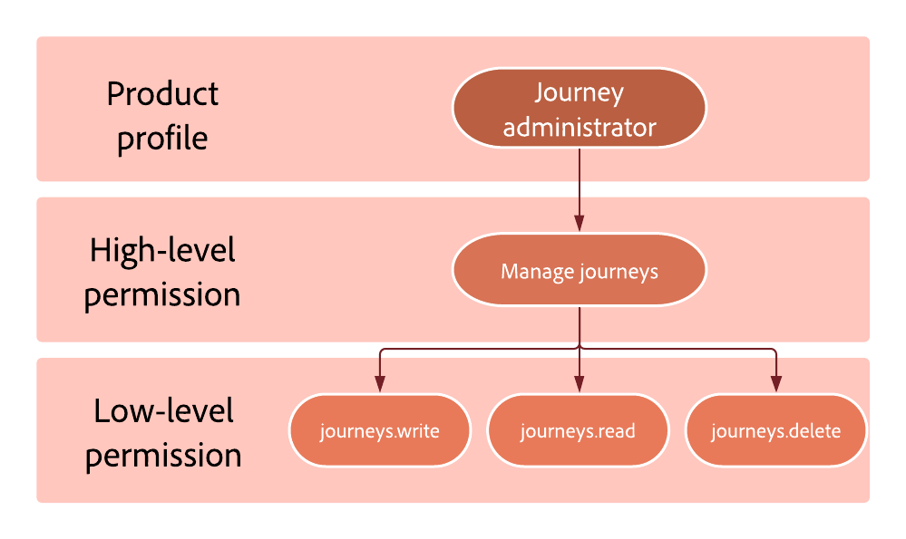

# Permission levels {#high-low-permissions}

Each product profile is composed of permissions allowing users to access the different features. 
They can be divided into two types:

* **High-level permission**: represents the different permissions that can be assigned to **[!UICONTROL Product profile]** in the [!DNL Admin console], such as **[!UICONTROL Publish journeys]** and **[!UICONTROL Manage subdomains delegation]**. High level permissions encompass low level permissions.

* **Low-level permission**: represents the different permissions that come from the high level permission.

For example, the **[!UICONTROL Journey administrator]** product profile is assigned the **[!UICONTROL Manage journeys]** permission. From this permission results the low-level permissions which will allow the Journey administrator to write, read and delete journeys.

## Journey capability {#journey-capability}

### Manage journeys permission {#manage-journeys}

The **[!UICONTROL Manage journeys]** high-level permission allows users to create new and edit/delete existing Journeys, as well as access to the objects that are used in the journey canvas to build the journey flow.

It includes the following low-level permissions: 

* Journey Optimizer specific:

  * journeys.read
  * journeys.write
  * journeys.delete
  * messages.read

* Adobe Experience Platform specific:

  * segments.read
  * profiles.read
  * datasets.read
  * schemas.read

### Publish journeys permission {#publish-journeys}

The **[!UICONTROL Publish journeys]** high-level permission allows users to publish journeys.

It includes the following low-level permissions: 

* Journey Optimizer specific:
  * journeys.publish
  * journeys.read

### View journeys permission {#view-journeys}

The **[!UICONTROL View journeys]** high-level permission allows users to browse and view journeys.

It includes the following low-level permissions: 

* Journey Optimizer specific:
  * journeys.read

* Adobe Experience Platform specific:
  * segments.read
  * profiles.read

### Manage journeys events, data sources and actions permission {#manage-journeys-events}

The **[!UICONTROL Manage journeys events, data sources and actions]** high-level permission allows users to configure event and data configurations.

It includes the following low-level permissions: 

* Journey Optimizer specific:
  * journeys_events.read
  * journeys_events.write
  * journeys_events.delete
  * journeys_data_sources.read
  * journeys_data_sources.write
  * journeys_data_sources.delete 
  * journeys_actions.read
  * journeys_actions.write
  * journeys_actions.delete
* Adobe Experience Platform specific:
  * schemas.read
  * datasets.read
  * identity_namespace.read

### View journeys events, data sources and actions permission {#view-journeys-event}

The **[!UICONTROL View journeys events, data sources and actions]** high-level permission allows users to use event and data in the journey flow.

It includes the following low-level permissions:

* Journey Optimizer specific: 
  * journeys_events.read
  * journeys_data_sources.read
  * journeys_actions.read

* Adobe Experience Platform specific:
  *  schemas.read
  * datasets.read
  * identity_namespace.read

### View journeys report permission {#view-journeys-report}

The **[!UICONTROL View journeys report]** high-level permission allows users to read-only journey report.

It includes the following low-level permissions: 

* Journey Optimizer specific: 
  * journeys_report.read
  * messages_report.read

* Adobe Experience Platform specific:
  * datasets.read
  * queries.read
  * queries.write
  * queries.delete

## Message capability {#message-capability}

### Manage messages permission {#manage-messages}

The **[!UICONTROL Manage messages]** high-level permission allows users to create and edit/delete message.

It includes the following low-level permissions:

* Journey Optimizer specific: 
  *  messages.write
  * messages.read
  * messages.delete
  * messages_presets.read

* Adobe Experience Platform specific:
  * segments.read
  * schemas.read 

### Manage messages preview and test permission {#mange-messages-preview}

The **[!UICONTROL Manage messages preview and test]** high-level permission allows users to preview personalized message.

It includes the following low-level permissions: 

* Journey Optimizer specific: 
  * messages.publish
  * messages_preview_and_test.write
  * messages.publish

* Adobe Experience Platform specific:
  * profiles.read
  * profiles.write
  * schemas.read
  * datasets.write
  * datasets.read
  * identity_namespace.read
  * segments.read
  * queries.write
  * merge_policies.read

### Publish messages permission {#publish-messages}

The **[!UICONTROL Publish messages]** high-level permission allows users to publish messages.

It includes the following low-level permissions:

* Journey Optimizer specific: 
  * messages.publish

* Adobe Experience Platform specific:
  * profiles.read
  * schemas.read
  * datasets.read

### View messages permission {#view-messages}

The **[!UICONTROL View messages]** high-level permission allows users to read messages only.

It includes the following low-level permissions:

* Journey Optimizer specific: 
  * messages.read
  * messages_presets.read

* Adobe Experience Platform specific:
  * schemas.read 
  * segments.read

### View messages report permission {#view-message-reports}

The **[!UICONTROL View messages report]** high-level permission allows users to to read-only email and push report.

It includes the following low-level permissions:

* Journey Optimizer specific:
  * messages_report.read
  * datasets.read
  * queries.read
  * queries.write
  * queries.delete
  * journey.read

## Decision management capability {#decisions-permissions}

### Manage decisions permission {#manage-decisioning}

The **[!UICONTROL Manage decisions]** high-level permission allows users to create new and edit/delete existing **[!UICONTROL Activity entities]**, as well as manage the objects that are used in those activities to make the decisions.

It includes the following low-level permissions: 

* Decision management specific:
  * activities.read
  * activities.write
  * activities.delete
  * offers.read
  * offers.write
  * offers.delete
  * placements.read
  * placements.write
  * placements.delete
  * ranking_strategy.read

* Adobe Experience Platform specific:
  * datasets.read
  * datasets.write
  * datasets.delete
  * schemas.read
  * profile.read
  * segments.read

### View decisions permission {#view-decisions}

The **[!UICONTROL View decisions]** high-level permission allows users to use an existing Activity and related business objects to make the decisions. 

It includes the following low-level permissions: 

* Decision management specific: 
  * activities.read
  * offers.read
  * placements.read
  * ranking_strategy.read

* Adobe Experience Platform specific:
  * schemas.read
  * segment.read
  * datasets.read
  * datasets.write
  * datasets.delete

### Publish offers decisioning permission {#publish-offers}

The **[!UICONTROL Publish offers decisioning]** high-level permission allows users to access to approve/un-approve Offer activities.

It includes the following low-level permissions: 

* Decision management specific:
  * offers_activity.read
  * offers.read
  * offers.write
  * offers.delete
  * placements.read
  * placements.write
  * placements.delete
  * ranking_strategy.read

* Adobe Experience Platform specific:
  * schemas.read
  * segment.read 
  * datasets.read
  * profiles.read

### Manage ranking strategies permission {#publish-offers}

The **[!UICONTROL Manage ranking strategies]** high-level permission allows users to read, create, edit, and delete custom messages report and use action features.

It includes the following low-level permissions: 

* Decision management specific:
  * ranking_strategy.read
  * ranking_strategy.write
  * ranking_strategy.delete
  * activities.read
  * offers.read
  * placements.read

## Administration capability {#administration-permissions}

### Manage subdomains delegation permission {#manage-subdomain}

The **[!UICONTROL Manage subdomains delegation]** high-level permission allows users to create, edit and delete subdomain delegation (including IP pool).

It includes the following low-level permissions: 

* subdomains_delegation.read
* subdomains_delegation.write
* subdomains_delegation.delete

### View PTR records permission {#view-ptr}

The **[!UICONTROL View PTR records]** high-level permission allows users to view PTR records that have been configured based on subdomain and includes the following low-level permissions:

* PTR_records.read
* subdomains_delegation.read

### Manage IP pools permission {#manage-ip-pools}

The **[!UICONTROL Manage IP pools]** high-level permission allows users to create, edit and delete affinity definition.

It includes the following low-level permissions: 

* IP_pools.read
* IP_pools.write
* IP_pools.delete

### Manage messages general settings permission {#manage-message-settings}

The **[!UICONTROL Manage messages general settings]** high-level permission allows users to create, edit and delete global settings at sandbox level.

It includes the following low-level permissions: 

* Journey Optimizer specific: 
  * messages_general_settings.read
  * messages_general_settings.write
  * messages_general_settings.delete

* Adobe Experience Platform specific:
  * schemas.read

### View messages general settings permission {#view-message-settings}

The **[!UICONTROL View messages general settings]** high-level permission allows users to view messages general settings such as suppression rules or execution address.

It includes the following low-level permissions:

* Journey Optimizer specific: 
  * messages_general_settings.read
* Adobe Experience Platform specific: 
  * schemas.read

### Manage messages presets permission {#manage-message-presets}

The **[!UICONTROL Manage messages presets]** high-level permission allows users to create, edit and delete message presets across channels at sandbox level.

It includes the following low-level permissions: 

* Journey Optimizer specific:
  * messages_presets.read
  * messages_presets.write
  * messages_presets.delete
  * subdomains_delegation.read
  * IP_pools.read
  * mobile_setting.read (from Adobe Experience Platform Launch)

### View messages presets permission {#view-message-presets}

The **[!UICONTROL View messages presets]** high-level permission allows users to view message presets in order to know which messages presets to use when creating a message. 

It includes the following low-level permissions: 

* messages_presets.read
* subdomains_delegation.read
* IP_pools.read
* mobile_setting.read (from Adobe Experience Platform Launch)

### Manage suppression rules permission {#manage-suppression-rules}

The **[!UICONTROL Manage suppression rules]** high-level permission allows users to define the number of bounces before the user's email address is added to the suppression list. 

It includes the following low-level permissions: 

* suppression_rules.read
* suppression_rules.write
* suppression_rules.delete

### View suppression list permission {#view-suppresion-list}

The **[!UICONTROL View suppression list]** high-level permission allows users to view messages configurations including messages presets and general message settings. 

It includes the following low-level permissions: 

* Journey Optimizer specific: 
  * suppression_list.view
* Adobe Experience Platform specific:
  * profiles.read
  * datasets.read

### Export suppression list permission {#export-suppression-list}

The **[!UICONTROL Export suppression list]** high-level permission allows users to configure messages configurations including message presets and general message settings.

It includes the following low-level permissions:

* Adobe Experience Platform specific:
  * profiles.read
  * datasets.read
