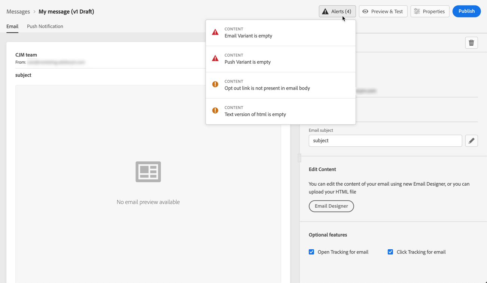

# Alerts on your messages {#publish-manage-messages}

## Checks before publication {#message-alerting}

While you are creating your message, alerts warn you when you need to take important actions before publishing your message.

Alerts are displayed on top right of the screen, as shown below:

>[!NOTE]
>
>If you do not see this button, no alert has been detected.

Two types of alerts can happen:

* **Warnings** refer to recommendations and best practices. For example, a message will display if the opt-out link is missing.

* **Errors** prevent you from publishing the message as long as they are not resolved. For example, a message will warn you that the subject line is missing.

All possible warnings and errors are detailed [below](#alerts-and-warnings).

>[!CAUTION]
>
> You need to resolve all **error** alerts before publication.

## List of warnings and errors {#alerts-and-warnings}

The settings and elements checked by the system are listed below. You will also find information on how to adapt your configuration to resolve the corresponding issues.

**Warnings**:

* **[!UICONTROL Opt out link not present in the email body]**: adding an unsubscription link into your email body is a best practice. Learn how to configure it in [this section](consent.md).

* **[!UICONTROL Text version of html is empty]**: do not forget to define a text version of your email body, as it will be used when HTML content cannot be displayed. Learn how to create the text version in [this section](create-email-content.md#generate-text-version).

* **[!UICONTROL Empty link is present in email body]**: check that all the links in your email are correct. Learn how to manage content and links in [this section](create-email-content.md).

* **[!UICONTROL Email size has exceeded the limit of 100KB]**: for optimal delivery, make sure the size of your email does not exceed 100KB. Learn how to edit email content in [this section](create-email-content.md).

**Errors**:

* **[!UICONTROL Subject Line Not Present]**: email subject line is mandatory. Learn how to define and personalize it in [this section](configure-email.md).

    <!--HTML is empty when Amp HTML is present-->

* **[!UICONTROL Push Variant is empty]**: this error is displayed when the push notification body or title is missing. Learn how to define push notification content in [this section](configure-push.md).

* **[!UICONTROL Email Variant is empty]**: this error is displayed when the email content has not been configured. Learn how to design email content in [this section](design-emails.md).

* **[!UICONTROL Preset doesn’t exist]**: you cannot publish your message if the preset you have selected is deleted after the message creation. If this error occurs, select another preset in the message **[!UICONTROL Properties]**. Learn more on branding in [this section](administration.md#cjm-branding).

* **[!UICONTROL Push iOS/Android payload has exceeded limit of 4KB]**: the push notification size cannot exceed 4KB. To respect this limit, try to reduce the use of images or emojis. Learn how to manage your push notification content in [this section](configure-push.md).

>[!CAUTION]
>
> To be able to publish your message, you need to resolve all **error** alerts.

<!--Other issues can stop publication such as:
* The push notification title is empty-->
