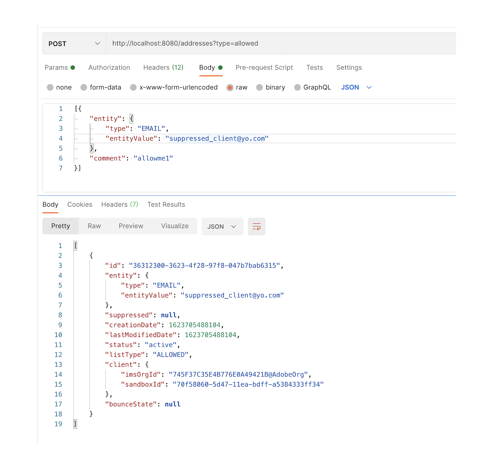

# Allowed list {#allow-list}

It is now possible to define a specific sending-safe list at the [sandbox](administration/sandboxes.md) level, to have a safe environment for testing purpose. On a non-production instance, where mistakes can occur, the allowed list ensures you have no risk of sending out unwanted messages to your customers.

>[!CAUTION]
>
>This feature is not available on production sandboxes.

The allowed list enables you to specify individual email addresses or domains that will be the only recipients or domains authorized to receive the emails you are sending from a specific sandbox. This can prevent you from sending emails accidentally to real customer addresses when you are in a testing environment.

>[!NOTE]
>
>This feature only applies to the email channel.

## Enable the allowed list {#enable-allow-list}

To enable the allowed list on a non-production sandbox, you need to make an Adobe API call.

* Using this API, you can also disable the feature at any time.

* You can update the allowed list before or after enabling the feature.

* The allowed list logic applies when the feature is enabled and if the allowed list is not empty. Learn more in [this section](#logic).

>[!NOTE]
>
>When enabled, the allowed list feature is honored when executing journeys, but also when testing messages with [proofs](preview.md#send-proofs) and testing journeys using the [test mode](building-journeys/testing-the-journey.md).

## Add entities to the allowed list {#add-entities}

>[!CAUTION]
>
>This feature is **not** available on production sandboxes. It only applies to email channel.

## Enable the allowed list {#enable-allow-list}

To enable the allowed list on a non-production sandbox, update the allow list so that it in no longer empty. To disable the feature, clear up the list such that it is again empty.

<!--
you need to make an Adobe API call.

* Using this API, you can also disable the feature at any time.

* You can update the allowed list before or after enabling the feature.

* The allowed list logic applies when the feature is enabled and if the allowed list is not empty. Learn more in \[this section\]\(\#logic\).

--> 
>[!NOTE]
>
>When enabled, the allowed list feature is honored when executing journeys, but also when testing messages with [proofs](preview.md#send-proofs) and testing journeys using the [test mode](building-journeys/testing-the-journey.md).

## Add entities to the allowed list {#add-entities}

To add new email addresses or domains to the allowed list for a specific sandbox, you must call the suppression API with the `ALLOWED` value for the `listType` attribute. For example:

You can perform the **Add**, **Delete** and **Get** operations.

>[!NOTE]
>
>The allowed list can contain up to 1,000 entries.

Learn more on making Adobe API calls in the [Experience Platform documentation](https://experienceleague.adobe.com/docs/experience-platform/landing/platform-apis/api-guide.html?lang=en).

## Allowed list logic {#logic}

<!-- When the allowed list is \[enabled\]\(\#enable-allow-list\) at the sandbox level using the API call above, the following applies.-->

1. When the allowed list is **empty**, the allowed list logic is not applied. This means that you can send emails to any profiles, provided they are not on the [suppression list](suppression-list.md).

1. When the allowed list is **not empty**, the allowed list logic is applied:

    * If an entity is **not on the allowed list**, and not on the suppression list, the corresponding recipient will not receive the email, the reason being **[!UICONTROL Not allowed]**.

    * If an entity is **on the allowed list**, and not on the suppression list, the email can be sent to the corresponding recipient. However, if the entity is also on the [suppression list](suppression-list.md), the corresponding recipient will not receive the email, the reason being **[!UICONTROL Suppressed]**.

