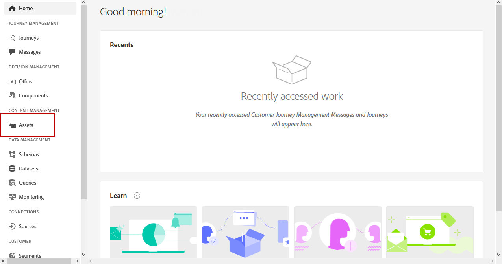
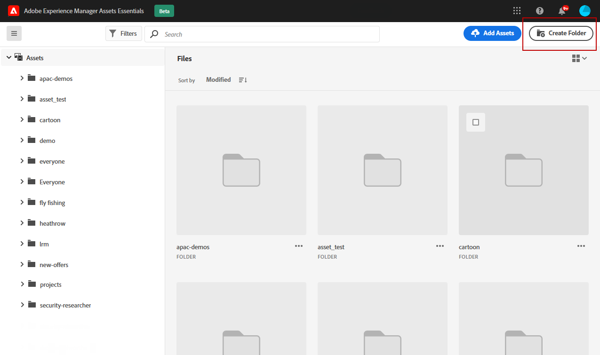
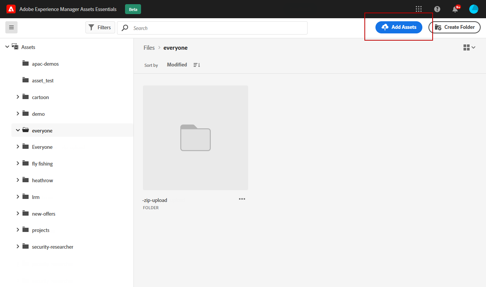
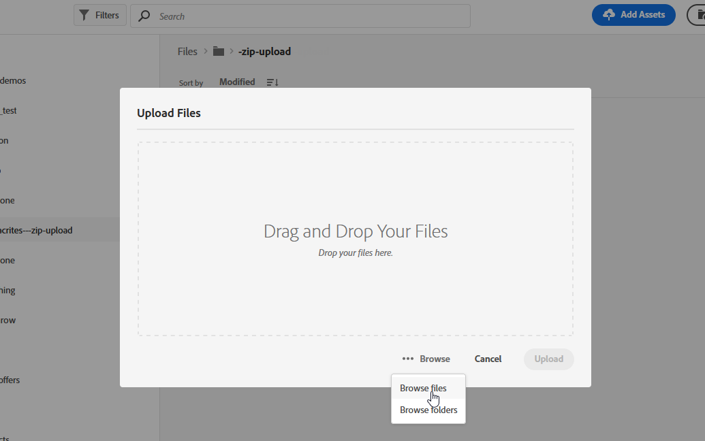
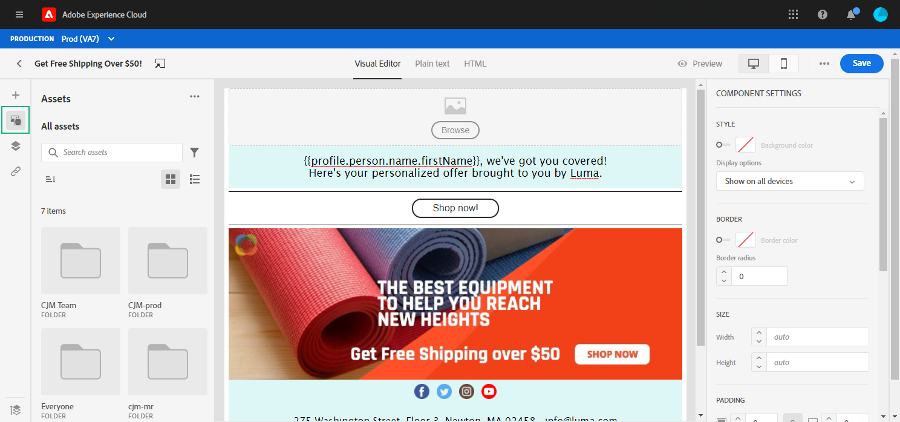
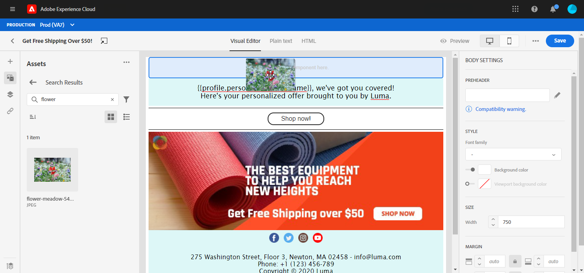
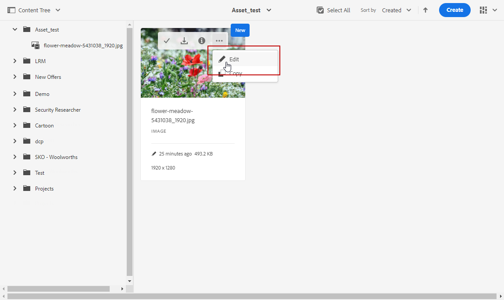
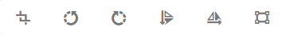

# Use [!DNL Adobe Experience Manager Assets Essentials]  {#experience-manager-assets}

## Get started with [!DNL Assets Essentials] {#get-started-assets-essentials}

[!DNL Adobe Experience Manager Assets Essentials] provides a single, centralized repository of assets that you can use to populate your messages. It can be accessed directly from [!DNL Adobe Journey Optimizer] through the **[!UICONTROL Assets]** section. You can also access assets and folders when designing an email content. [Learn more about email design](design-emails.md).

<!--You need specific permissions to access the [!DNL Adobe Experience Manager Assets Essentials]. Learn more about permissions for the Adobe Experience Manager Assets Essentials.-->

## Upload assets{#add-asset}

To upload files in the [!DNL Assets Essentials], you first need to browse or create the folder it will be stored into:

1. From [!DNL Adobe Journey Optimizer] home page, select the **[!UICONTROL Assets]** tab to access [!DNL Assets Essentials].

    

1. Double-click a folder from the central section or from the tree view to open it.

    You can also click **[!UICONTROL Create folder]** to create a new folder.

    

1. Once in the selected or created folder, click **[!UICONTROL Add Assets]** to upload new asset to your folder.

    

1. From the **[!UICONTROL Upload files]**, click **[!UICONTROL Browse]** and choose if you want to **[!UICONTROL Browse files]** or **[!UICONTROL Browse folders]**.

    

1. Select the file you want to upload. When done, click **[!UICONTROL Upload]**.

1. Once your asset is uploaded, you can manage it through different options detailed in this [section](#manage-asset). Your asset can also be further edited with the **Edit** mode of [!DNL Assets Essentials]. For more on this, refer to this [page](#edit-assets).

    

## Manage assets{#manage-asset}

You can manage assets available in [!DNL Adobe Experience Manager Assets Essentials]. Click your asset to access further options. 

Following actions are available in the toolbar:

* **[!UICONTROL Details]** to access further details on your assets.
* **[!UICONTROL Download]** to start direct local download.
* **[!UICONTROL Delete]** to remove the asset from [!DNL Assets Essentials].
* **[!UICONTROL Copy]** to copy/paste the asset in another folder.
* **[!UICONTROL Move]** to move your asset to other folders.

## Insert assets in messages {#use-assets}

You can insert assets in one of your messages via the Email designer. [Learn more about email design](design-emails.md).

To insert an asset from [!DNL Adobe Experience Manager Assets Essentials]:

1. From the Email designer, select **[!UICONTROL Asset picker]** from the left pane.

    

1. Select the asset folder. You can also search for your asset or your folder in the search bar.

1. Drag and drop your asset in a **[!UICONTROL Structure component]**.

    

You can further customize your assets such as adding an external link or a text with the **[!UICONTROL Components settings]**. [Learn more about components settings](content-components.md)

<!--

## Edit and modify assets {#edit-assets}

Your assets can be edited through the **[!UICONTROL Edit mode]** in [!DNL Assets Essentials]. Through this mode, you can crop, resize and rotate your asset. Click the **[!UICONTROL Edit]** button to access the editing mode of your asset.

Following actions are available in the toolbar:

* **[!UICONTROL Start crop]** to focus on only the content you want in your asset.
* **[!UICONTROL Rotate left]** to rotate your asset counter-clockwise by 90 degrees.
* **[!UICONTROL Rotate right]** to rotate your asset clockwise by 90 degrees.
* **[!UICONTROL Flip vertically]** to vertically mirror your asset.
* **[!UICONTROL Flip horizontally]** to horizontally mirror your asset.
* **[!UICONTROL Launch map]** to insert an image map. For more on this, refer to the [Add image maps](https://experienceleague.adobe.com/docs/experience-manager-65/assets/using/image-maps.html?lang=en#using) documentation.

## Share assets {#share-assets}

When using the Media library, each asset is saved in folders or sub-folders. You can choose to share your folders and which level of access to assign.

For more information on how to share access to your folders, refer to this [page](#assets-permissions).

### Assets permissions {#assets-permissions}

The Media library provides a single, centralized repository of assets that you can use to populate your messages.
Each asset is saved in folders or sub-folders. You can choose to share your folders and which level of access to assign.

1. From the **[!UICONTROL Assets]** tab, navigate through your folders to find the one you need to share.

1. Select your folder or asset and click **[!UICONTROL Share]**.

    

1. Enter the email address of the different person you want to share access to your folder with.

1. Choose between the different access level:

    * **[!UICONTROL Can view]**
    * **[!UICONTROL Can edit]**
    * **[!UICONTROL Has ownership (can share, edit, and delete)]**

    

1. Add a message to your invite if needed.

1. Click **[!UICONTROL Invite]**.

    
-->
