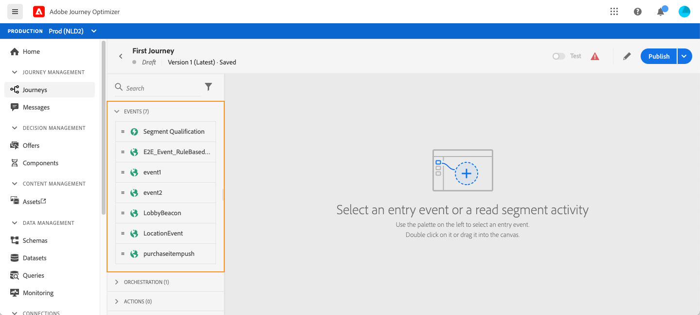
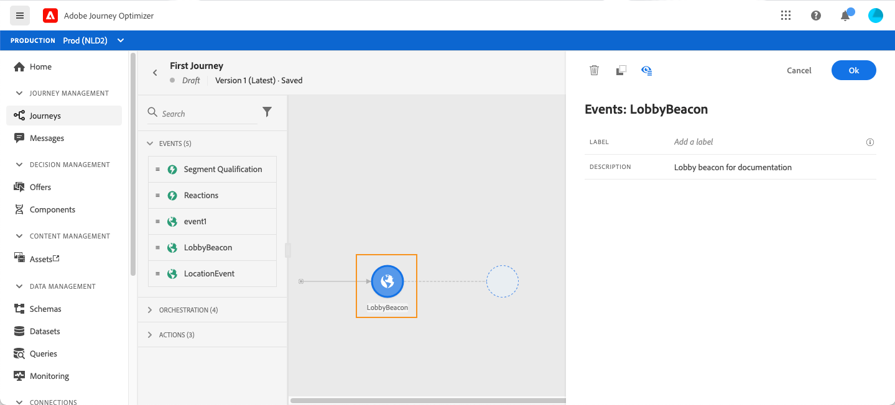
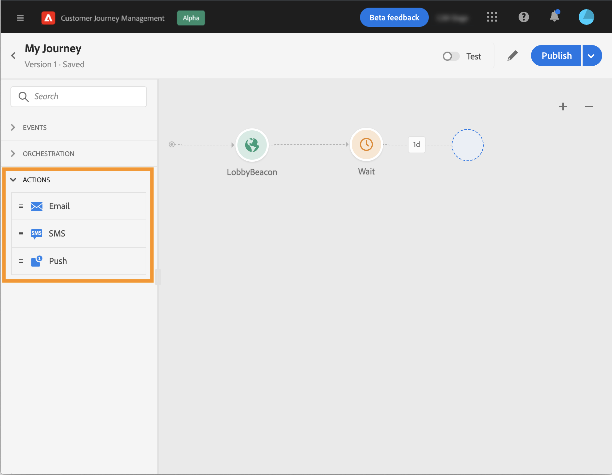

# About journey activities {#about-journey-activities}

Combine the different event, orchestration and action activities to build your multi-step cross-channel scenarios.

## Events activities {#event-activities}

The events configured by the technical user (see [this page](../event/about-events.md)) are all displayed in the first category of the palette, on the left side of the screen. The following events activities are available:

* [General events](../building-journeys/general-events.md)
* [Reaction](../building-journeys/reaction-events.md)
* [Segment qualification](../building-journeys/segment-qualification-events.md)

 

Start your journey by drag and dropping an event activity. You can also double-click on it.

 

## Orchestration activities {#orchestration-activities}

From the palette, on the left-hand side of the screen, the following orchestration activities are available:

* [Condition](../building-journeys/condition-activity.md)
* [End](../building-journeys/end-activity.md)
* [Wait](../building-journeys/wait-activity.md)
* [Read segment](../building-journeys/read-segment.md)

## Action activities {#action-activities}

From the palette, on the left-hand side of the screen, below **[!UICONTROL Events]** and **[!UICONTROL Orchestration]**, you will find the **[!UICONTROL Actions]** category. The following action activities are available:

* [Message](../building-journeys/journeys-message.md)
* [Custom actions](../building-journeys/using-custom-actions.md)
* [Jump](../building-journeys/jump.md)

These activities represent the different available communication channels. You can combine them to create a cross-channel scenario. 

If you've configured custom actions, they will appear here (see [this page](../building-journeys/using-custom-actions.md)).

## Best practices {#best-practices}

Most activities allow you to define a **[!UICONTROL Label]**. This adds a suffix to the name that will appear under your activity in the canvas. This is useful if you use the same activity several times in your journey and want to identify them more easily. It will also make debugging easier in case of errors and it will make reports easier to read. You can also add an optional **[!UICONTROL Description]**.

When an error occurs in an action or a condition, the journey of an individual stops. The only way to make it continue is to check the box **[!UICONTROL Add an alternative path in case of a timeout or an error]**. See [this section](../building-journeys/using-the-journey-designer.md#paths).

