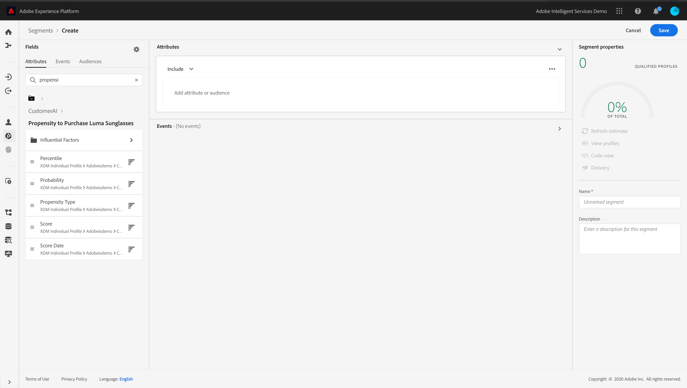

# Integrate with Intelligent Services {#ai-overview}

The integration with **[!DNL Adobe Intelligent Services]** allows you to leverage the power of artificial intelligence and machine learning in customer experience use cases. This allows for marketing analysts to set up predictions specific to a company's needs using business-level configurations without the need for data science expertise.

[!DNL Intelligent Services], built on Adobe Experience Platform, gives marketers responsible for customer experience access to AI-as-a-service, making it easy for anyone to predict customer behavior, measure the impact of a campaign, or ensure better return on every investment. For more information on [!DNL Adobe Intelligent Services], refer to the [Adobe Experience Platform documentation](https://experienceleague.adobe.com/docs/experience-platform/intelligent-services/home.html){target="_blank"}.  

Integration between [!DNL Journey Optimizer] and [!DNL Intelligent Services] allows you to leverage customer predictions.

Customer AI is part of [!DNL Adobe Intelligent Services]. It helps predict what a customer is likely to do. See the [Adobe Experience Platform documentation](https://experienceleague.adobe.com/docs/experience-platform/intelligent-services/customer-ai/overview.html){target="_blank"}.  

Customer AI allows brands to create churn or conversion machine learning based scores that will be available as profile attributes in the Adobe Experience Platform profiles (Real-time Customer Profile).

As a result, they can be used as any other profile attributes in Journey Optimizer's conditions (to make the best decisions), actions or segment building. 

