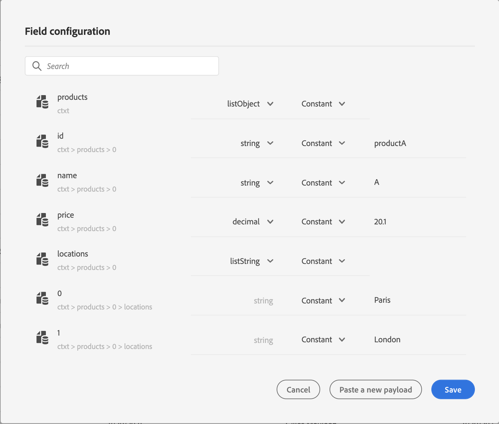
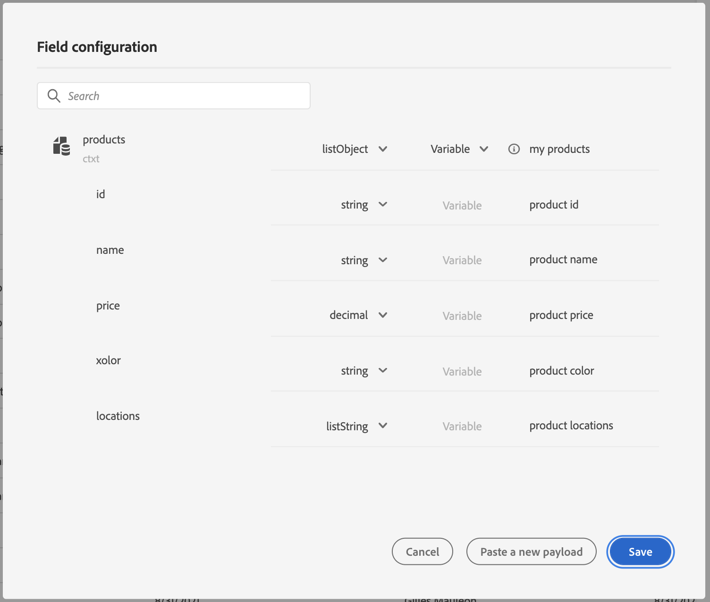
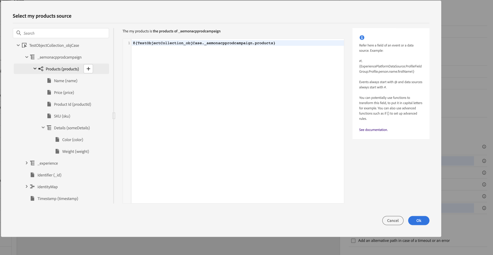
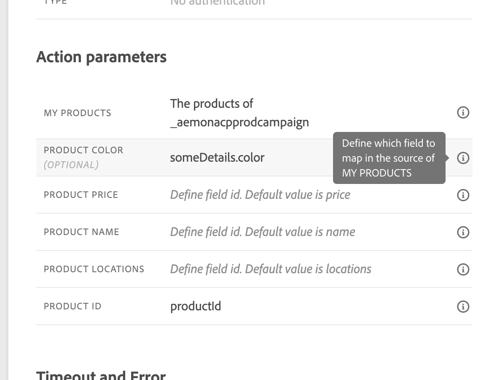
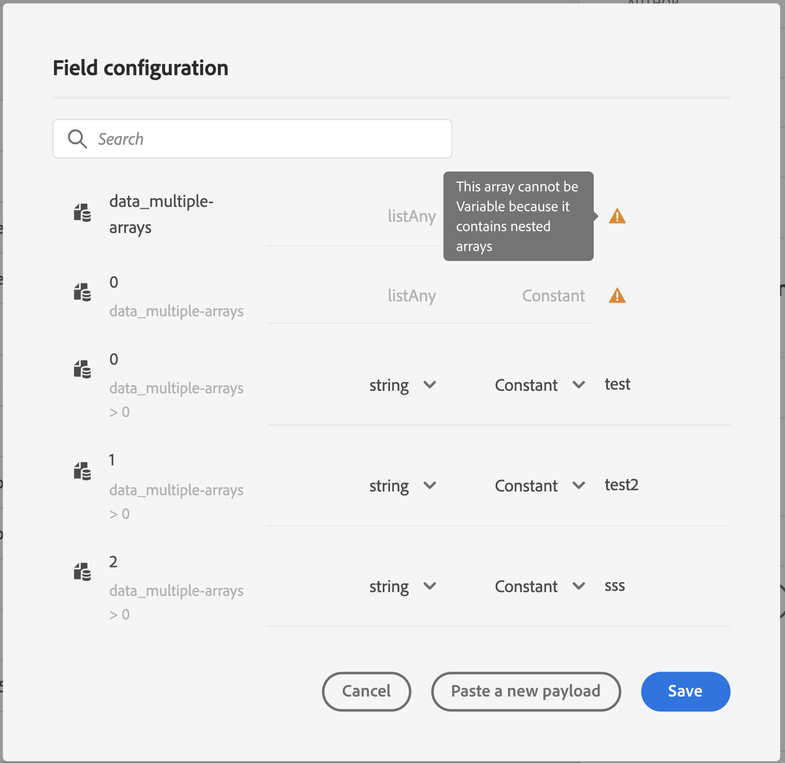

# Pass collections dynamically using custom actions{#passing-collection}

You can pass a collection in custom action parameters that will be dynamically populated dynamically at runtime. Two kinds of collections are supported:

* simple collections: arrays of simple data types, for example, with a listSring:

   ```
   {
    "deviceTypes": [
        "android",
        "ios"
    ]
   }
   ```

* object collections: an array of JSON objects, for example:

   ```
   {
   "products":[
      {
         "id":"productA",
         "name":"A",
         "price":20.1
      },
      {
         "id":"productB",
         "name":"B",
         "price":10.0
      },
      {
         "id":"productC",
         "name":"C",
         "price":5.99
      }
    ]
   }
   ```

## Limitations {#limitations}

* Arrays of objects containing sub-objects are not supported. For example:

    ```
    {
   "products":[
      {
         "id":"productA",
         "name":"A",
         "details": {
            "color":"blue"
         },
         "price":20.0
      }
     ]
    }
    ```

* Nested arrays of objects within an object array are not supported at the moment. For example:

    ```
    {
   "products":[
      {
         "id":"productA",
         "name":"A",
         "price":20,
         "locations": [{"name": "Paris"}, {"name": "London"}]
      },
     ]
    }
    ```

## General procedure {#general-procedure} 

In this section, we will use the following JSON payload example. This is an array of objects with a field that is a simple collection.

```
{
  "ctxt": {
    "products": [
      {
        "id": "productA",
        "name": "A",
        "price": 20.1,
        "color":"blue",
        "locations": [
          "Paris",
          "London"
        ]
      },
      {
        "id": "productB",
        "name": "B",
        "price": 10.99
      }
    ]
  }
}
```

You can see that "products" is an array of two objects. You need to have at least one object.

1. Create your custom action. See [this page](../action/about-custom-action-configuration.md).

1. In the **[!UICONTROL Action parameters]** section, paste the JSON example. The displayed structure is static: when pasting the payload, all fields are defined as constants. 

   

1. If needed, adjust the field types. The following field types are supported for collections: listString, listInteger, listDecimal, listBoolean, listDateTime, listDateTimeOnly, listDateOnly, listObject

   >[!NOTE]
   >
   >The field type is automatically inferred according to the payload example.

1. If you want to pass objects dynamically, you need to set them as variables. In this example we set "products" as variable. All the object fields included in the object are set to variables automatically.

    >[!NOTE]
    >
    >The first object of the payload example is used to define the fields.

1. For each field, define the label which will be displayed in the journey canvas.

   

1. Create your journey and add the custom action you created. See [this page](../building-journeys/using-custom-actions.md).

1. In the **[!UICONTROL Action parameters]** section, define the array parameter ("products" in our example) using the advanced expression editor.

   

1. For each of the following object field, type the corresponding field name from the source XDM schema. If the names are identical, this is not needed. In our example, we only need to define "product id" and "color".

   

## Particular cases{#examples}

For heterogeneous types and arrays of arrays, the array is defined with the listAny type because it contains heterogenous data types. You can only map individual items, but cannot change the array to variable.



Example of heterogenous type:

```
{
    "data_mixed-types": [
        "test",
        "test2",
        null,
        0
    ]
}
```

Example of array of arrays:

```

{
    "data_multiple-arrays": [
        [
            "test",
            "test1",
            "test2"
        ]
    ]
}
```

**Related topics**

[Use custom actions](../building-journeys/using-custom-actions.md)