# Condition activity{#section_e2n_pft_dgb}

Four types of conditions are available:

* [Data Source condition](#data_source_condition) 
* [Time condition](#time_condition) 
* [Percentage split](#percentage_split) 
* [Date condition](#date_condition) 

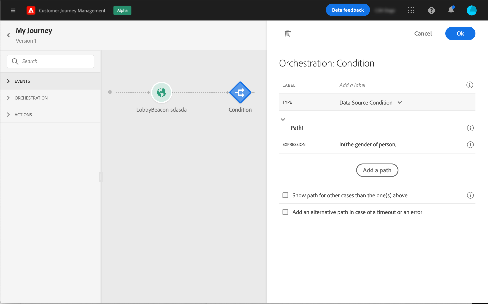

## About the Condition activity {#about_condition}

When using several conditions in a journey, you can define labels for each of them to identify them more easily.

Click **[!UICONTROL Add a path]** if you want to define several conditions. For each condition, a new path is added in the canvas after the activity.

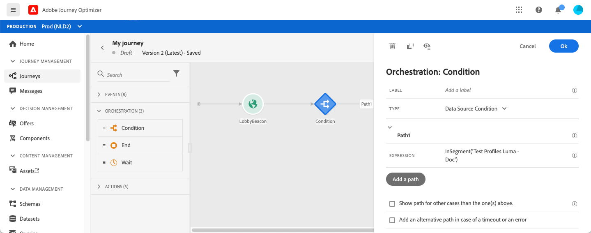

Note that the design of journeys has functional impacts. When several paths are defined after a condition, only the first eligible path will be executed. It means that you can vary the prioritization of paths by placing them above or below one another.

For example, let's take the example of a first path's condition "The person is a VIP" and a second path's condition "The person is a male". If a person meeting both conditions (a male who is a VIP) passes this step, the first path will be chosen even if this person is also eligible to the second one, because the first path is "above". To change this priority, move your activities in another vertical order.

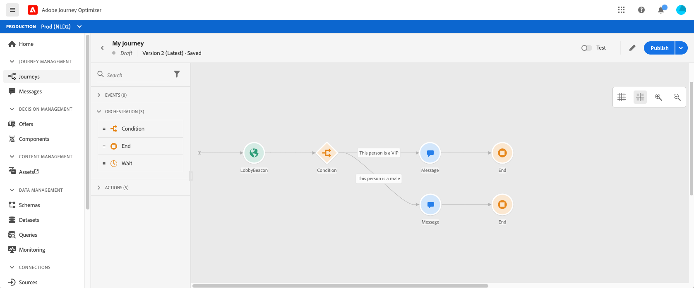

You can create another path for audiences that are not eligible to the defined conditions by checking **[!UICONTROL Show path for other cases than the one(s) above]**. Note that this option is not available in split conditions. See [Percentage split](#percentage_split).

The simple mode allows you to perform simple queries based on a combination of fields. All the available fields are displayed on the left side of the screen. Drag and drop fields into the main zone. To combine the different elements, interlock them into one another to create different groups and/or group levels. You can then select a logical operator to combine elements on the same level:

* AND: an intersection of two criteria. Only the elements matching all criteria are taken into account.
* OR: a union of two criteria. Elements matching at least one of the two criteria are taken into account.

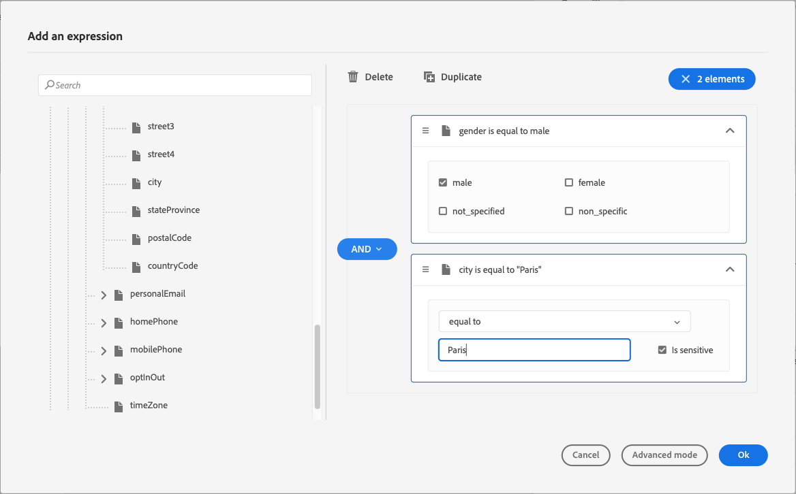

If you're using the [Adobe Experience Platform Segmentation Service](https://experienceleague.adobe.com/docs/experience-platform/segmentation/home.html){target="_blank"} to create your segments, you can leverage them in your journey conditions. Refer to [Using segments in conditions](../building-journeys/condition-activity.md#using-a-segment).

>[!NOTE]
>
>You cannot perform queries on time series (for example a list of purchases, past clicks on messages) with the simple editor. For this you’ll need to use the advanced editor. See [Adobe Journey Orchestration documentation](https://experienceleague.adobe.com/docs/journeys/using/building-advanced-conditions-journeys/expressionadvanced.html){target="_blank"}.

When an error occurs in an action or a condition, the journey of an individual stops. The only way to make it continue is to check the box **[!UICONTROL Add an alternative path in case of a timeout or an error]**. See [this section](../building-journeys/using-the-journey-designer.md#paths).

In the simple editor, you will also find the Journey Properties category, below the event and data source categories. This category contains technical fields related to the journey for a given profile. This is the information retrieved by the system from live journeys, such as the journey ID or the specific errors encountered. For more information, see [Adobe Journey Orchestration documentation](https://experienceleague.adobe.com/docs/journeys/using/building-advanced-conditions-journeys/syntax/journey-properties.html){target="_blank"}

## Data Source condition {#data_source_condition}

This allows you to define a condition based on fields from the data sources or the events previously positioned in the journey. To learn how to use the expression editor, see [Adobe Journey Orchestration documentation](https://experienceleague.adobe.com/docs/journeys/using/building-advanced-conditions-journeys/expressionadvanced.html){target="_blank"}. Using the advanced expression editor, you can setup more advanced conditions manipulating collections or using data sources requiring the passing of parameters. See [this page](../datasource/external-data-sources.md).

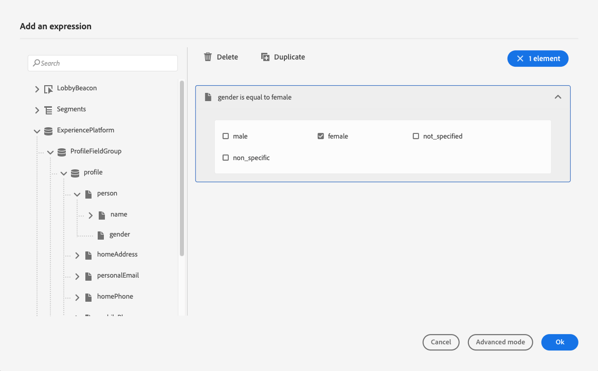

## Time condition{#time_condition}

This allows you to perform different actions according to the hour of the day and/or the day of the week. For example, you can decide to send SMS messages during daytime and emails at night during weekdays.

>[!NOTE]
>
>The time zone is no longer specific to a condition and is now defined at the journey level in the journey properties. Refer to [this page](../building-journeys/timezone-management.md).

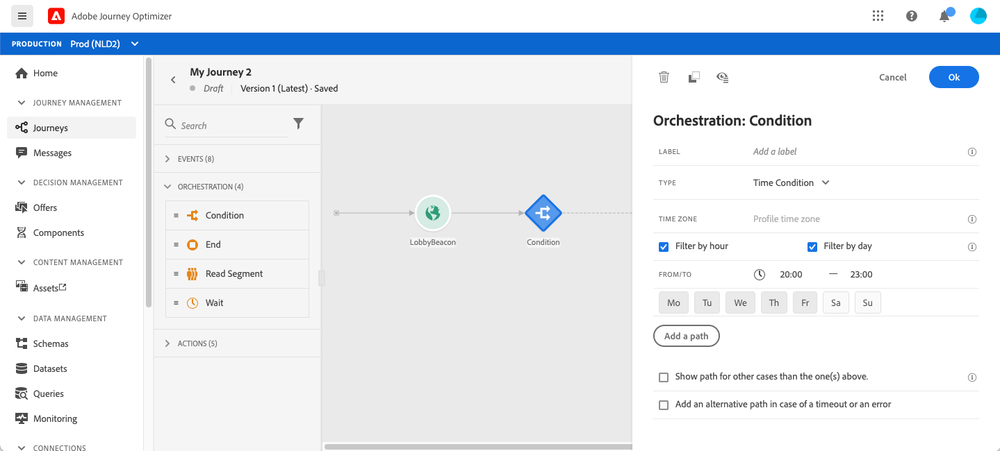

## Percentage split {#percentage_split}

This option allows you to randomly split the audience to define a different action for each group. Define the number of splits and the repartition for each path. The split calculation is statistical as the system cannot anticipate how many people will flow in this activity of the journey. As a result, the split has a very low error margin. This function is based on a Java random mechanism (see this [page](https://docs.oracle.com/javase/7/docs/api/java/util/Random.html)).

In test mode, when reaching a split, the top branch is always chosen. You can reorganize the position of the split branches if you want the test to choose a different path. Refer to [this page](../building-journeys/testing-the-journey.md)

>[!NOTE]
>
>Note that there is no button to add a path in the percentage split condition. The number of paths will depend on the number of splits. In split conditions, you cannot add a path for other cases as it cannot happen. People will always go into one of the split paths.

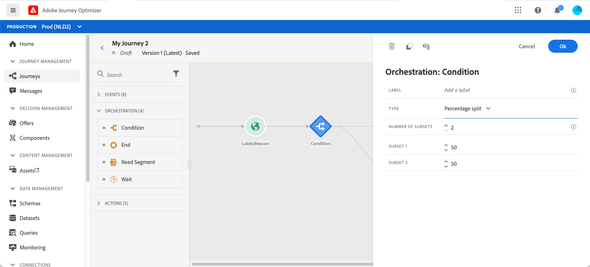

## Date condition {#date_condition}

This allows you to define a different flow based on the date. For example, if the person enters the step during the "sales" period, you'll send them a specific message. The rest of the year, you'll send another message.

>[!NOTE]
>
>The time zone is no longer specific to a condition and is now defined at the journey level in the journey properties. See [this page](../building-journeys/timezone-management.md).

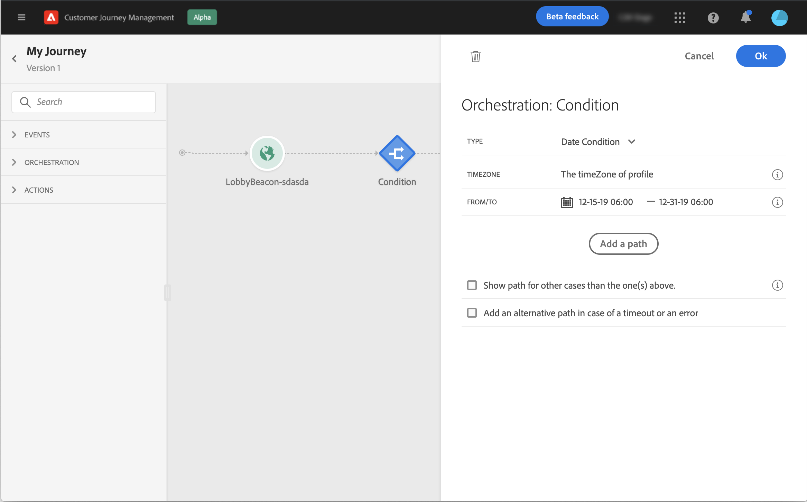

## Profile cap {#profile_cap}

Use this condition type to set a maximum number of profiles for a journey path. When this limit is reached, the selected profiles take a second path.

You can use this condition type to ramp up the volume of your deliveries. For example, you might have recently moved to another email service provider, IP address, or email domain or subdomain. Using this feature, you can establish your reputation as a sender and avoid that your deliveries be blocked or moved to the spam folder of the recipients' mailbox. Learn more with this [use case](ramp-up-deliveries-uc.md).

The default cap is 1000. You must set an integer value that is equal to or greater than 1.

The counter applies only to the selected journey version. By default, the counter is reset to zero after 180 days. After a reset, the selected profiles take the first path again until the counter limit is reached. You can gradually increase this limit up to the total number of your subscribers. After your IP has warmed up, you can remove this condition.

The first path always has priority over the second path, even if you move the second path above the first path on the journey canvas.

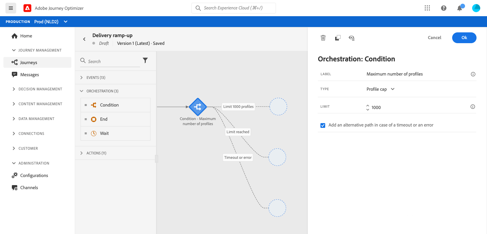

## Using segments in conditions {#using-a-segment}

This section explains how to use a segment in a journey condition. For more on segments and how to build them, refer to [this section](../segment/about-segments.md).

To use a segment in a journey condition, follow these steps:

1. Open a journey, drop a **[!UICONTROL Condition]** activity and choose the **Data Source Condition**.
   

1. Click **[!UICONTROL Add a path]** for each extra path needed. For each path, click the **[!UICONTROL Expression]** field.

   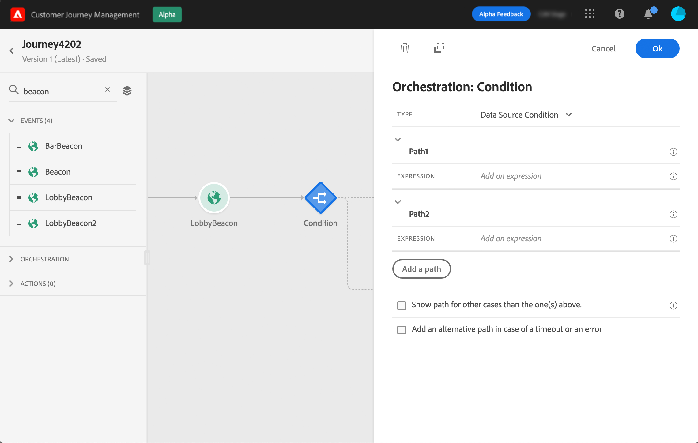

1. On the left side, unfold **[!UICONTROL Segments]** node. Drag and drop the segment you want to use for your condition. By default, the condition on the segment is true.

   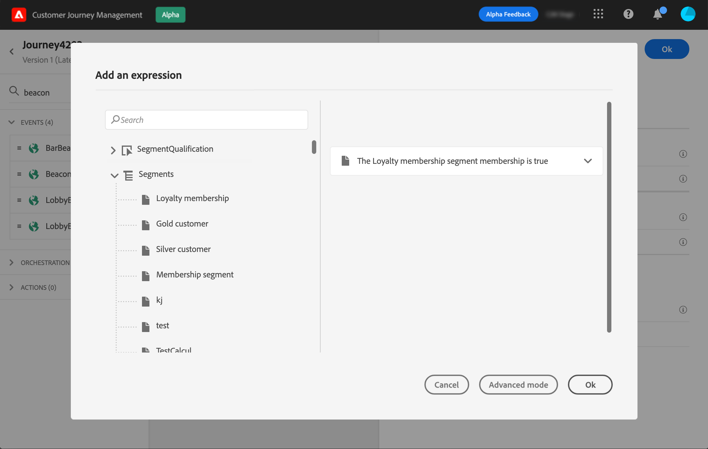

   >[!NOTE]
   >
   >Note that only the individuals with the **Realized** and **Existing** segment participation statuses will be considered as members of the segment. For more on how to evaluate a segment, refer to the [Segmentation Service documentation](https://experienceleague.adobe.com/docs/experience-platform/segmentation/tutorials/evaluate-a-segment.html#interpret-segment-results){target="_blank"}.
