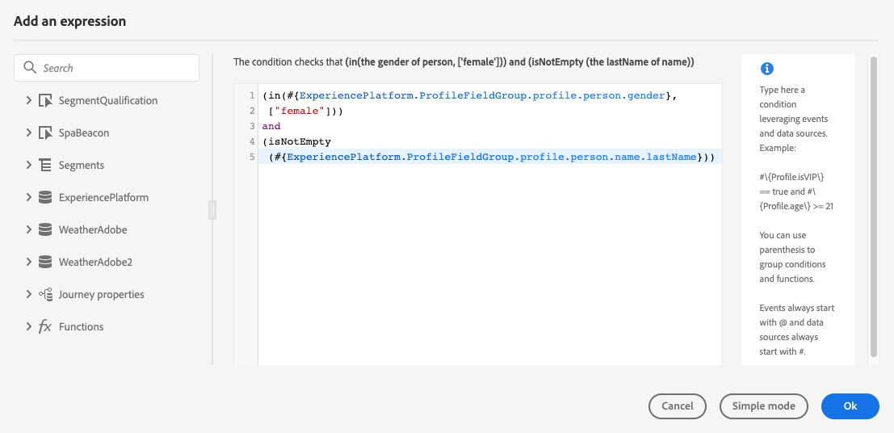
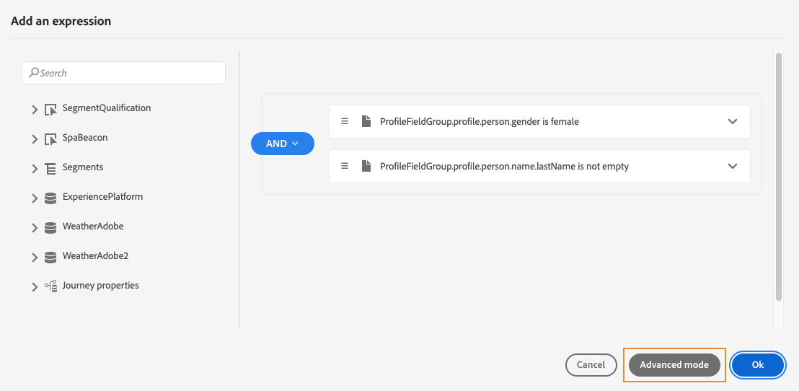
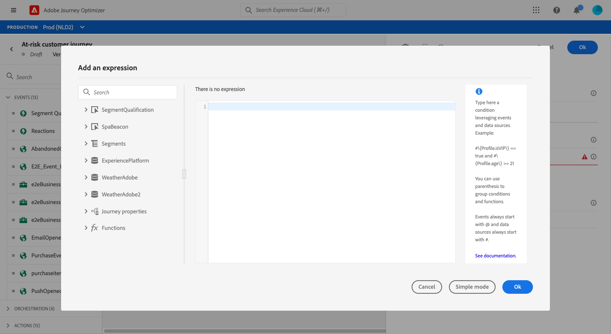
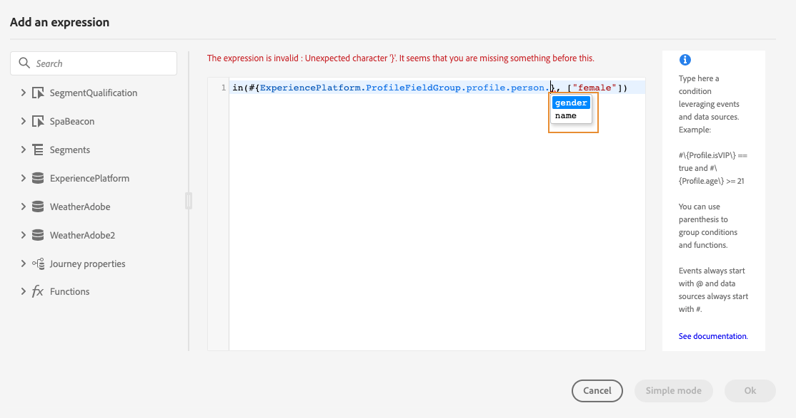
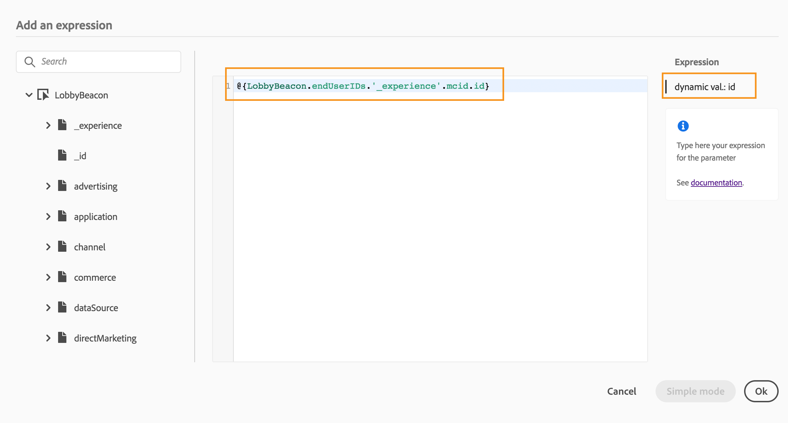

# About the advanced expression editor {#concept_uyj_trt_52b}

Use the advanced expression editor to build advanced expressions in various screens of the interface. For example, you can build expressions when configuring and using journeys, and when defining a data source condition.
It is also available every time you need to define action parameters that require specific data manipulations. You can leverage data coming from the events or additional information retrieved from the data source. In a journey, the displayed list of event fields is contextual and varies according to the event(s) added in the journey.

The advanced expression editor offers a set of built-in functions and operators to let you manipulate values and define an expression that fits specifically your needs. The advanced expression editor also allows you to define the values of the external data source parameter, manipulate map fields and collections, such as experience events.

 

_The advanced expression editor interface_

The advanced expression editor can be used to:

* create [advanced conditions](../condition-activity.md#about_condition) on data sources and event information
* define custom [wait activities](../wait-activity.md#custom)
* define action parameters mapping

When possible, you can switch between the two modes using the **[!UICONTROL Advanced mode]** / **[!UICONTROL Simple mode]** button. The simple mode is described [here](../condition-activity.md#about_condition).

>[!NOTE]
>
>Conditions can be defined in the simple or advanced expression editor. They always return a boolean type.  
>
>Actions parameters can be defined by selecting fields or via the advanced expression editor. They return a specific data type according to their expression.  

## Accessing the advanced expression editor {#section_fdz_4nj_cjb}

You can access the advanced expression editor in different ways:

* When you create a data source condition, you can access the advanced editor by clicking on **[!UICONTROL Advanced mode]**.

    

* When you create a custom timer, the advanced editor will be directly displayed.
* When you map action parameter, click on **[!UICONTROL Advanced mode]**.

## Discovering the interface{#section_otq_tnj_cjb}

This screen allows you to manually write your expression.

On the left part of the screen are displayed available fields and functions:

* **[!UICONTROL Events]**: choose one of the fields received from the inbound event. The displayed list of event fields is contextual and varies according to the event(s) added in the journey. [Read more](../../event/about-events.md)
* **[!UICONTROL Segments]**: if you have dropped a **[!UICONTROL Segment qualification]** event, choose the segment you want to use in your expression. [Read more](../condition-activity.md#using-a-segment)
* **[!UICONTROL Data Sources]**: choose from the list of fields available from your data sources' field groups. [Read more](../../datasource/about-data-sources.md)
* **[!UICONTROL Journey properties]**: this section regroups the technical fields related to the journey for a given profile. [Read more](journey-properties.md)
* **[!UICONTROL Functions]**: choose from the a list of built-in functions that allow to carry out complex filtering. Functions are organized by categories. [Read more](functions.md)

An autocompletion mechanism displays contextual suggestions.

A syntax validation mechanism checks the integrity of your code. Errors are displayed on top of the editor.

**Need for parameters when building conditions with the advanced expression editor**

If you select a field from an external data source requiring a parameter to be called (see [this page](../../datasource/external-data-sources.md). For example, in a weather-related data source, a frequently used parameter will be "city". As a result, you must select where you want to get this city parameter. Functions can also be applied to parameters to perform format changes or concatenations.

For more complex use cases, if you want to include the parameters of the data source in the main expression, you can define their values using the "params" keyword. See [this page](../expression/field-references.md).
