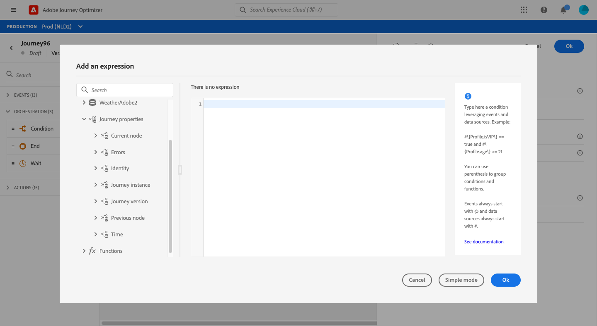

# Journey properties attributes {#journey-properties}

In the advanced expression editor, you will find the **Journey Properties** category, below the event and data source categories. This category contains technical fields related to the journey for a given profile. This is the information retrieved by the system from live journeys, such as the journey ID or the specific errors encountered.

>[!NOTE]
>
>Journey properties attributes are also available in the simple expression editor. See this [section](../condition-activity.md#about_condition)

You will find information, for example, about:

* journey version: journey uid, journey version uid, instance uid, etc.
* errors: data fetch, action execution, etc.
* current step, last current step, etc.
* discarded profiles

You can use these fields to build expressions. During the journey execution, the values will be retrieved directly from the journey. 

Here are a few examples of use cases:

* **Log discarded profiles**: you can send all profiles excluded from a message by a capping rule to a third-party system for logging purposes. For this, you set up a path in case of timeout and error and add a condition to filter on a specific error type, for example: "discard people by capping rule". You can then push the discarded profiles to a third-party system via a custom action. 

* **Send alerts in case of errors**: you can send a notification to a third-party system every time an error occurs on a message. For this, you set up a path in case of error, add a condition and a custom action. You can send a notification on a Slack channel, for example, with the description of the error encountered.

* **Refine errors in reporting** : instead of having just one path for messages in error, you can define a condition per error type. This will allow you to refine the reporting and view all error types data.

## List of fields {#journey-properties-fields}

|Category|Field name|Label|Description|
|---|---|---|------------|
|Journey Version|journeyUID|Journey Identifier| |
| |journeyVersionUID|Journey Version Identifier| |
| |journeyVersionName|Journey Version Name| |
| |journeyVersionDescription|Journey Version Description| |
| |journeyVersion|Journey Version| |
|Journey Instance|instanceUID|Journey Instance Identifier|ID of the instance|
| |externalKey|External Key|Individual identifier triggering the journey|
| |organizationId|Organization identifier|Brand's organization|
| |sandboxName|Sandbox name|Name of the sandbox|
|Identity|profileId|Profile Identity Identifier|Identifier of the profile in the journey|
| |namespace|Profile Identity Namespace|Namespace of the profile in the journey (example: ECID)|
|Current Node|currentNodeId|Current Node Identifier|Identifier of the current activity (node)|
| |currentNodeName|Current Node Name|Name of the current activity (node)|
|Previous Node|previousNodeId|Previous Node Identifier|Identifier of the previous activity (node)|
| |previousNodeName|Previous Node Name|Name of the previous activity (node)|
|Errors|lastNodeUIDInError|Last Node Identifier in Error|Identifier of the latest activity (node) in error|
| |lastNodeNameInError|Last Node Name in Error|Name of the latest activity (node) in error|
| |lastNodeTypeInError|Last Node Type in Error|Error type of the latest activity (node) in error. Possible types:<ul><li>Events: Events, Reactions, SQ (example: Segment Qualification)</li><li>Flow control: End, Condition, Wait</li><li>Actions: ACS actions, Jump, Custom Action</li></ul>|
| |lastErrorCode|Last Error Code|Error code of the latest activity (node) in error. Possible errors: <ul><li>HTTP error codes</li><li>capped</li><li>timedOut</li><li>error (example: default in case of an unexpected error. Should not/extremely rarely happen)</li></ul>|
| |lastExecutedActionErrorCode|Last Executed Action Error Code|Error code of the latest action in error |
| |lastDataFetchErrorCode|Last Data Fetch Error Code|Error code of the latest data fetch from data sources|
|Time|lastActionExecutionElapsedTime|Last action execution elapsed time|Time spent to execute the latest action|
| |lastDataFetchElapsedTime|Last data fetch elapsed time|Time spent to execute the latest data fetch from data sources|
