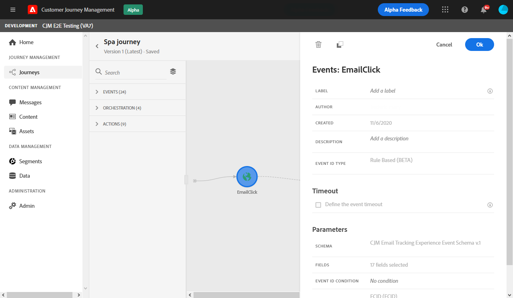
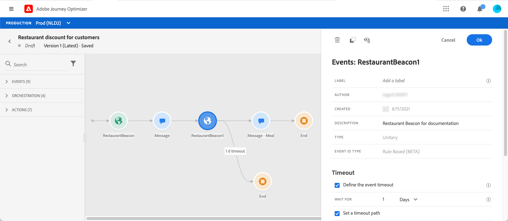
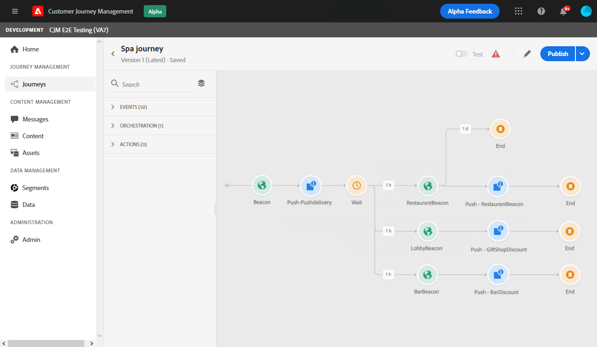

# General events {#section_ofg_jss_dgb}

For this type of event, you can only add a label and a description. The rest of the configuration cannot be edited. It was performed by the technical user. See [this page](../event/about-events.md).

When you drop a business event, it automatically adds a **Read segment** activity. For more information on business events, refer to [this section](../event/about-events.md) 

## Listening to events during a specific time {#events-specific-time}

An event activity positioned in the journey listens to events indefinitely. To listen to an event only during a certain time, you must configure a timeout for the event.

The journey will then listen to the event during the time specified in the timeout. If an event is received during that period, the person will flow in the event path. If not, the customer will either flow into a timeout path, or end his journey.

To configure a timeout for an event, follow these steps:

1. Activate the **[!UICONTROL Enable the event timeout]** option from the event properties.

1. Specify the amount of time the journey will wait for the event.

1. If you want to send the individuals into a timeout path when no event is received within the specified timeout, enable the **[!UICONTROL Set the timeout path]** option. If this option is not enabled, the journey will end for the individual once the timeout is reached.

    

In this example, the journey sends a first welcome push to a customer. It then sends a meal discount push only if the customer enters the restaurant within the next day. We therefore configured the restaurant event with a 1-day timeout:

* If the restaurant event is received less than 1 day hours after the welcome push, the meal discount push message is sent.
* If no restaurant event is received within the next day, the person flows through the timeout path.

Note that if you want to configure a timeout on multiple events positionned after a **[!UICONTROL Wait]** activity, you need to configure the timeout on one these events only.

The timeout will apply to all the events positionned after the **[!UICONTROL Wait]** activity. If no event is received after the specified timeout, the individuals will flow into one single timeout path or will end their journey.

