# Get started with journeys{#jo-quick-start}

## Pre-requisites

In order to send messages with journeys, the following configuration is required:

1. **Configure an event**: if you want to trigger your journeys unitarily when an event is received, you need to configure an event. You define the expected information and how to process it. This step is performed by a **technical user**. [Read more](../event/about-events.md).

   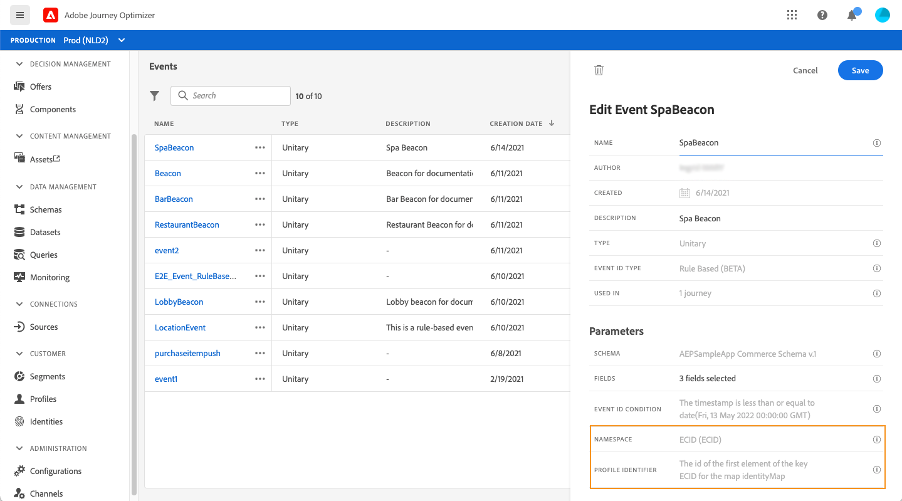  
 
1. **Create a segment**: your journey can also listen to Adobe Experience Platform segments in order to send messages in batch to a specified set of profiles. For this, you need to create segments. [Read more](../segment/about-segments.md).

   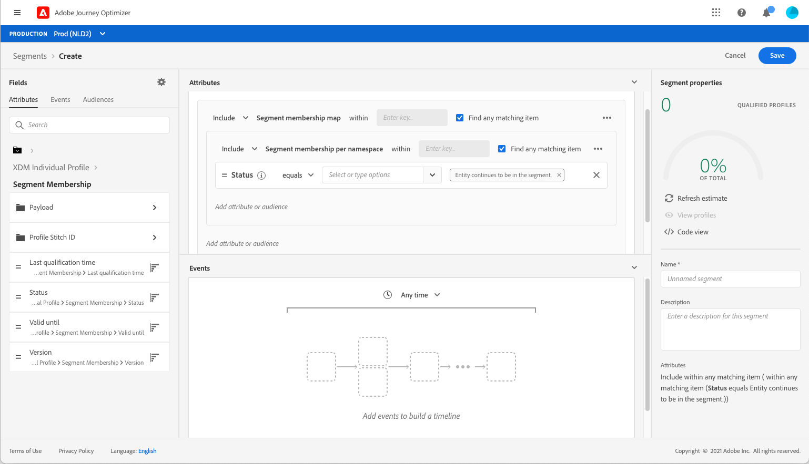  

1. **Configure the data source**: you can define a connection to a system to retrieve additional information that will be used in your journeys, for example in your conditions. A built-in Adobe Experience Platform data source is also configured at provisioning time. This step is not required if you only leverage data from the events in your journey. This step is performed by a **technical user**. [Read more](../datasource/about-data-sources.md) 

   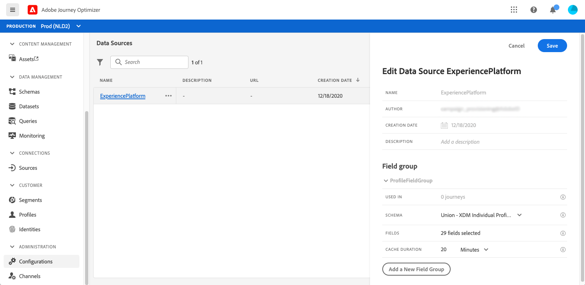  

1. **Configure an action**: Journey Optimizer message capabilities are built-in, you just need to design your content and publish your message. See [this section](../get-started-content.md). If you're using a third-party system to send your messages, you can create a custom action. Learn more in this [section](../action/action.md). This step is performed by a **technical user**. 

      

## Building your journey{#jo-build}

This step is performed by the **business user**. This is where you create your journeys. Combine the different event, orchestration and action activities to build your multi-step cross-channel scenarios.

Here are the main steps to send messages through journeys:

1. In the JOURNEY MANAGEMENT menu section, click **[!UICONTROL Journeys]**. The list of journeys is displayed.

    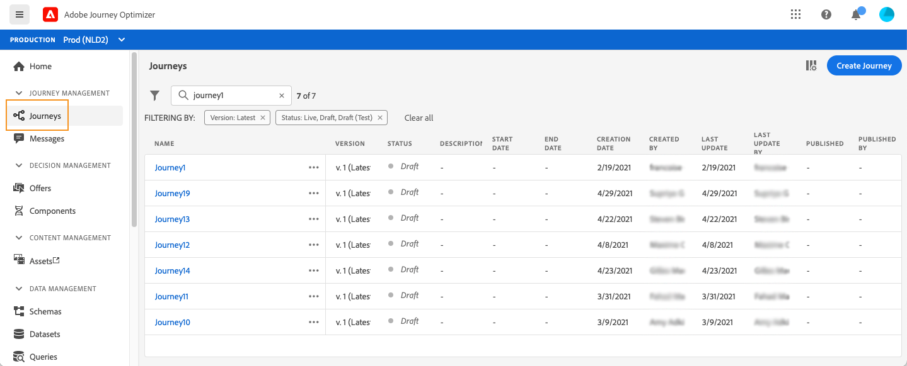

1. Click **[!UICONTROL Create Journey]** to create a new journey. 

1. Edit the journey's properties in the configuration pane displayed on the right side. Learn more in this [section](journey-gs.md#change-properties).

    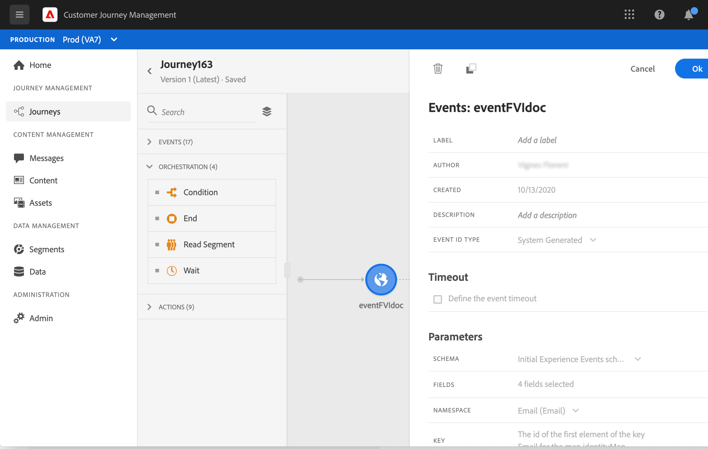

1. Start by drag and dropping an event or a **Read Segment** activity from the palette into the canvas. To learn more about journey design, refer to [this section](using-the-journey-designer.md).

    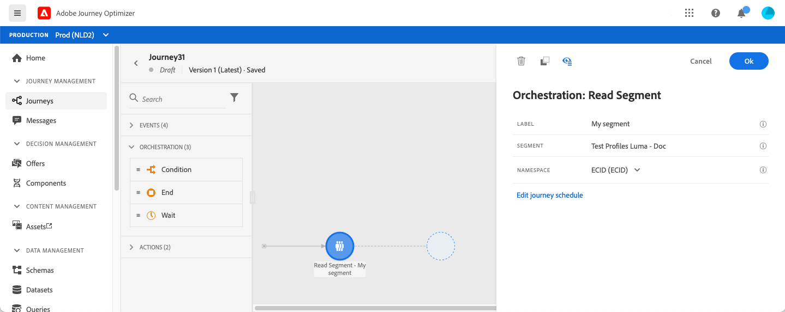

1. Drag and drop the next steps that the individual will follow. For example, you can add a condition followed by a message. To learn more about activities, refer to [this section](using-the-journey-designer.md).

1. Test your journey using test profiles. Learn more in this [section](testing-the-journey.md)

1. Publish your journey to activate it. Learn more in this [section](publishing-the-journey.md).

    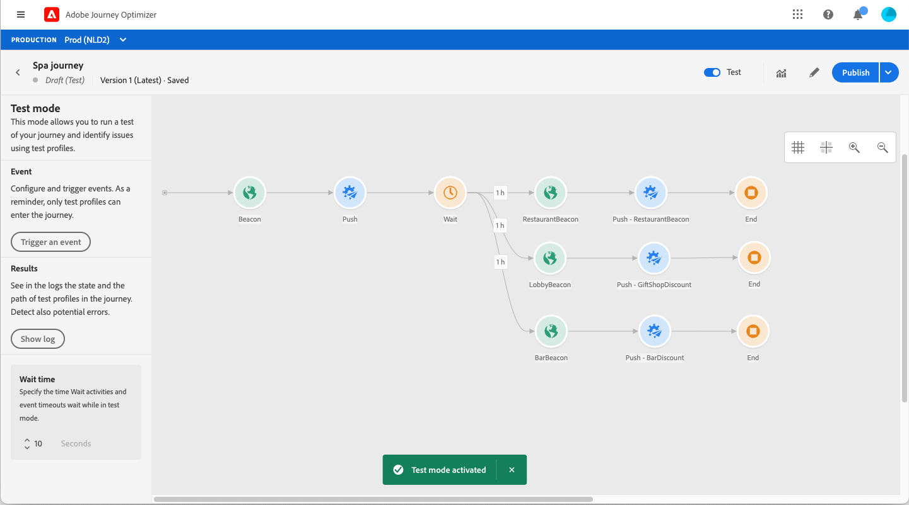

1. Monitor your journey using the dedicated reporting tools to measure your journey's effectiveness. Learn more in this [section](../reports/live-report.md).

    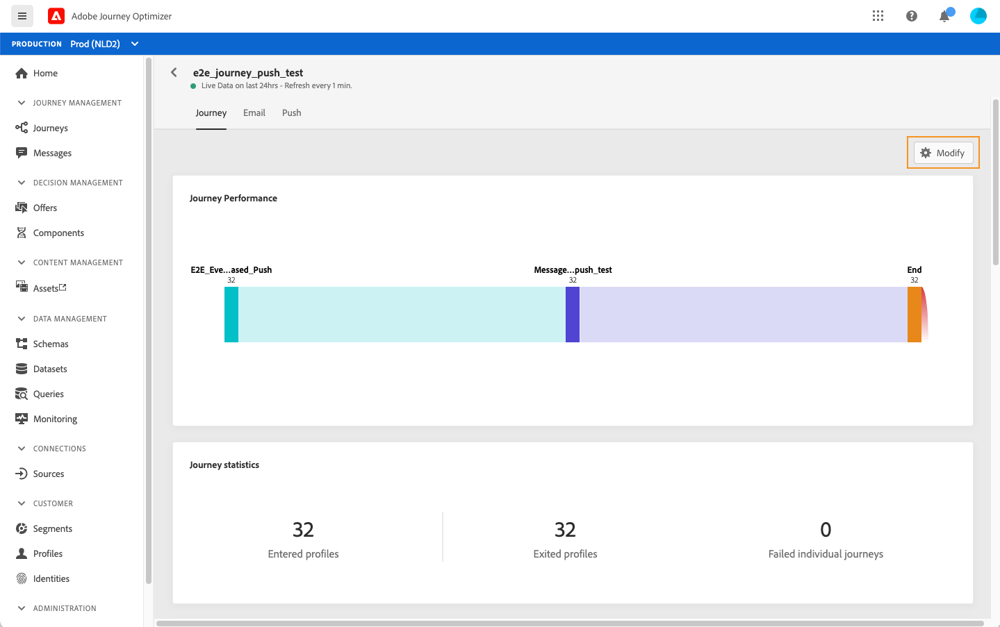

## Changing properties {#change-properties}

Click on the pencil icon, in the top right to access the journey's properties.

You can change the name of the journey, add a description, allow re-entrance, choose start and end dates and define a **[!UICONTROL Timeout and error]** duration if you are admin. 

For live journeys, this screen displays the publication date and the name of the user who published the journey.

The **Copy technical details** allows you to copy technical information about the journey which the support team can use to troubleshoot. The following information is copied: JourneyVersion UID, OrgID, orgName, sandboxName, lastDeployedBy, lastDeployedAt.

 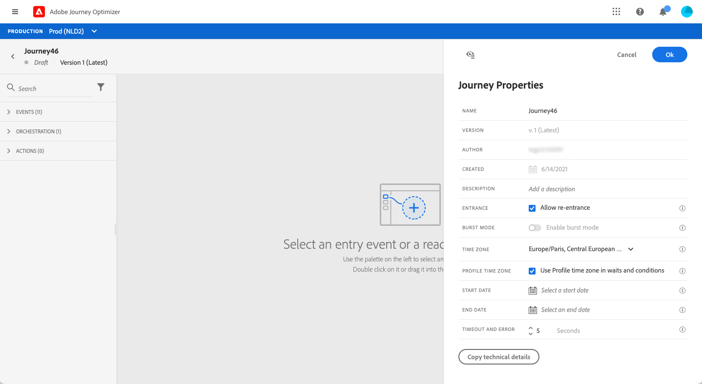

### Entrance{#entrance}

By default, new journeys allow re-entrance. You can uncheck the option for “one shot” journeys, for example if you want to offer a one-time gift when a person enters a shop. In that case, you don't want the customer to be able to re-enter the journey and receive the offer again.

When a journey "ends", it will have the status **[!UICONTROL Closed]**. The journey will stop letting new individuals enter the journey. Persons already in the journey will finish the journey normally.

After the default global timeout of 30 days, the journey will switch to the **Finished** status. See this [section](../building-journeys/journey-gs.md#global_timeout).

### Timeout and error in journey activities {#timeout_and_error}

When editing an action or condition activity, you can define an alternative path in case of error or timeout. If the processing of the activity interrogating a third-party system exceeds the timeout duration defined in the journey's properties (**[!UICONTROL Timeout and  error]** field), the second path will be chosen to perform a potential fallback action. 

Authorized values are between 1 and 30 seconds.

We recommend that you define a very short **[!UICONTROL Timeout and error]** value if your journey is time sensitive (example: reacting to the real-time location of a person) because you cannot delay your action for more than a few seconds. If your journey is less time sensitive, you can use a longer value to give more time to the system called to send a valid response.

Journeys also uses a global timeout. See the [next section](#global_timeout).

### Global journey timeout {#global_timeout}

In addition to the [timeout](#timeout_and_error) used in journey activities, there is also a global journey timeout which is not displayed in the interface and cannot be changed. This timeout will stop the progress of individuals in the journey 30 days after they enter. This means that an individual's journey cannot last longer than 30 days. After the 30 day timeout period, the individual's data is deleted. Individuals still flowing in the journey at the end of the timeout period will be stopped and they will be taken into account as errors in reporting.

>[!NOTE]
>
>Journeys do not directly react to privacy opt-out, access or delete requests. However, the global timeout ensures that individuals never stay more than 30 days in any journey.

Due to the 30-day journey timeout, when journey re-entrance is not allowed, we cannot make sure the re-entrance blocking will work more than 30 days. Indeed, as we remove all information about persons who entered the journey 30 days after they enter, we cannot know the person entered previously, more than 30 days ago.

### Timezone and profile timezone {#timezone}

Timezone are defined at journey level.

You can enter a fixed time zone or use Adobe Experience Platform profiles to define the journey time zone.

For more information on timezone management, see [this page](../building-journeys/timezone-management.md).

### Burst mode {#burst}

Burst mode is a paid add-on that allows very fast push message sending in large volumes. It is used for simple journeys that include a read segment and a simple push message. Burst is used when delay in message delivery is business-critical, when you want to send an urgent push alert on mobile phones, for example a breaking news to users who have installed your news channel app.

Limitations:

* The journey must start with a read segment. Events are not allowed.
* The next step must be a push message. No other activity or step is allowed (except the optional end activity):
   * Push channel only
   * No personalization is allowed in the message
   * The message must be small (<2KB)

Important note:

If any of the requirements is not fulfilled, burst mode will not be available in the journey.

To activate Burst mode, open your journey and click the pencil icon, in the top right to access the journey's properties. Then, activate the **Enable burst mode** toggle.

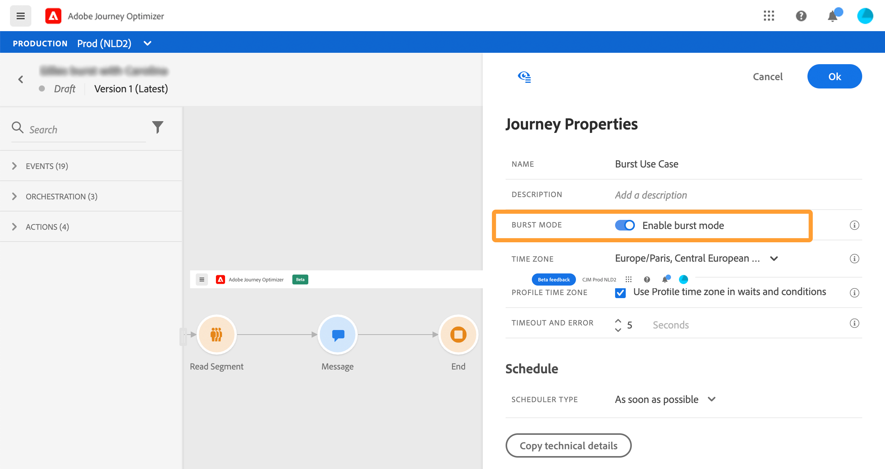

Burst mode will be deactivated if you modify a burst journey and add an activity that is not compliant with burst (message, any other action, an event etc.). A message will be displayed.

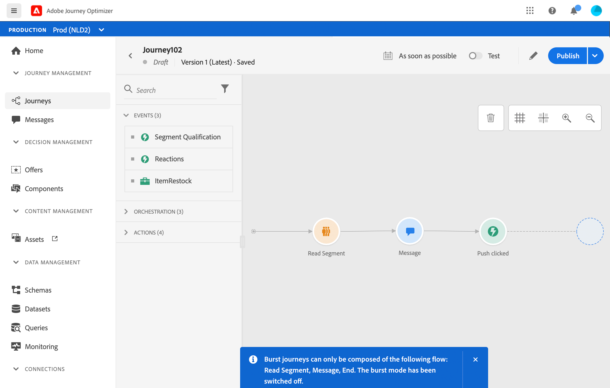

Then test and publish your journey normally. Test mode messages are not sent via the burst mode.

## Ending a journey

A journey can end for an individual because of two reasons:

* The person arrives at the last activity of a path. This last activity can be an end activity or another activity. There is no obligation to end a path with an end activity. See [this page](../building-journeys/end-activity.md).
* The person arrives at a condition activity (or a wait activity with a condition) and does not match any of the conditions.

The person can then re-enter the journey if re-entrance is allowed. See [this page](../building-journeys/journey-gs.md#change-properties)

A journey can close because of the following reasons:

* The journey is closed manually via the **[!UICONTROL Close to new entrances]** button. 
* A one-shot segment based journey that has finished executing.
* After the last occurrence of a recurring segment based journey.

When a journey is closed (for any of the reasons above), it will have the status **[!UICONTROL Closed]**. The journey will stop letting new individuals enter the journey. Persons already in the journey will finish the journey normally. After the default global timeout of 30 days, the journey will switch to the **Finished** status. See this [section](../building-journeys/journey-gs.md#global_timeout).

In case you need to stop the progress of all individuals in the journey, you can stop it. Stopping the journey will timeout all individuals in the journey.

Here is how you close or stop a journey manually:

The **[!UICONTROL Stop]** and **[!UICONTROL Close to new entrances]** options allow you to terminate **live** journeys. Closing a journey involves **that the arrival of new customers in the journey is blocked** and that the customers who already entered in the journey are able to experience it to the end. This is the most recommended way to put an end to a journey as it offers the best experience for customers. Stopping a journey involves that people who already entered a journey are all stopped in their progress. The journey is basically switched off.

>[!NOTE]
>
>Note that you cannot resume a closed or stopped journey.

### Closing a journey

You can close a journey manually to ensure that customers who already entered the journey can finish their path but new users are not able to enter the journey.

When closed, a journey will have the status **[!UICONTROL Closed]**. After the default global timeout of 30 days, the journey will switch to the **Finished** status. See this [section](../building-journeys/journey-gs.md#global_timeout).

A closed journey version cannot be restarted or deleted. You can create a new version of it or duplicate it. Only finished journeys can be deleted.

To close a journey from the list of journeys, click the **[!UICONTROL Ellipsis]** button that is located to the right of the journey name and select **[!UICONTROL Close to new entrances]**.

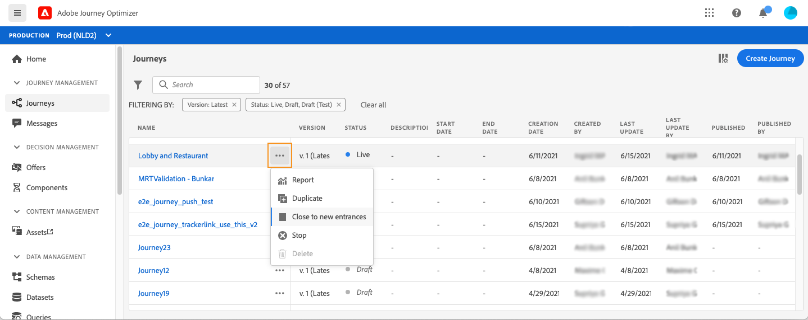

You can also:

1. In the **[!UICONTROL Journeys]** list, click on the journey you want to close.
1. On the top-right, click the down arrow.

    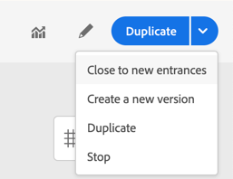

1. Click **[!UICONTROL Close to new entrances]**. A dialog box appears.
1. Click **[!UICONTROL Close to new entrances]** to confirm.

### Stopping a journey

You can stop a journey when an emergency occurred and all processing needs to be ended immediately on a journey.

A stopped journey version cannot be restarted.

When stopped, a journey will have the status **[!UICONTROL Stopped]**. 

You can stop a journey, for example, if a marketer realizes that the journey targets the wrong audience or a custom action supposed to deliver messages is not working correctly. To stop a journey from the list of journeys, click the **[!UICONTROL Ellipsis]** button that is located to the right of the journey name and select **[!UICONTROL Stop]**.

You can also:

1. In the **[!UICONTROL Journeys]** list, click on the journey you want to stop.
1. On the top-right, click on the down arrow.

  

1. Click **[!UICONTROL Stop]**. A dialog box appears.
1. Click **[!UICONTROL Stop]** to confirm.
