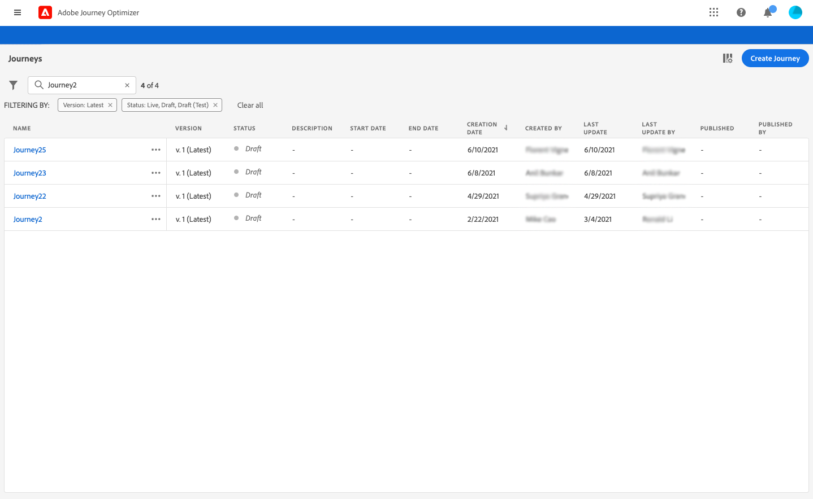
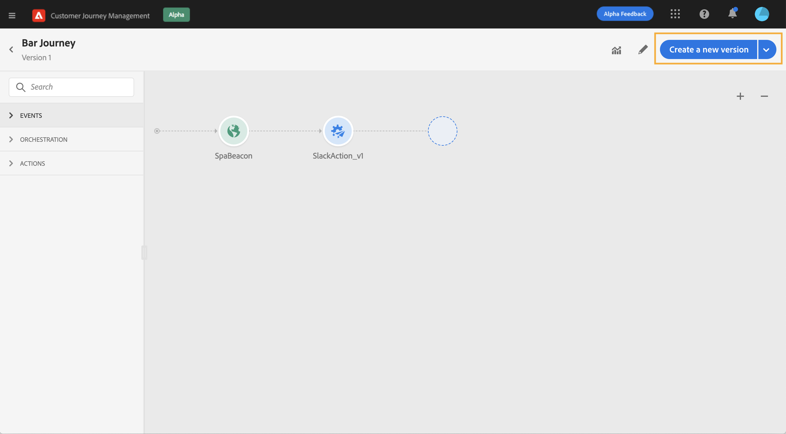
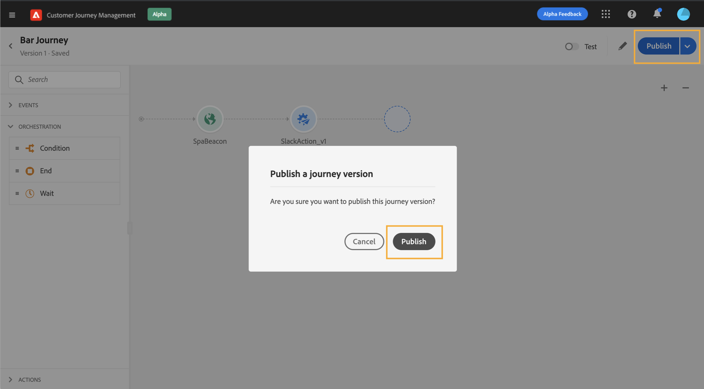

# Journey versions{#concept_ldc_k55_zgb}

In the journey list, all journey versions are displayed with the version number. See [this page](../building-journeys/using-the-journey-designer.md). 

When you search for a journey, newest versions appear at the top of the list the first time the application opens. Then, you can define the sorting you want and the application will keep it as a user preference. The journey's version is also displayed at the top of the journey edition interface, above the canvas.

If you need to modify to a live journey, you need to create a new version of your journey.

>[!NOTE]
>
>To learn more on journey versions limitations, see [this page](../building-journeys/limitations.md#journey-versions-limitations)

1. Open the latest version of your live journey, click **[!UICONTROL Create a new version]** and confirm.

    

    >[!NOTE]
    >
    >You can only create a new version from the latest version of a journey.

1. Make your modifications, click **[!UICONTROL Publish]** and confirm.

    

From the moment the journey is published, individuals will start to flow into the latest version of the journey. People who have already entered a previous version stay in it until they finish the journey. If they later re-enter the same journey, they will go into the latest version.

Journey versions can be stopped individually. All versions of journeys have the same name.

>[!NOTE]
>
>When you publish a new version of a journey, the previous version automatically ends and switches to the **Closed** status. No entrance in the journey will happen. Even if you stop the latest version, the previous version will stay closed.
