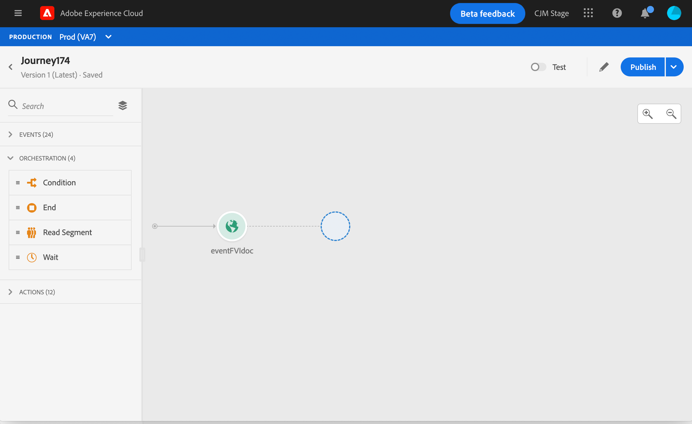
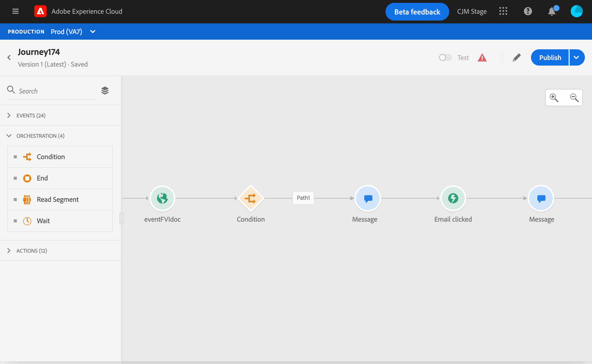
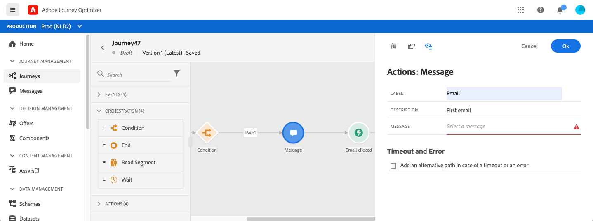
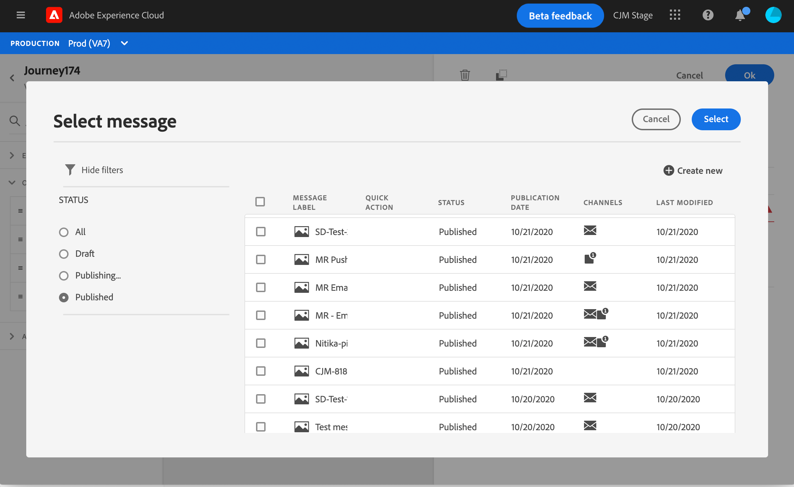
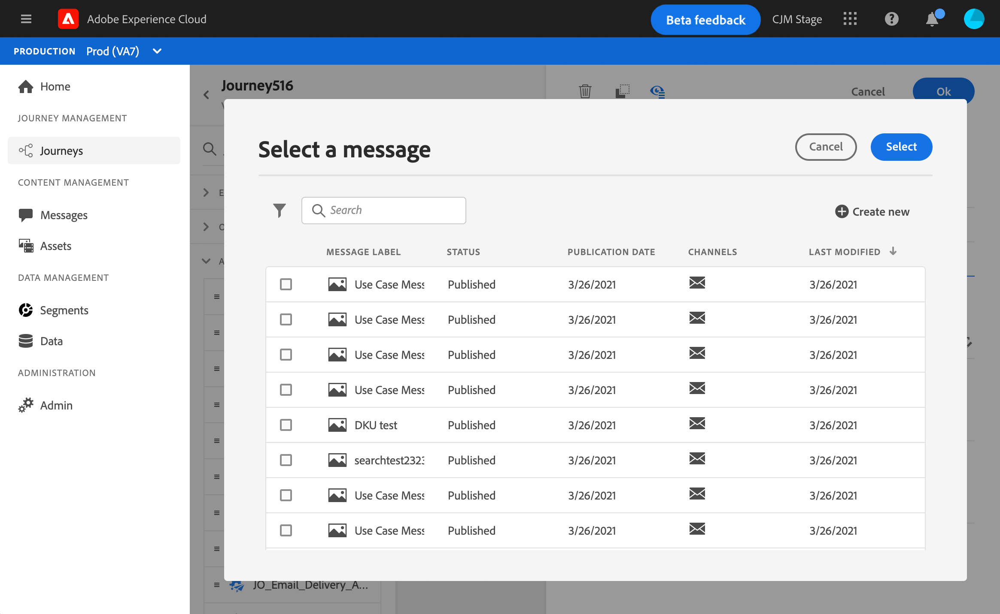
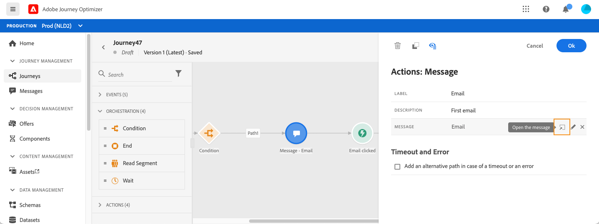
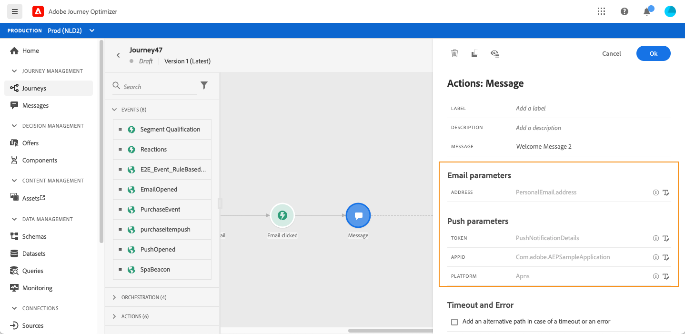

# Add a message in a journey

[!DNL Journey Optimizer] message capabilities are built-in, you just need to design your content and publish your message. See [this section](../get-started-content.md). Then you simply add, in your journey, a push or email message designed using Journey Optimizer. 

If you're using a third-party system to send your messages, you can create a custom action. Learn more in this [section](../action/action.md).

## Add a Message activity

1. As always, start your journey with an event or a **Read Segment** activity.

   

1. From the **Actions** section of the palette, drag and drop a **Message** activity into the canvas.  

   

1. Add a label and description.

   

1. Click inside the **Message** field. The list of available messages designed in Journey Optimizer is displayed. You can filter the list by status. 

   

1. Choose a message and click **Select**. You can also create a new message directly from this screen by clicking **Create message**.

   

   If you want to check your message, you can click the **Open the message** icon in the **Message** field. The message will open in a new tab.

   

1. Add the next steps to your journey.

## Email parameters and push parameters

The **[!UICONTROL Email parameters]** and **[!UICONTROL Push parameters]** sections show read-only fields. You typically perform this configuration when creating the message. See [this section](../get-started-content.md). 

To force a specific value, you can use the **Enable parameter override** icon to the right of the field. This option may be useful for testing purposes. For example, for an email, you can add your email address. After you have published the journey, the email is sent to you.

## Send-Time Optimization{#send-time-optimization}

### About Sent time optimization{#about-send-time-optimization}

>[!CONTEXTUALHELP]
>id="jo_bestsendtime_disabled"
>title="About Sent time optimization"
>abstract="Adobe Journey Optimizer's Send-Time Optimization feature, powered by Adobe’s AI services, can predict the best time to send an email or push message to maximize engagement based on historical open and click rates."

>[!NOTE]
>
>This feature is currently in beta version and only available to beta customers. To join the beta program, contact Adobe Customer Care.

Adobe Journey Optimizer's Send-Time Optimization feature, powered by Adobe’s AI services, can predict the best time to send an email or push message to maximize engagement based on historical open and click rates. Use our machine-learning model to schedule personalized send times for each user to grow the open and click rates of your messages.

The Send-Time Optimization model ingests your Adobe Journey Optimizer data and looks at user-level open (for email and push) and click (for email) rates to determine when your customers are most likely to engage with your messaging. Send-Time Optimization requires a minimum of one month of message-tracking data to make informed recommendations. For each user, the model outputs the following predictive data:

* The best hour of each day of the week to maximize engagement
* The best day of the week to maximize engagement
* The best hour of the best day of the week to maximize engagement

The model varies whether you are talking about scoring or training. Training is conducted weekly initially and then quarterly. Scoring is weekly initially and then monthly.

* Training - the development of the algorithm used to make the score
* Scoring - the application of a score to individual profiles based on the trained model

This information is stored with the user's profile and is referenced at journey execution to tell Adobe Journey Optimizer when to send your message. 

### Important notes{#send-time-optimization-notes}

* This feature is only available for mono-channel messages on email and push with tracking enabled.
* The message must be published.
* This feature is not compatible with burst mode.

### Activate Send-Time Optimization{#activate-send-time-optimization}

>[!CONTEXTUALHELP]
>id="jo_bestsendtime_email"
>title="Activate Send-Time Optimization"
>abstract="Choose whether to optimize on email opens or email click-throughs by selecting the appropriate radio button. You can also choose to bracket the send times used by the system by entering a value for the Send within the next option."

>[!CONTEXTUALHELP]
>id="jo_bestsendtime_push"
>title="Activate Send-Time Optimization"
>abstract="Push messages defaults to the opens option, as clicks are not applicable for push messaging. You can also choose to bracket the send times used by the system by entering a value for the Send within the next option."

Enable Send-Time Optimization on an email or push message by selecting the **Send-Time Optimization** switch from the Message activity parameters. 

For email messages, choose whether to optimize on email opens or email click-throughs by selecting the appropriate radio button. Push messages defaults to the opens option, as clicks are not applicable for push messaging. 

You can also choose to bracket the send times used by the system by entering a value for the **Send within the next** option. If you choose "six hours" as the value, [!DNL Journey Optimizer]will check each user profile to see if the optimal send time occurs within six hours from the journey execution time and select the Send-Time Optimization-determined time. If that time is not within the next six hours, [!DNL Journey Optimizer] will default to sending the message at journey execution time. 

