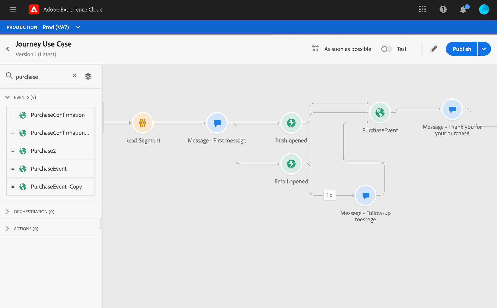
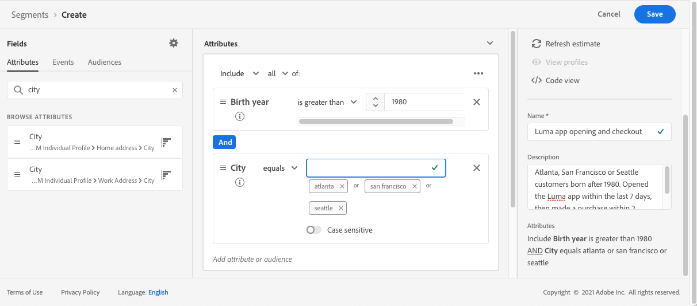
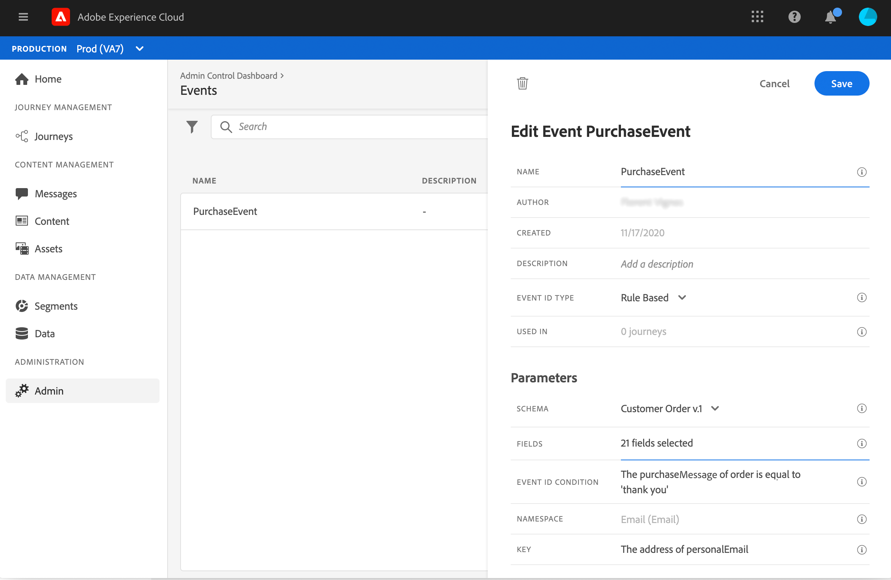
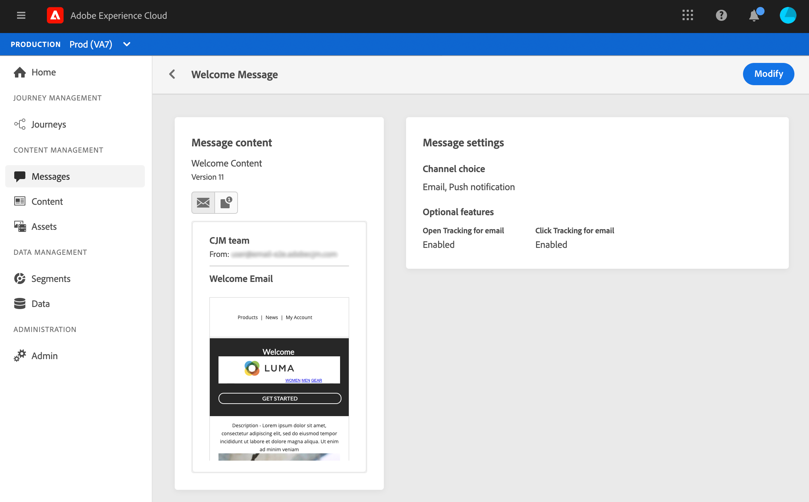
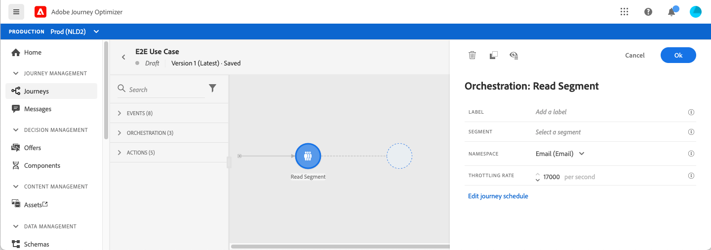

# Journey use case

This section presents a use case that combines a Read segment, an event, reaction events and email/push messages.

## Description of the use case

In this use case, we want to send a first message (email and push) to all customers belonging to a specific segment. 

Based on their reaction to the first message, we want to send specific messages.

After the first message, we wait one day for customers to open the push or email. If there is no reaction, we send them a follow-up email.

Then we wait for a purchase and send a push message to thank the customer. 

## Prerequisites

For this use case to work, you need to configure the following:

* a segment for all customers living in Atlanta, San Francisco, or Seattle and born after 1980.
* a purchase event
* three messages

### Create the segment

In our journey, we want to leverage a specific segment of customers. All individuals belonging to the segment enter the journey and follow the different steps. In our example, we need a segment that targets all customers living in Atlanta, San Francisco, or Seattle and born after 1980. 

For more information on segments, refer to this [page](../segment/about-segments.md).

1. From the **[!UICONTROL Segments]** menu, click **[!UICONTROL Create segment]**.

1. In the **[!UICONTROL Segment properties]** pane, enter a name for the segment.

1. Drag and drop the desired fields from the left pane into the center workspace, and then configure them according to your needs. In this example, we use the **City** and **Birth year** attributes fields.

1. Click **[!UICONTROL Save]**. 

   

The segment is now created and ready to be used in your journey. Using a **Read segment** activity, you can make all individuals belonging to the segment enter the journey. 

### Configure the event

You need to configure an event that is sent to your journey when a customer makes a purchase. When the journey receives the event, it triggers the "thank you" message.

For this, we use a rule-based event. For more information on events, refer to this [page](../event/about-events.md).

1. In the ADMINISTRATION section, browse to **[!UICONTROL Configurations]**, then click **[!UICONTROL Events]**. Click **[!UICONTROL Add]** to create a new event. 

1. Enter the name of your event.

1. In the **[!UICONTROL Event ID type]** field, select **[!UICONTROL Rule Based]**. 

1. Define the **[!UICONTROL Schema]** and payload **[!UICONTROL Fields]**. You can use several fields, for example, the product purchased, the purchase date and the purchase id. 

1. In the **[!UICONTROL Event ID condition]** field, define the condition used by the system to identify the events that trigger your journey. For example, you can add a `purchaseMessage` field and define the following rule: `purchaseMessage="thank you"`

1. Define the **[!UICONTROL Namespace]** and **[!UICONTROL Key]**.

1. Click **[!UICONTROL Save]**. 

   

The event is now configured and ready to be used in your journey. Using the corresponding event activity, you can trigger an action every time a customer makes a purchase.

### Create the messages

For this use case, we need to create three messages:

* a push and email first message
* a push "thank you" message 
* an email follow-up message

Refer to this [section](../segment/about-segments.md) to learn how to design and publish these messages.

## Design the journey

1. Start the journey with a **Read segment** activity. Select the segment created previously. All individuals belonging to the segment enter the journey.

   

1. Drop a **Message** activity and select the push and email first message. This message is sent to all individuals in the journey.

   

1. Place your cursor on the message activity and click on the “+” symbol to create a new path.

1. In the first path, add a **Reaction** event and select **Push opened**. The event is triggered when an individual belonging to the segment opens the push version of the first message.

1. In the second path, add a **Reaction** event and select **Email opened**. The event is triggered when the individual opens the email. 

1. In one of the reaction activities, check the **Define the event timeout** box, define a duration (1 day in our example) and check **Set a timeout path**. This creates another path for individuals who do not open the push or email first message.

   >[!NOTE]
   >
   >When configuring a timeout on multiple events (the two reactions in this case), you only need to configure the timeout on one these events.

1. In the timeout path, drop a **Message** activity and select the email follow-up message. This message is sent to the individuals who do not open the email or push first message in the next day.

1. Connect the three paths to the purchase event created previously. The event is triggered when an individual makes a purchase.

1. After the event, drop a **Message** activity and select the email "thank you" message. 

1. Add an **End** activity.

## Test and publish the journey

1. Before testing your journey, verify that it is valid and that there is no error.

1. Click on the **Test** toggle, located in the top right corner, to activate the test mode. Define how you want test profiles to enter the test: a single profile, or up to 100 at once. Refer to this [section](testing-the-journey.md) to learn how to use the test mode.

1. When the journey is ready, publish it using the **Publish** button, located in the top right corner.
