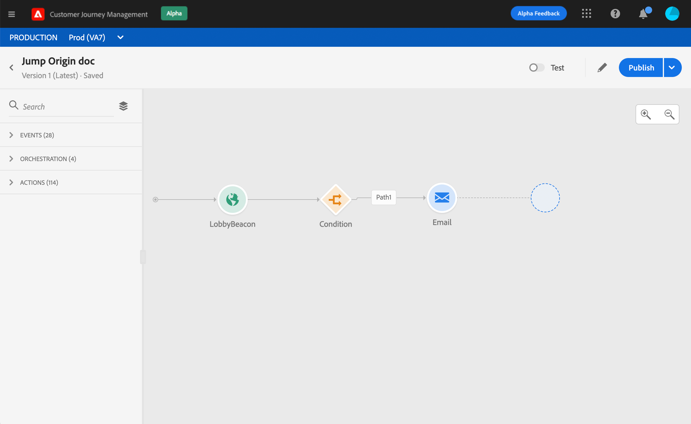
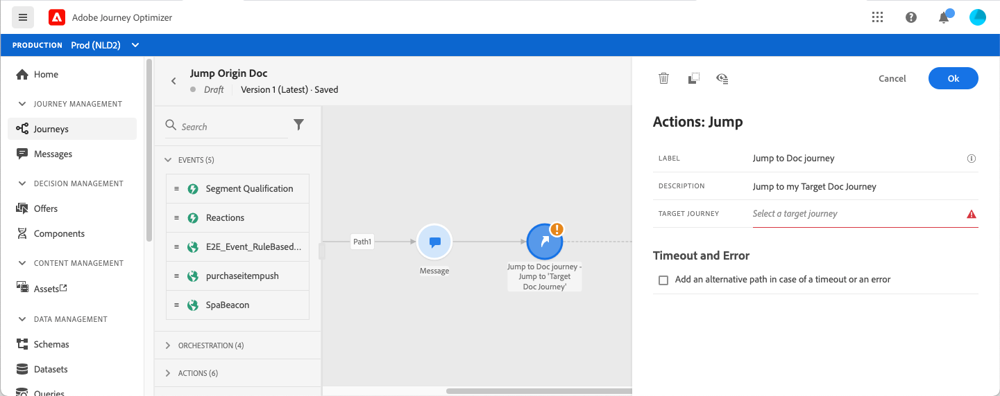
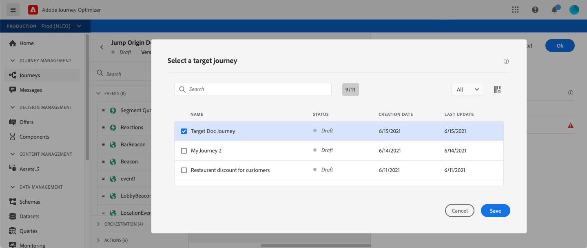
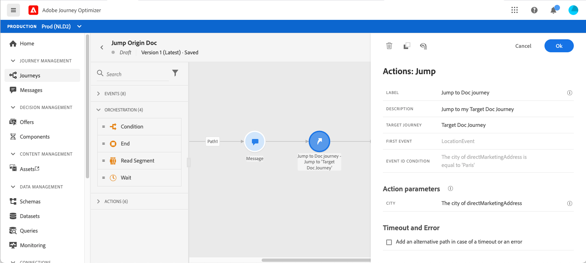
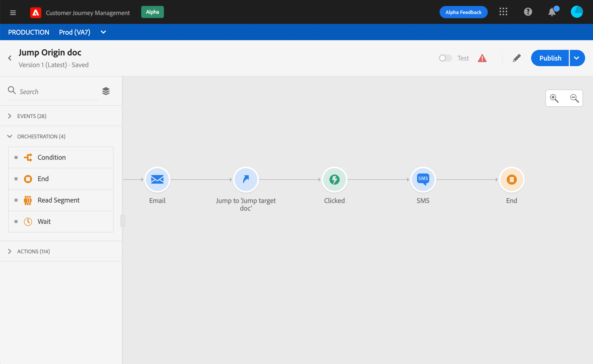
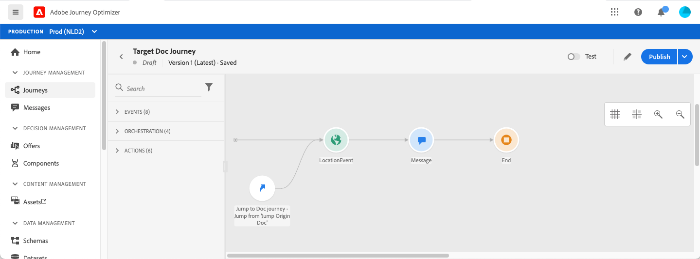
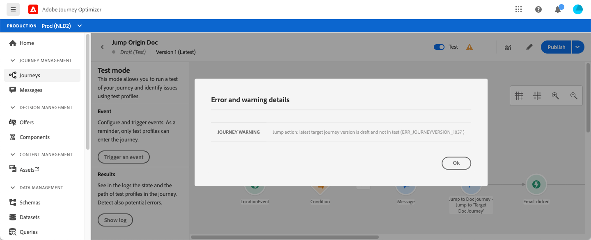

# Jumping from one journey to another {#jump}

The **[!UICONTROL Jump]** action activity allows you to push individuals from one journey to another. This feature allows you to:

* simplify the design of very complex journeys by splitting them into several ones  
* build journeys based on common and reusable journey patterns

In the origin journey, simply add a **[!UICONTROL Jump]** activity and select a target journey. When the individual enters the **[!UICONTROL Jump]** step, an internal event is sent to the first event of the target journey. If the **[!UICONTROL Jump]** action is successful, the individual continues to progress in the journey. The behavior is similar to other actions.

In the target journey, the first event triggered internally by the **[!UICONTROL Jump]** activity will make the individual flow in the journey.

>[!NOTE]
>
>Also refer to the tutorial video [here](https://experienceleague.adobe.com/docs/journey-orchestration-learn/tutorials/building-a-journey/jumping-to-another-journey.html)

## Lifecycle

Let's say you have added a **[!UICONTROL Jump]** activity in a journey A to a journey B. Journey A is the **origin journey** and journey B, the **target journey**. 
Here are the different steps of the execution process:

**Journey A** is triggered from an external event:

1. Journey A receives an external event related to an individual.
1. The individual reaches the **[!UICONTROL Jump]** step. 
1. The individual is pushed to Journey B, and moves on to the next steps in Journey A, after the **[!UICONTROL Jump]** step.

In journey B, the first event is triggered internally, via the **[!UICONTROL Jump]** activity from journey A:

1. Journey B received an internal event from Journey A.
1. The individual starts flowing in Journey B.

>[!NOTE]
>
>Journey B can also be triggered via an external event.

## Best practices and limitations

### Authoring

* The **[!UICONTROL Jump]** activity is only available in journeys that use a namespace.
* You can only jump to a journey that uses the same namespace as the origin journey.
* You cannot jump to a journey that starts with a **Segment qualification** event or **Read segment**. 
* You cannot have a **[!UICONTROL Jump]** activity and a **Segment qualification** event or **Read segment** in the same journey.
* You can include as many **[!UICONTROL Jump]** activities as you need in a journey. After a **[!UICONTROL Jump]**, you can add any activity needed.
* You can have as many jump levels as needed. For example, Journey A jumps to journey B, which jumps to journey C, and so on.
* The target journey can also include as many **[!UICONTROL Jump]** activities as needed.
* Loop patterns are not supported. There is no way to link two or more journeys together which would create an infinite loop. The **[!UICONTROL Jump]** activity configuration screen prevents you from doing this.

### Execution

* When the **[!UICONTROL Jump]** activity is executed, the latest version of the target journey is triggered.
* As usual, a unique individual can only be present once in a same journey. As a result, if the individual pushed from the origin journey is already in the target journey, then the individual will not enter the target journey. No error will be reported on the **[!UICONTROL Jump]** activity because this is a normal behavior.

## Configuring the Jump activity

1. Design your **origin journey**.

   

1. At any step of the journey, add a **[!UICONTROL Jump]** activity, from the **[!UICONTROL ACTIONS]** category. Add a label and description.

   

1. Click inside the **Target journey** field. 
   The list displays all journey versions that are draft, live or in test mode. Journeys that use a different namespace or that start with a **Segment qualification** event are not available. Target journeys that would create a loop pattern are also filtered out.

   

   >[!NOTE]
   >
   >You can click the **Open target journey** icon, on the right side, to open the target journey in a new tab.

1. Select the target journey that you want to jump to.
   The **First event** field is prefilled with the name of the target journey's first event. If your target journey includes multiple events, the **[!UICONTROL Jump]** is only allowed on the first event.

   

1. The **Action parameters** section displays all the fields of the target event. In the same way as for other types of actions, map each field with fields from the origin event or data source. This information will be passed to the target journey at runtime.
1. Add the next activities to finish your origin journey.

   

   >[!NOTE]
   >
   >The individual's identity is automatically mapped. This information is not visible in the interface.

Your **[!UICONTROL Jump]** activity is configured. As soon as your journey is live or in test mode, individuals reaching the **[!UICONTROL Jump]** step will be pushed from to the target journey.

When a **[!UICONTROL Jump]** activity is configured in a journey, a **[!UICONTROL Jump]** entry icon is automatically added at the beginning of the target journey. This helps you identify that the journey can be triggered externally but also internally from a **[!UICONTROL Jump]** activity. 

## Troubleshooting

When the journey is published or in test mode, errors will happen if:
* the target journey no longer exists
* the target journey is draft, closed or stopped
* if the first event of the target journey has changed and the mapping is broken

