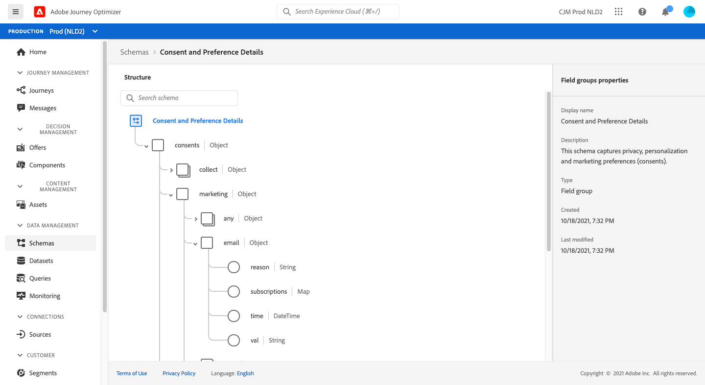
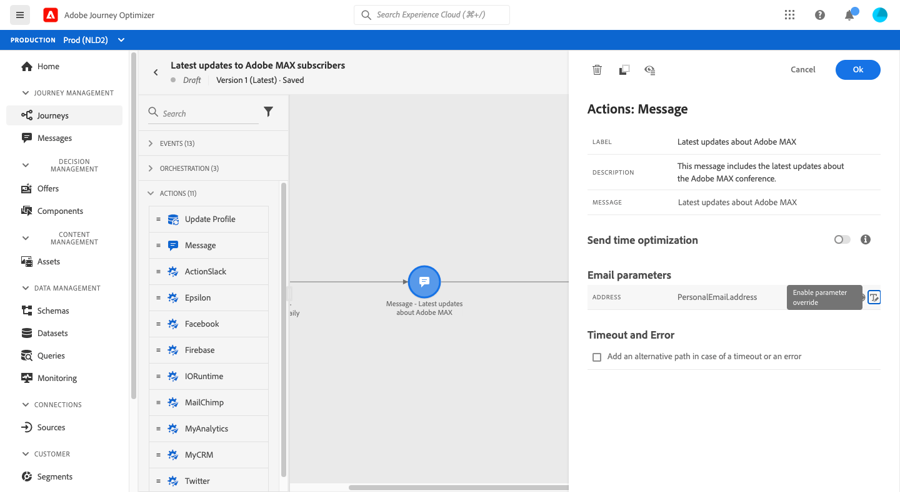
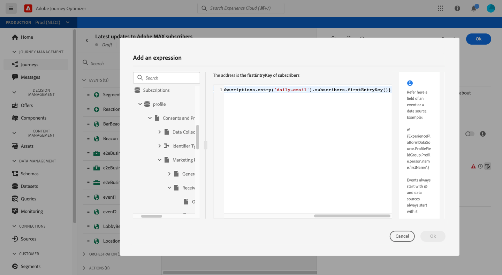
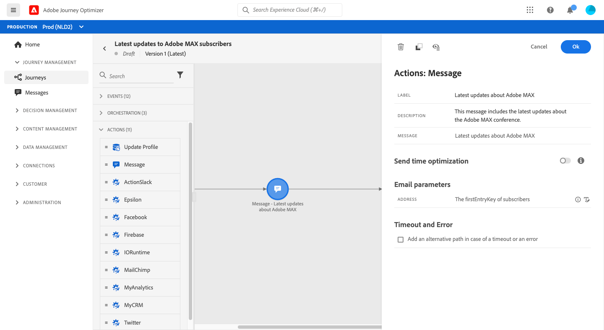

# Send a message to the subscribers of a list

The purpose of this use case is to create a journey to send a message to the subscribers of a list.

In this example, the **[!UICONTROL Consent and Preference Details]** field group from [!DNL Adobe Experience Platform] is used. To find this field group, from the **[!UICONTROL Data Management]** menu, choose **[!UICONTROL Schemas]**. On the **[!UICONTROL Field groups]** tab, enter the name of the field group in the search field.



To configure this journey, follow these steps:

1. Create a journey that starts with a **[!UICONTROL Read]** activity. [Read more](journey-gs.md).
1. Add a **[!UICONTROL Message]** activity, with an email, to the journey. [Read more](journeys-message.md).
1. In the **[!UICONTROL Email parameters]** section of the **[!UICONTROL Message]** activity settings, replace the default email address (`PersonalEmail.adress`) with the email address of the list subscribers:

   1. Click the **[!UICONTROL Enable parameter override]** icon at the right of the **[!UICONTROL Address]** field, then click the **[!UICONTROL Edit]** icon.

      

      To be able to modify the email address, you must have previously published the message.

   1. In the expression editor, enter the expression to retrieve the subscribers' email addresses. [Read more](expression/expressionadvanced.md).

      This example shows an expression that includes references to map fields:

      ```json
      #{ExperiencePlatform.Subscriptions.profile.consents.marketing.email.subscriptions.entry('daily-email').subscribers.firstEntryKey()}
      ```
      
      In this example, these functions are used:

      | Function | Description | Example |
      | --- | --- | --- |
      | `entry` | Refer to a map element according to the selected namespace | Refer to a specific subscription list |
      | `firstEntryKey` | Retrieve the first entry key of a map | Retrieve the first email address of subscribers |

      In this example, the subscription list is named `daily-email`. Email addresses are defined as keys in the `subscribers` map, which is linked to the subscription list map.

      Read more about [references to fields](expression/field-references.md) in expressions.

      

    1. In the **[!UICONTROL Add an expression]** dialog box, click **[!UICONTROL Ok]**.

      

1. End the journey with an **[!UICONTROL End]** activity.
