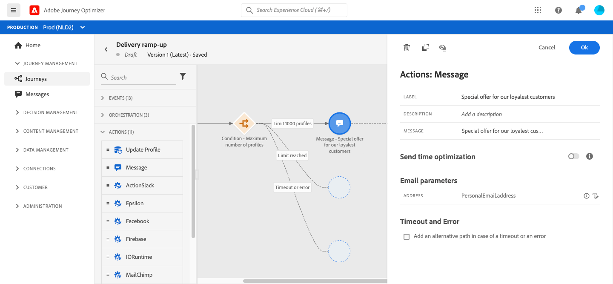

# Use case: ramp up your deliveries

If you recently moved to another email service provider, IP address, or email domain or subdomain, you need to establish your reputation as a sender. Otherwise, your deliveries might be blocked or moved to the spam folder of the recipients' mailbox. Learn how to increase your email reputation with IP warming in the [Deliverability Best Practice Guide](https://experienceleague.adobe.com/docs/deliverability-learn/deliverability-best-practice-guide/additional-resources/generic-resources/increase-reputation-with-ip-warming.html){target="_blank"}.

To warm up your IP, you can gradually ramp up the number of your deliveries. Read more about [optimizing deliverability in Journey Optimizer](../deliverability.md).

The purpose of this use case is to create a journey to ramp up your email deliveries. To configure this journey, follow these steps:

1. Create a journey. [Read more](journey-gs.md).

1. Add a **[!UICONTROL Condition]** activity to the journey. [Read more](condition-activity.md).

1. In the **[!UICONTROL Condition]** activity settings, set the maximum number of recipients for your delivery:

   1. In the **[!UICONTROL Condition]** activity settings, set the **[!UICONTROL Type]** field to **[!UICONTROL Profile cap]**. [Read more](condition-activity.md#profile_cap).

   1. Set the **[!UICONTROL Limit]** field to the maximum number of recipients for this delivery.

    

      You can gradually increase this limit up to the total number of your subscribers.

1. Add a **[!UICONTROL Message]** activity to the first path after the **[!UICONTROL Condition]** activity.

    

    When the journey runs, the message is sent the selected recipients, up to the maximum number of recipients that you have specified. When this limit is reached, the selected recipients take the second path.

1. Complete the journey with the activities of your choice.

After your IP has warmed up, you can remove this condition.

