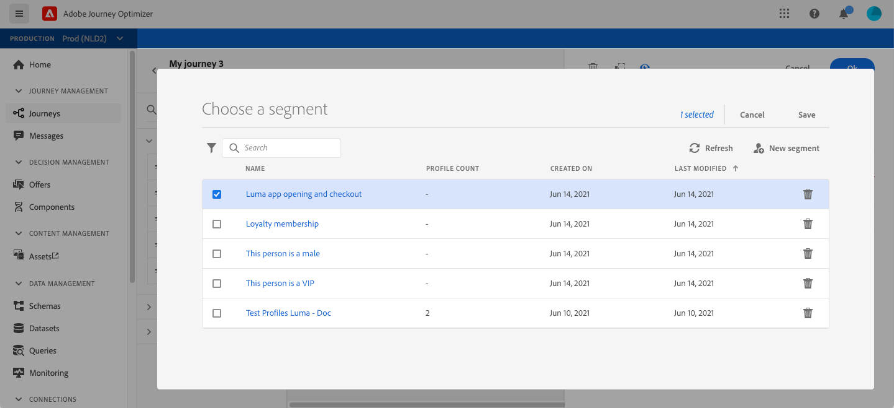
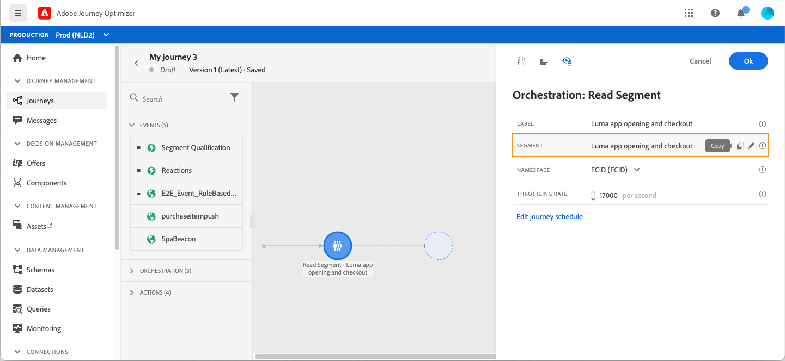
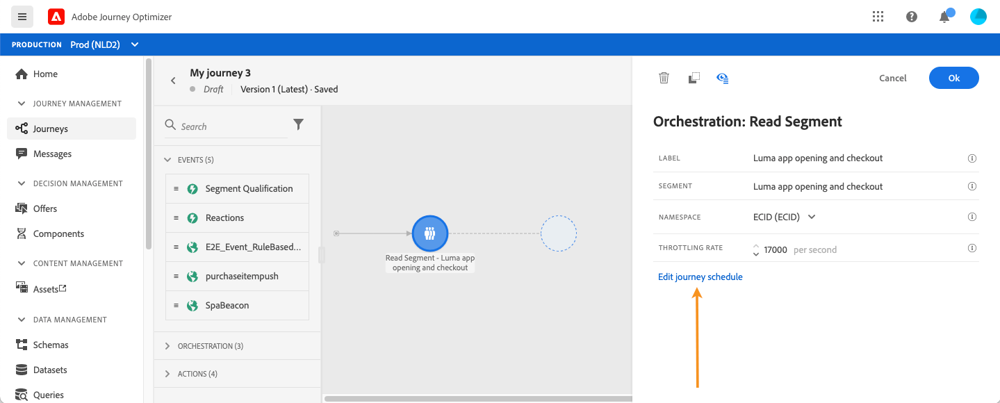
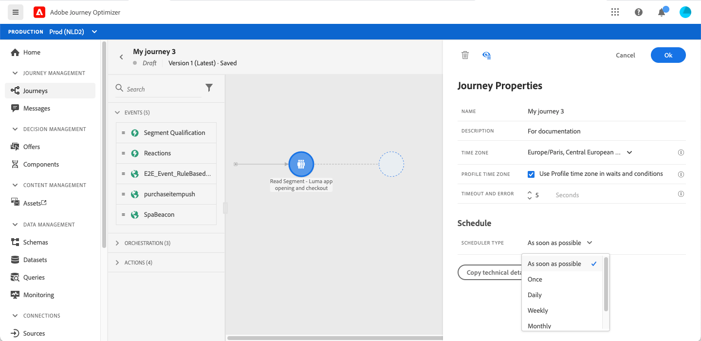
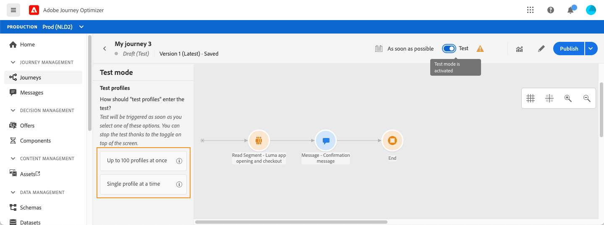
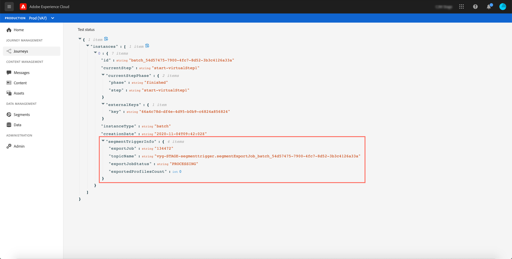
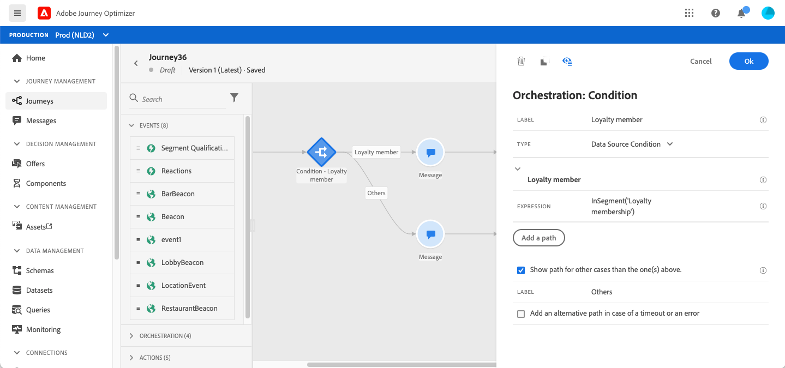
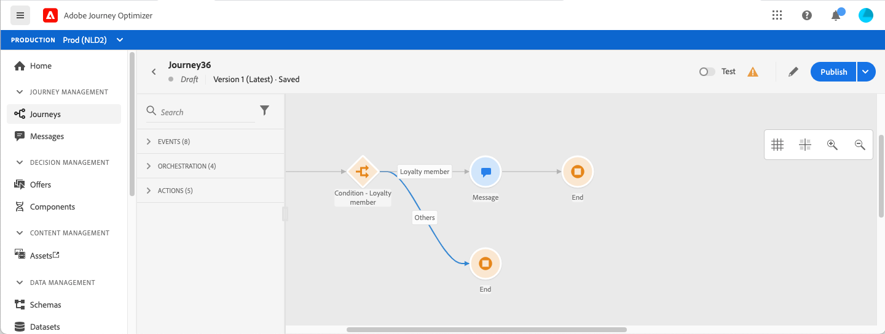
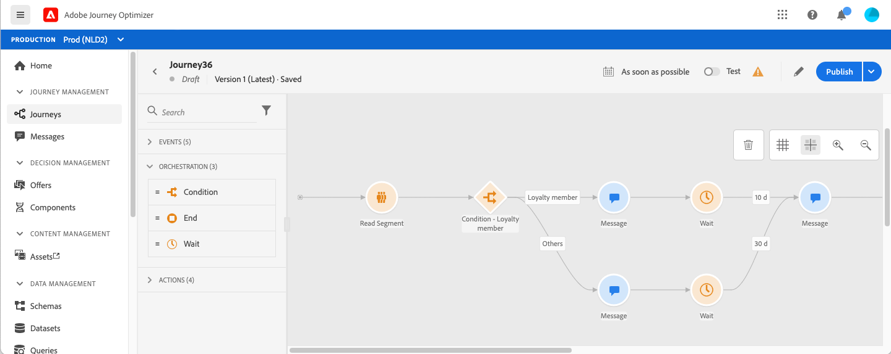

# Use a segment in a journey {#segment-trigger-activity}

## About the Read Segment activity {#about-segment-trigger-actvitiy}

The Read Segment activity allows you to make all individuals belonging to an Adobe Experience Platform segment enter a journey. Entrance into a journey can be executed either once, or on a regular basis.

Let's take as an example the "Luma app opening and checkout" segment created in the [Build segments](../segment/about-segments.md) use case. With the Read Segment activity, you can make all individuals belonging to this segment enter a journey and make them flow into individualized journeys that will leverage all journey functionalities: conditions, timers, events, actions.

>[!NOTE]
>
>It is not possible to trigger a segment-based journey in a shorter timeframe than 1 hour.
>
>The Burst paid add-on allows very fast push message sending in large volumes for simple journeys that include a read segment and a simple push message. For more information, refer to [this section](../building-journeys/journey-gs.md#burst)

### Configure the activity {#configuring-segment-trigger-activity}

The steps to configure the Read Segment activity are as follows:

1. Unfold the **[!UICONTROL Orchestration]** category and drop a **[!UICONTROL Read Segment]** activity into your canvas.

    The activity must be positioned as the first step of a journey.

1. Add a **[!UICONTROL Label]** to the activity (optional).

1. In the **[!UICONTROL Segment]** field, choose Adobe Experience Platform segment that will enter the journey, then click **[!UICONTROL Save]**.

    Note that you can customize the columns displayed in the list and sort them.

    >[!NOTE]
    >
    >Only the individuals with the **Realized** and **Existing** segment participation statuses will enter the journey. For more on how to evaluate a segment, refer to the [Segmentation Service documentation](https://experienceleague.adobe.com/docs/experience-platform/segmentation/tutorials/evaluate-a-segment.html?lang=en#interpret-segment-results). 

    

   Once the segment is added, the **[!UICONTROL Copy]** button allows you to copy its name and ID:

   `{"name":"Luma app opening and checkout",”id":"8597c5dc-70e3-4b05-8fb9-7e938f5c07a3"}`

   

1. In the **[!UICONTROL Namespace]** field, choose the namespace to use in order to identify the individuals. [Learn more about namespaces](../event/about-creating.md#select-the-namespace).

    >[!NOTE]
    >
    >Individuals belonging to a segment that does not have the selected identity (namespace) among their different identities cannot enter the journey.

1. The **[!UICONTROL Read Segment]** activity allows you to specify the time at which the segment will enter the journey. To do this, click the **[!UICONTROL Edit journey schedule]** link to access the journey's properties, then configure the **[!UICONTROL Scheduler type]** field.

    

    By default, segments enter the journey **[!UICONTROL As soon as possible]**, meaning 1 hour after the journey is published. If you want to make the segment enter the journey on a specific date/time or on a recurring basis, select the desired value from the list.

    >[!NOTE]
    >
    >Note that the **[!UICONTROL Schedule]** section is only available when a **[!UICONTROL Read Segment]** activity has been dropped in the canvas.

    

### Test and publish the journey {#testing-publishing}

The **[!UICONTROL Read Segment]** activity allows you to test the journey either on a unitary profile, or on 100 randomly test profiles selected among the profiles qualified for the segment.

To do this, activate the test mode, then select the desired option from the left pane.

You can then configure and run the test mode as usual. [Learn how to test a journey](testing-the-journey.md).

Once the test is running, the **[!UICONTROL Show logs]** button allows you to see the test results according to the selected test option:

* **[!UICONTROL Single profile at a time]**: the test logs display the same information as when using the unitary test mode. For more on this, refer to [this section](testing-the-journey.md#viewing_logs)

* **[!UICONTROL Up to 100 profiles at once]**: the test logs allow you to track the progression of the segment export from Adobe Experience Platform, as well as the individual progress of all the persons that entered the journey.

    Note that testing the journey using up to 100 profiles at once does not allow you to track the progress of the individuals in the journey using the visual flow.

    

Once the tests are successfull, you can publish your journey (see [Publishing the journey](publishing-the-journey.md)). Individuals belonging to the segment will enter the journey on the date/time specified in the journey's properties **[!UICONTROL Scheduler]** section.

>[!NOTE]
>
>When a segment-based journey that is not recurrent ("starting as soon as possible" or "once") is executed, its status is automatically changed to "closed".
>
>For recurring segment-based journeys, the journey will automatically close once its last occurrence is executed. If no end date/time has been specified, you will have to close the journey to new entrances manually to end it.

## Audience targeting in segment-based journeys

Segment-based journeys always start with a **Read Segment** activity to retrieve individuals belonging to an Adobe Experience Platform segment.

The audience belonging to the segment is retrieved once or on a regular basis.

After entering the journey, you can create audience orchestration use cases, making individuals from the initial segment flow into different branches of the journey. 

**Segmentation**

You can use conditions to perform segmentation using the **Condition** activity. For example, you can make VIP persons take a particular path and non-VIP flow in another path.

The segmentation can be based on:

* data source data
* the context of events part of the journey data, for example: did a person click on the message she received an hour ago?
* a date, for example: are we in June when a person go through the journey?
* a time, for example: is it morning in the person’s timezone?
* an algorithm splitting the audience flowing in the journey based on a percentage, for example: 90% - 10% to exclude a control group

**Exclusion**

The same **Condition** activity used for segmentation (see above) also allows you to exclude part of the population. For example, you can exclude VIP persons by making them flow into a branch with an end step right after.

This exclusion could happen right after segment retrieval, for population counting purposes or along a multistep journey.

**Union**

Journeys allow you to create N branches and join them together after a segmentation.

As a result, you can make two audiences return to a common experience.

For example, after following a different experience during ten days in a journey, VIP and non-VIP customers can return to the same path.

After a union, you can split the audience again by performing a segmentation or an exclusion.

