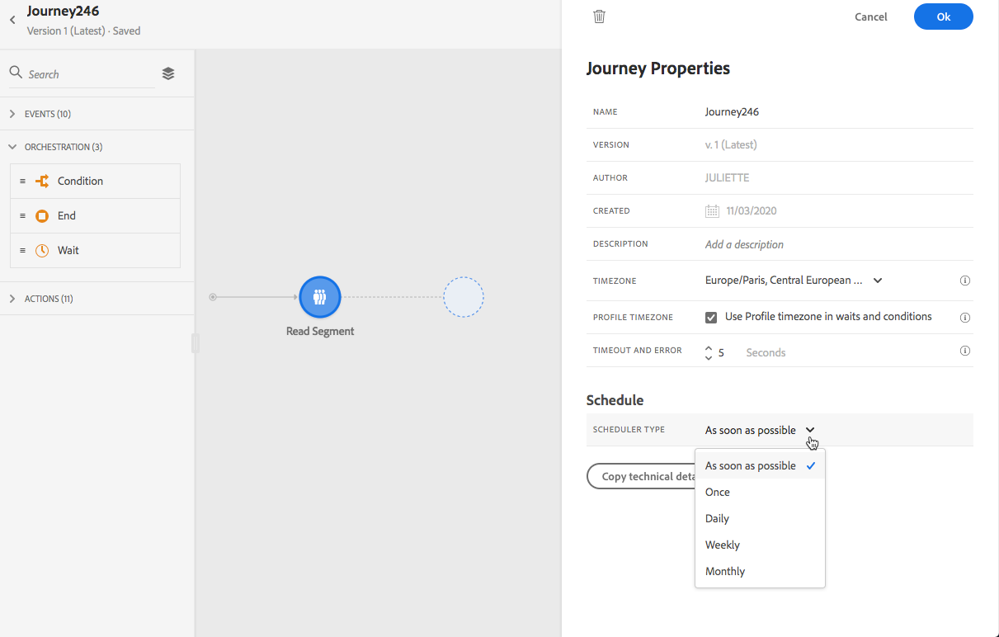
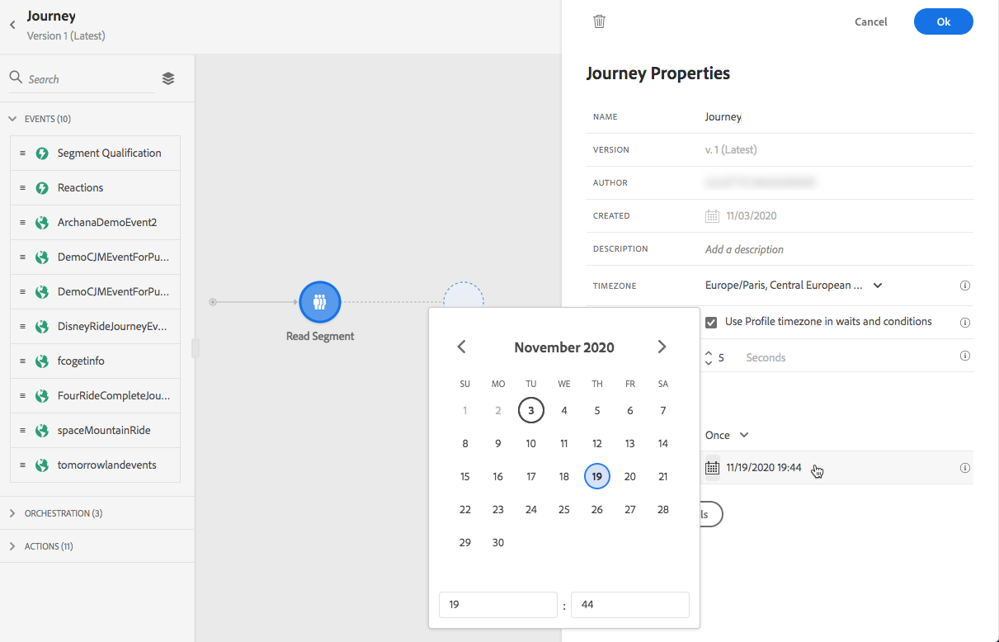
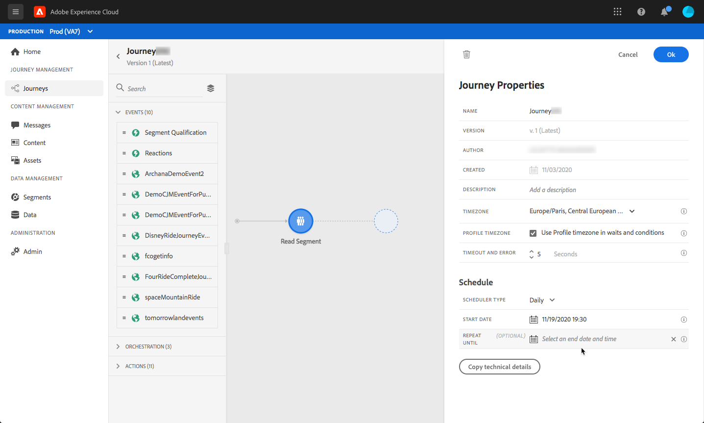

# Journey execution {#message-execution}

## Test your journey

You can test your journey using test profiles. This step is recommended to validate your settings and messages.

Learn more in this [section](testing-the-journey.md).

## Activate your journey

You must publish your journey to activate it. 

Learn more in this [section](publishing-the-journey.md).

Once published, you can monitor your journey using the dedicated reporting tools to measure your journey's effectiveness. 

[Learn more about reports](../reports/live-report.md) 

## Send messages {#send-messages}

When your message has a content defined and is published, it is ready to be sent through a [journey](journey.md).

>[!NOTE]
>
>You can add a message that is still in draft mode to a journey, but make sure the message is published before publishing the journey.

Once a message is sent, you can monitor its execution through multiple indicators. [Learn more about monitoring message execution](../message-monitoring.md).

## Schedule messages {#schedule-messages}

Messages can be scheduled through the **[!UICONTROL Read Segment]** activity in a [journey](journey.md). You can specify when the segment will enter the journey. [Learn more about the Read Segment activity](read-segment.md).

To do this, follow the steps below:

1. Edit a journey, drag and drop a **[!UICONTROL Read Segment]** activity and start configuring it. [Learn more about configuring the Read Segment activity](read-segment.md#configuring-segment-trigger-activity).

1. Click the **[!UICONTROL Edit journey schedule]** link to access the journey's properties.
    
    

1. Configure the **[!UICONTROL Scheduler type]** field: select the desired value from the list to make the segment enter the journey on a specific date/time, or on a recurring basis.

    >[!NOTE]
    >
    >The **[!UICONTROL Schedule]** section is only available when a **[!UICONTROL Read Segment]** activity has been dropped into the canvas.

    

1. If you select **[!UICONTROL Once]**, define a specific date and time at which the segment will enter the journey.

    

1. If you select a recurring method, edit the start date and time. You can also define an optional end date and time.

    

    >[!NOTE]
    >
    >By default, segments enter the journey **[!UICONTROL As soon as possible]**, meaning 1 hour after the journey is published.

1. Click **[!UICONTROL OK]** to save your changes.

<!--Unitary messages that are triggered by an event within a journey cannot be scheduled.-->
