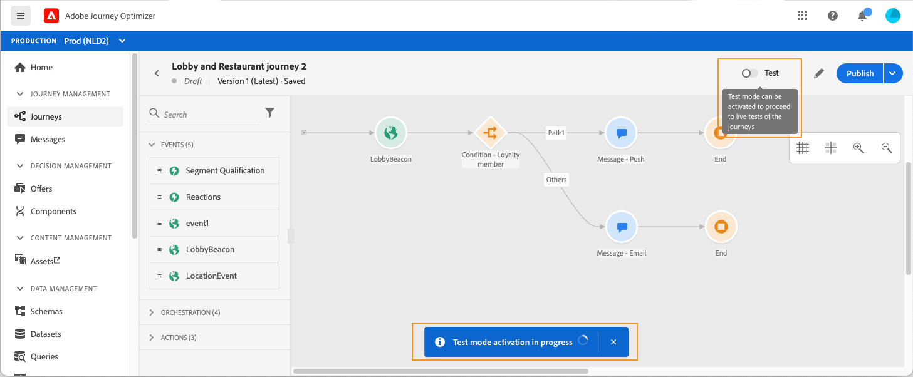
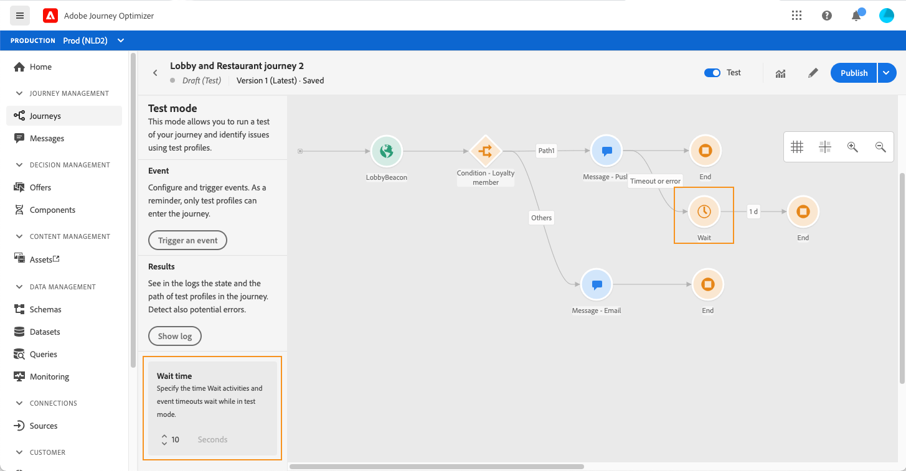
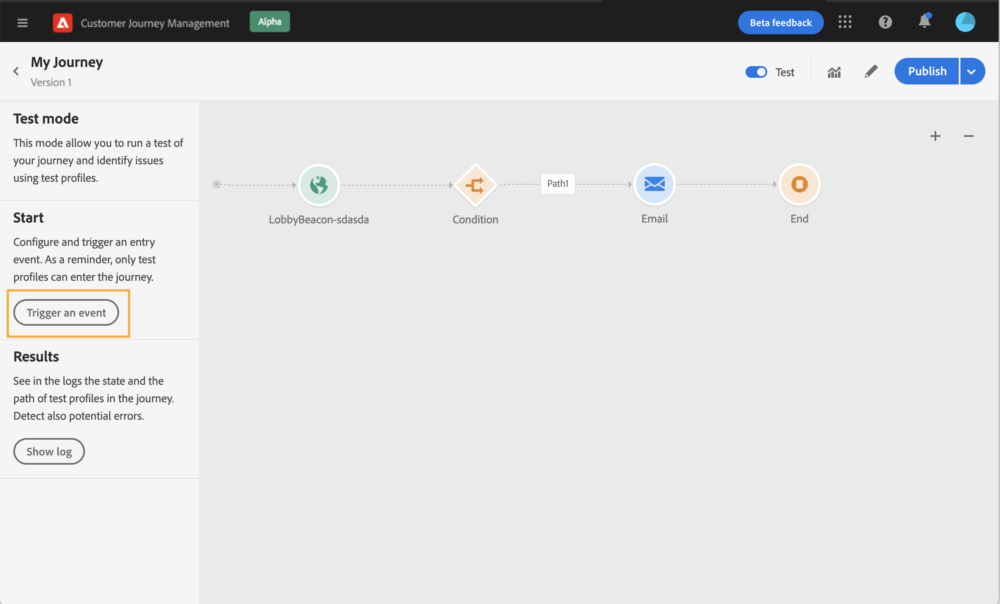
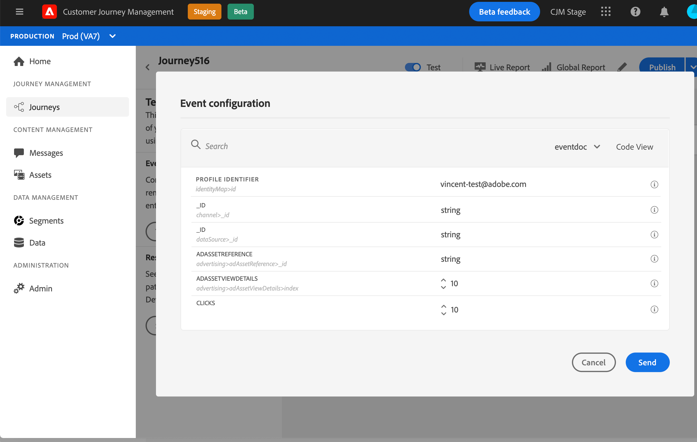
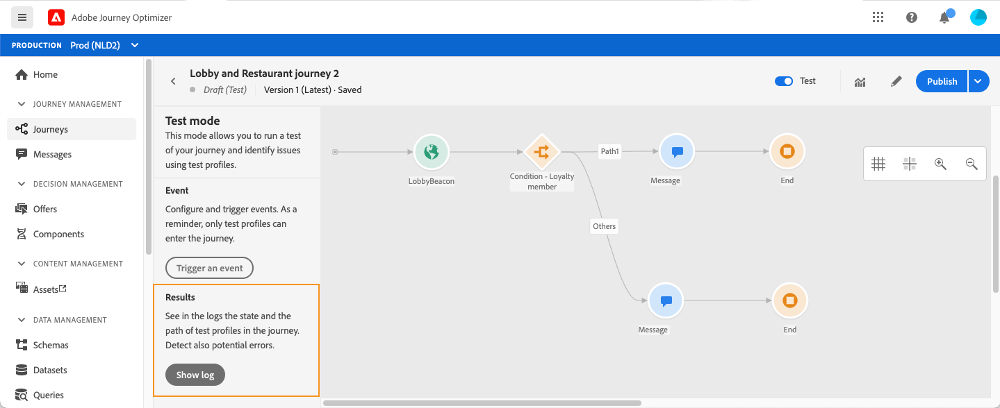
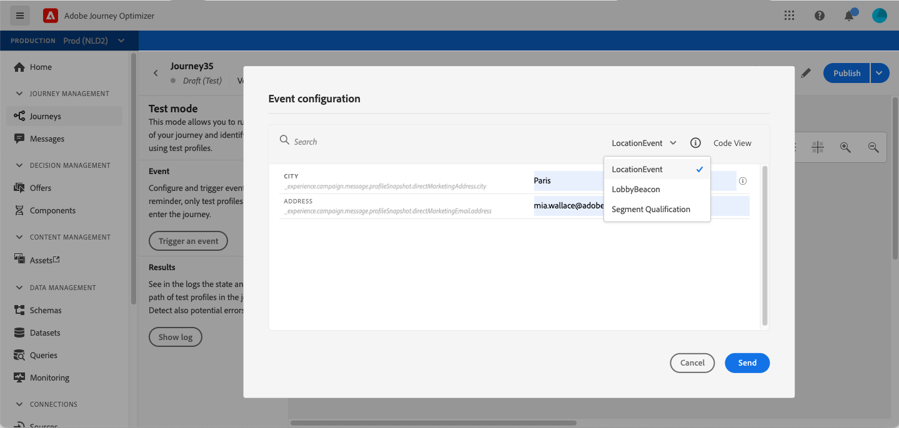
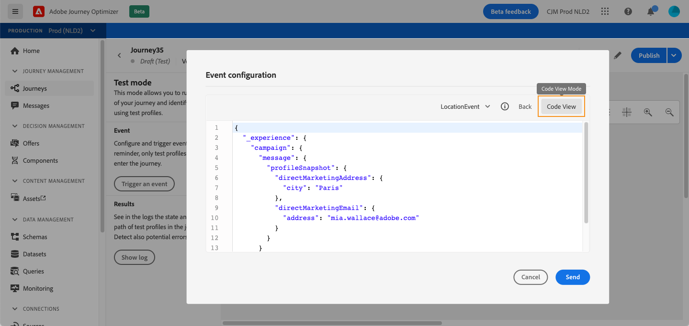
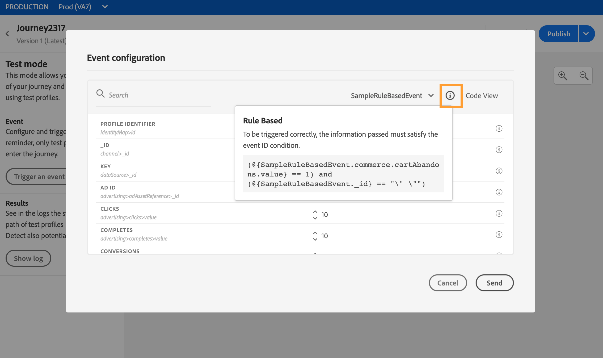
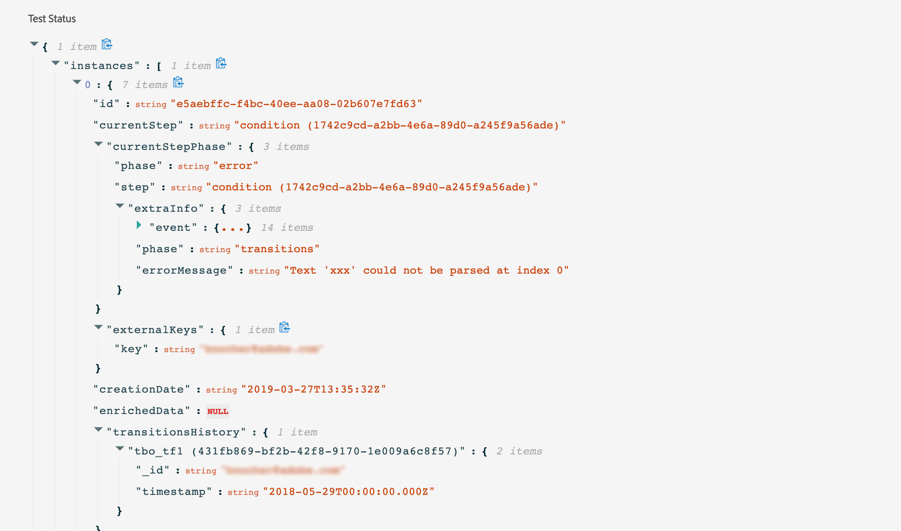

# Testing the journey{#testing_the_journey}

Before being able to test your journey, you must resolve all errors if any. See [this section](../building-journeys/troubleshooting.md#section_h3q_kqk_fhb).

You have the possibility to test your journey before its publication, using test profiles. This allows you to analyze how individuals flow in the journey and troubleshoot before publication.

Only test profiles can enter a journey in test mode. You can either create a new test profile or turn an existing profile into a test profile. Refer to this [section](../building-journeys/creating-test-profiles.md). 

To use the test mode, follow these steps:

1. Before testing your journey, verify that it is valid and that there is no error. You won’t be able to launch a test of a journey with errors. See [this section](../building-journeys/troubleshooting.md#section_h3q_kqk_fhb). A warning symbol is displayed when there are errors.

1. To activate the test mode, click on the **[!UICONTROL Test]** toggle, located in the top right corner.

    

1. Use the **[!UICONTROL Wait time]** parameter, in the bottom left corner, to define the time that each wait activity and event timeout will last in test mode. The default time is 10 seconds for waits and event timeouts. This will ensure that you get the test results quickly. This parameter only appears if you have dropped one or more wait activities in your journey.

    

    >[!NOTE]
    >
    >When a reaction event is used in a journey, the wait time default and minimum value is 40 seconds. See [this section](../building-journeys/reaction-events.md).

1. Click **[!UICONTROL Trigger an event]** to configure and send events to the journey.

    

1. Configure the different fields expected. In the **Profile Identifier** field, enter the value of the field used to identify the test profile. It can be the email address, for example. Make sure to send events related to test profiles. See [Firing your events](#firing_events).

    

1. After the events are received, click the **[!UICONTROL Show log]** button to view the test result and verify them. See [Viewing the logs](#viewing_logs).

    

1. If there is any error, deactivate the test mode, modify your journey and test it again. When the test is conclusive, you can publish your journey. See [this page](../building-journeys/publishing-the-journey.md).

## Important notes {#important_notes}

* An interface is provided to fire events to the tested journey but events can also be sent by third-party systems such as Postman.
* Only individuals flagged as "test profiles" in the Real-time Customer Profile Service will be allowed to enter the tested journey. Refer to this [section](../building-journeys/creating-test-profiles.md). 
* The test mode is only available in draft journeys that use a namespace. Test mode needs to check if a person entering the journey is a test profile or not and thus must be able to reach Adobe Experience Platform.
* The maximum number of test profiles than can enter a journey during a test session is 100.
* When you disable the test mode, it empties the journeys from all people who entered it in the past or who are currently in it. It also clears the reporting.
* You can enable/disable the test mode as many times as needed.
* You cannot modify your journey when the test mode is activated. When in test mode, you can directly publish the journey, no need to deactivate the test mode before.

## Firing your events {#firing_events}

The **[!UICONTROL Trigger an event]** button allows you to configure an event that will make a person enter the journey.

>[!NOTE]
>
>When you trigger an event in test mode, a real event is generated, meaning it will also hit other journey listening to this event.

As a prerequisite, you must know which profiles are flagged as test profiles in Adobe Experience Platform. Indeed, the test mode only allows these profiles in the journey and the event must contain an ID. The expected ID depends on the event configuration. It can be an ECID or an email address for example. The value of this key needs to be added in the **Profile Identifier** field. 

If your journey contains several events, use the drop-down list to select an event. Then, for each event, configure the fields passed and the execution of the event sending. The interface helps you pass the right information in the event payload and make sure the information type is correct. The test mode saves the last parameters used in a test session for later use.

The interface allows you to pass simple event parameters. If you want to pass collections or other advanced objects in the event, you can click on **[!UICONTROL Code View]** to see the entire code of the payload and modify it. For example, you can copy and paste event information prepared by a technical user.

A technical user can also use this interface to compose event payloads and trigger events without having to use a third-party tool.

When clicking the **[!UICONTROL Send]** button, the test begins. The progression of the individual in the journey is represented by a visual flow. The path progressively turns green as the individual moves across the journey. If an error occurs, a warning symbol is displayed on the corresponding step. You can place the cursor on it to display more information about the error and access full details (when available). 

When you select a different test profile in the event configuration screen and run the test again, the visual flow is cleared and shows the path of the new individual.

When opening a journey in test, the displayed path corresponds to the last test executed.

The visual flow works whether the event is triggered via the interface or externally (using Postman, for example). 

## Test mode for rule-based journeys {#test-rule-based}

The test mode is also available for journeys that use a rule-based event. For more information on rule-based events, refer to [this page](../event/about-events.md).

When triggering an event, the **Event configuration** screen allows you to define the event parameters to pass in the test. You can view the event ID condition by clicking the tooltip icon in the top right corner. A tooltip is also available next to each field that is part of the rule evaluation.

For more information on how to use the test mode, refer to [this page](../building-journeys/testing-the-journey.md).

## Test mode for business events {#test-business}

When using a business event (see [this section](../event/about-events.md)), test mode will allow you to trigger a single test profile entrance in the journey, simulating the event and passing the right profile ID. You have to pass the event parameters and the identifier of the test profile that will enter the journey in test. You cannot use the **[!UICONTROL Up to 100 profiles at once]** option that exists for other segment based journeys. In test mode, there is no "Code view" mode available for journeys based on business events.

Note that when you first trigger a business event, you cannot change the business event definition in the same test session. You can only make the same individual or a different individual enter the journey passing the same or another identifier. If you want to change business event parameters, you must stop and start again test mode.

## Viewing the logs {#viewing_logs}

The **[!UICONTROL Show log]** button allows you to view the test results. This page displays the journey’s current information in JSON format. A button allows you to copy entire nodes. You need to manually refresh the page to update the journey’s test results.

>[!NOTE]
>
>In the test logs, in case of an error when calling a third-party system (data source or action), the error code and error response are displayed.

The number of individuals (technically they are called instances) currently inside the journey are displayed. Here is useful information that is displayed for each individual:

* _Id_: the individual’s internal ID in the journey. This can be used for debugging purposes.
* _currentstep_: the step where the individual is at in the journey. We recommend adding labels to your activities to identify them more easily.
* _currentstep_ > phase: the status of the individual’s journey (running, finished, error or timed out). See below for more information.
* _currentstep_ > _extraInfo_: description of the error and other contextual information.
* _currentstep_ > _fetchErrors_: information on fetch data errors that occurred during this step.
* _externalKeys_: the value for the key formula defined in the event.
* _enrichedData_: the data that the journey has retrieved if the journey uses data sources.
* _transitionHistory_: the list of steps that the individual followed. For events, the payload is displayed.
* _actionExecutionErrors_ : information on the errors that occurred.

Here are the different statuses of an individual's journey:

* _Running_: the individual is currently in the journey.
* _Finished_: the individual is at the end of the journey.
* _Error_: the individual is stopped in the journey because of an error.
* _Timed out_: the individual is stopped in the journey because of a step which took too much time.

When an event is triggered using the test mode, a dataset is automatically generated with the name of the source.

When an event is triggered using the test mode, a dataset is automatically generated with the name of the source.

The test mode automatically creates an Experience Event and sends it to Adobe Experience Platform. The name of the source for this experience Event is "Journey Orchestration Test Events".

In the case of multiple events triggered from multiple journeys

There is a scenario when there are multiple events sent from multiple journeys that will have different Schemas. Can n schema map to 1 dataset? If not, then we will have multiple datasets required.

Automatic creation and naming of these datasets is performed if a destination dataset is not included in the experience event. That is why we see the "Automatically created dataset for voyager" today.

The naming of our source drives the automatic creation. If we have multiple events, we should concatenate and have it be "Journey Orchestration Test Event - NAME OF SCHEMA". This will automatically turn to "Automatically generated dataset for Journey Orchestration Test Event - NAME OF SCHEMA".
