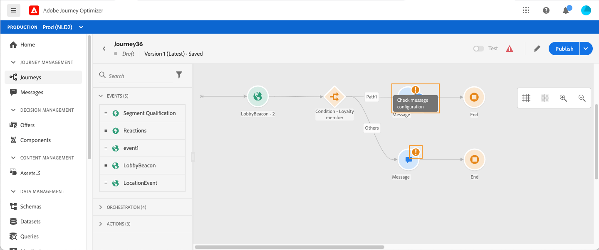
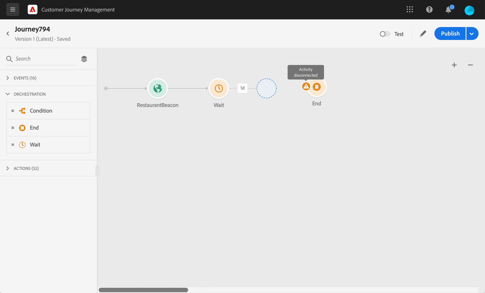
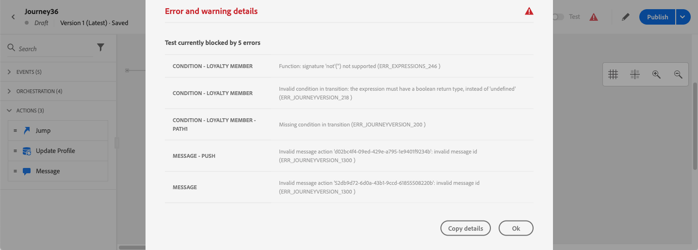

# Troubleshooting{#concept_nlv_bcv_2fb}


In this section, you will find how to troubleshoot journeys before testing or publishing. All the checks listed below can be performed when the journey is in test mode or when the journey is live. The recommendation is to make all the checks below in test mode and then proceed to publication. See [this page](../building-journeys/testing-the-journey.md).

## Checking for errors before testing{#section_h3q_kqk_fhb}

Before testing and publishing your journey, verify that all the activities are properly configured. You cannot perform tests or publications if errors are still detected by the system.

Errors appear with a warning symbol displayed on the activities themselves on the canvas. Place your cursor on the exclamation mark to display the error message. If you click on the activity, you should see the line in error with a warning. For example, if a mandatory field is empty, an error will be displayed.

 

For example, in the canvas, when two activities are disconnected, a warning is displayed.

 

Next to the **[!UICONTROL Test]** toggle and the **[!UICONTROL Publish]** button, a warning sign can be displayed. This warning sign displays errors detected by the system and prevents test mode activation or journey publication. Most of the time, errors detected by the system are linked to errors visible on the activities but sometimes they are linked to other issues. In this case, you can display them, try to identify the issue using to the error description. If you can’t identify the issue, you can copy the details and send them to the administrator or to support. Note that errors blocking the test and errors blocking the publication are similar.

The system detects two kinds of issues: errors and warnings. Errors block publication and test activation. Warnings indicate potential issues that are not blocking test activation or publication. You will see a description of the issue and an issue log ID of the type ERR_XXX_XXX. This will help technical support identify the issue.

Two different colors can be displayed on the sign next to the **[!UICONTROL Test]** toggle and the **[!UICONTROL Publish]** button. The sign is displayed in red in case of errors. It is displayed in orange in case of warnings.

 

Errors and warnings that are global to the journey appear first in the list. Error and warnings related to specific activities are listed after, by activity order or appearance in the journey from left to right. The **[!UICONTROL Copy details]** button copies technical information about the journey which the support team can use to troubleshoot.

When an error occurs in an action or a condition, the journey of an individual stops. The only way to make it continue is to check the box **[!UICONTROL Add an alternative path in case of a timeout or an error]**. See [this section](../building-journeys/using-the-journey-designer.md#paths).

## Checking that events are properly sent{#section_rqz_11t_dgb}

The starting point of a journey is always an event. You can perform tests using tools such as Postman.

You can check if the API call you send through these tools is sent correctly or not. If you get an error back, it means that your call has an issue. Check the payload again, the header (and especially the organization ID) and the destination URL. You can ask your administrator what is the right URL to hit.

Events are not pushed directly from the source to journeys. Indeed, journeys rely on Adobe Experience Platform’s streaming ingestion APIs. As a result, in case of event related issues, you can refer to [this page](https://experienceleague.adobe.com/docs/experience-platform/ingestion/streaming/troubleshooting.html) for Streaming ingestion APIs troubleshooting.

## Checking if people enter the journey{#section_x4v_zzs_dgb}

Journey reporting measures people's entrances in a journey in real-time.

If you're successfully sending the event but see no entrance in the journey, it means that something goes wrong between the event sending and the event reception in the journey.

Here are a few things and administrator should check:

* Are you sure the journey where you expect the incoming event is in test mode or live?
* Did you save your event before copying the payload from the payload preview?
* Does your event payload contain an event id?
* Did you hit the right URL?
* Did you follow the Streaming Ingestion APIs payload structure, using the payload structure preview in the event configuration pane? See [this page](../event/about-creating.md#preview-the-payload).
* Did you use the right key/value pairs in the header of your event?

    ```
    X-gw-ims-org-id - your ORGID
    Content-type - application/json
    ```

## Checking how people navigate through the journey{#section_l5y_yzs_dgb}

Journey reporting measures the progress of individuals inside a journey. It's easy to identify where and why a person got stopped.

Here are a few things to check:

* Is it due to a condition excluding the person? For example, the condition is "gender = male" and the person is a woman. This check can be performed by a business user if the condition is not too complex.
* Is it due to a call to a data source not responding? When the journey is in test, this information can be seen in test mode logs. When the journey is live, an administrator can test direct calls to the data source and check the answer received. An administrator can also duplicate the journey and test it.

## Checking that messages are sent successfully{#section_qb1_yzs_dgb}

If individuals flow the right way in the journey but don't receive messages they should receive, you can check if:

* Customer Journey Management has correctly taken into account the request to send the message. A business user can access the message supposed to be sent and check if the time of the latest execution corresponds to the execution time of your journey. He can also check the latest API calls/events received.
* Customer Journey Management has successfully sent the message. In the sending logs of the message, you can see the status of each execution. You can see if it's green, red and what was the issue. A business user can access this screen and send the logs to an administrator for further investigations.

In case of a message sent via a custom action, the only thing that can be checked during journey test is the fact that the call of the custom action’s system leads to an error or not. If the call to the external system associated with the custom action does not lead to an error but does not lead to a message sending, some investigations should be done on the external system’s side.
