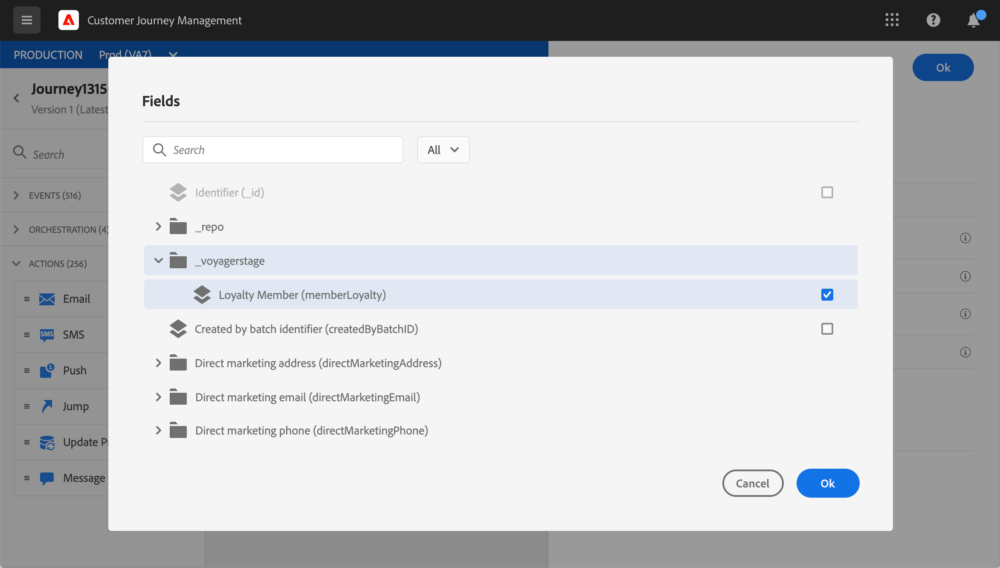
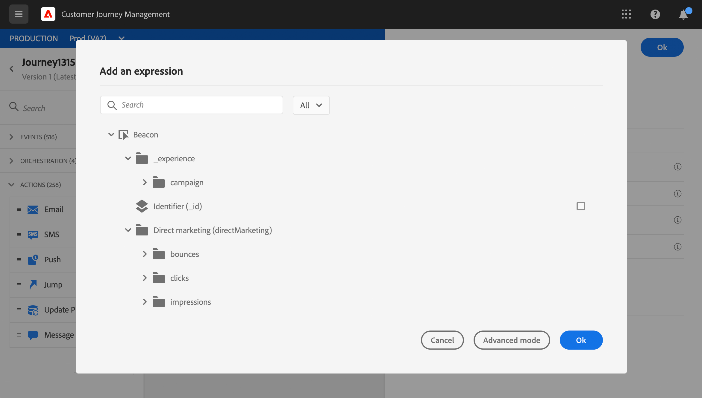
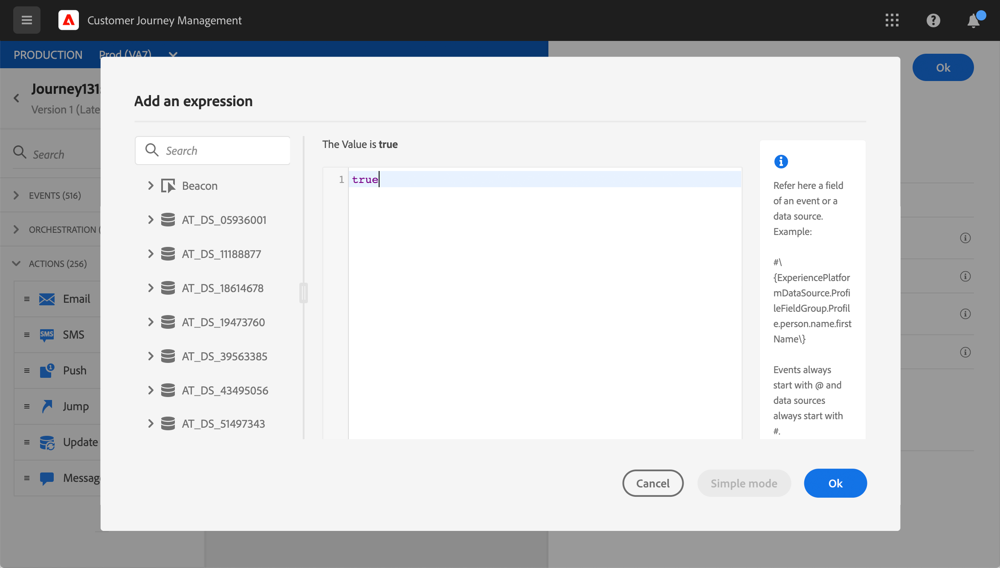
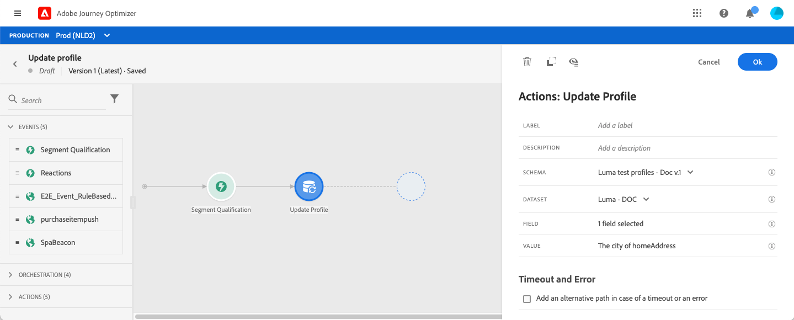

# Update profile {#update-profile}

The **[!UICONTROL Update profile]** action activity allows you to update an existing Adobe Experience Platform profile with information coming from the event, a datasource or using a specific value.

## Important notes

* The **Update profile** action can only be used in journeys starting with an event that has a namespace.
* The action only updates existing fields, it does not create new profile fields.
* You cannot use the **Update profile** action to generate experience events, for example a purchase.
* Just like any other action, you can define an alternative path in case of error or timeout and you cannot place two actions in parallel.
* The update request sent to Platform will be fast but not immediate/within a second. It will take normally a few seconds but sometimes more with no guarantee. As a result, for example, if an action is using "field 1" updated by an Update Profile action positioned right before, you should not expect that "field 1" will be updated in the action.
* Data sources have a notion of cache duration, at field group level. If you expect to leverage, in a journey, a profile field recently updated, be careful to define a very short cache duration.

## Using the test mode {#using-the-test-mode}

In test mode, the profile update will not be simulated. The update will be performed on the test profile. 

Only test profiles can enter a journey in test mode. You can either create a new test profile or turn an existing profile into a test profile. In Adobe Experience Platorm, you can update profiles attributes via a csv file import or API calls. A simpler method is to use an **Update profile** action activity and change the test profile boolean field from false to true.

For more information on the how to turn an existing profile into a test profile, refer to this [section](../building-journeys/creating-test-profiles.md#create-test-profiles-csv).

## Using the profile update

1. Design your journey by starting with an event. See this [section](../building-journeys/journey.md).

1. In the **Action** section of the palette, drop the **Update profile** activity into the canvas.

   

1. Select a schema from the list.

1. Click on **Fields** to select the field you want to update. Only one field can be selected.

   

1. Select a dataset from the list. The dataset selection will determine where the new value of the profile field will be stored.

1. Click on the **Value** field to define the value you want to use:

   * Using the simple expression editor, you can select a field from a data source or from the incoming event.

      

   * If you want to define a specific value or leverage advanced functions, click on **Advanced mode**.

      

The **Update profile** is now configured.

