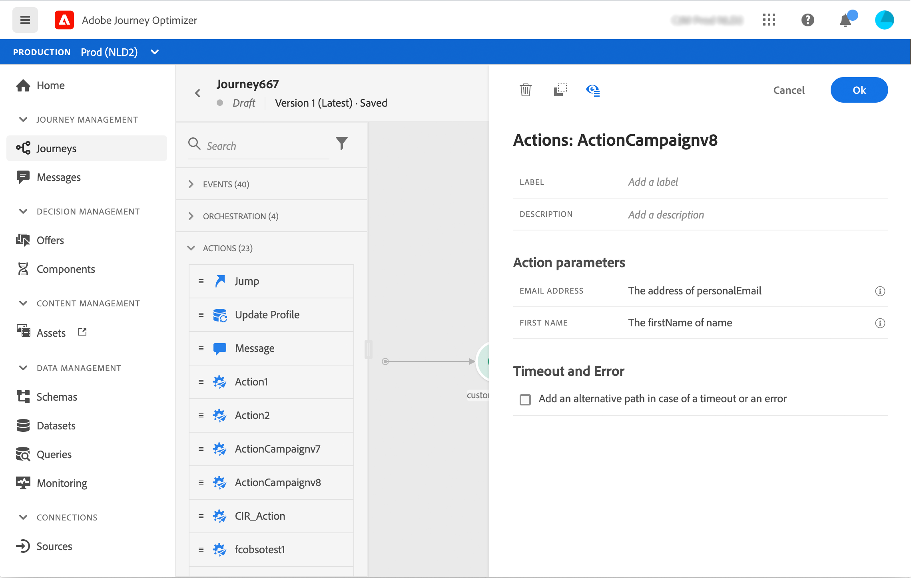

# Adobe Campaign v7/v8 actions {#using_campaign_classic} 

An integration is available if you have Adobe Campaign v7 or v8. It will allow you to send emails, push notifications and SMS using Adobe Campaign Transactional Messaging capabilities.

The connection between the Journey Optimizer and Campaign instances is setup by Adobe at provisioning time. Contact Adobe.

For this to work, you need to configure a dedicated action. Refer to this [section](../action/acc-action.md).

An end-to-end use case is presented in this [section](../building-journeys/campaign-classic-use-case.md).

1. Design your journey, starting with an event. See this [section](../building-journeys/journey.md).
1. In the **Action** section of the palette, select a Campaign action and add it to your journey.
1. In the **Action parameters**, all the fields expected in the message payload are displayed. You need to map each of these fields with the field you want to use, either from the event or from the data source. This is similar to custom actions. Refer to this [section](../building-journeys/using-custom-actions.md).

