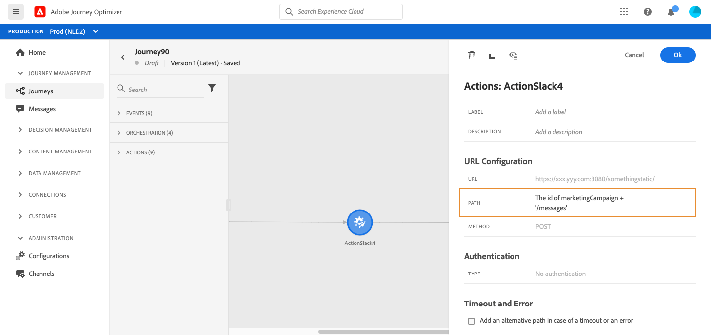
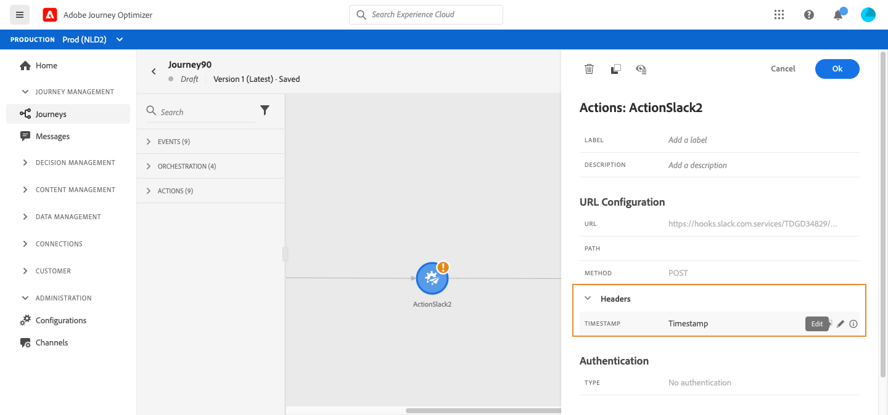

# Use custom actions {#section_f2c_hbg_nhb}

The activity configuration pane shows the URL configuration parameters and the authentication parameters that are configured for the custom action. [Learn more](../action/about-custom-action-configuration.md).

>[!NOTE]
>
>You cannot pass a simple collection in custom action parameters. More complex collection fields (arrays of objects) are not supported.  Also note that the parameters have an expected format (example: string, decimal, etc.). You must be careful to respect these expected formats.

## URL configuration

### Dynamic path

If the URL includes a dynamic path, specify the path in the **[!UICONTROL Path]** field.

>[!NOTE]
>
>You cannot set up the static part of the URL in the journey, but in the global configuration of the custom action. [Learn more](../action/about-custom-action-configuration.md).

To concatenate fields and plain text strings, use the String functions or the Plus sign (+) in the advanced expression editor. Enclose plain text strings in single quotation marks (') or in double quotation marks ("). [Learn more](https://experienceleague.adobe.com/docs/journeys/using/building-advanced-conditions-journeys/expressionadvanced.html){target="_blank"}.

This table shows an example of configuration:

| Field | Value |
| --- | --- |
| URL | `https://xxx.yyy.com:8080/somethingstatic/` |
| Path | `The id of marketingCampaign + '/messages'` |

The concatenated URL has this form:

`https://xxx.yyy.com:8080/somethingstatic/`\<campaign ID\>`/messages` 

### Headers

The **[!UICONTROL URL Configuration]** section shows the dynamic header fields, but not the constant header fields. Dynamic header fields are HTTP header fields whose value is configured as a variable. [Learn more](../action/about-custom-action-configuration.md).

If required, specify the value of dynamic header fields:

1. Select the custom action in the journey.
1. In the configuration pane, click the pencil icon next to the header field in the **[!UICONTROL URL Configuration]** section.

   

1. Select a field and click **[!UICONTROL OK]**.

## Action parameters

In the **[!UICONTROL Action parameters]** section, you'll see the message parameters defined as _"Variable"_. For these parameters, you can define where to get this information (example: events, data sources), pass values manually or use the advanced expression editor for advanced use cases. Advanced uses cases can be data manipulation and other function usage. See [Adobe Journey Orchestration documentation](https://experienceleague.adobe.com/docs/journeys/using/building-advanced-conditions-journeys/expressionadvanced.html){target="_blank"}.

**Related topics**

[Configure an action](../action/about-custom-action-configuration.md)
