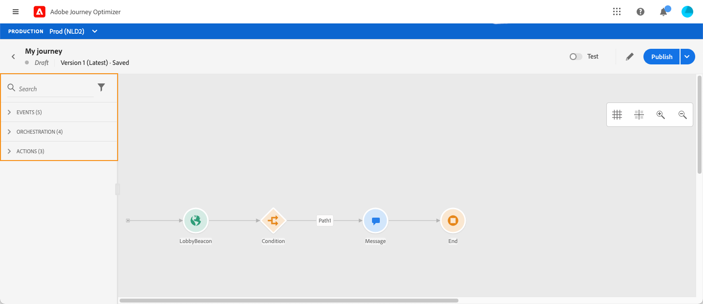
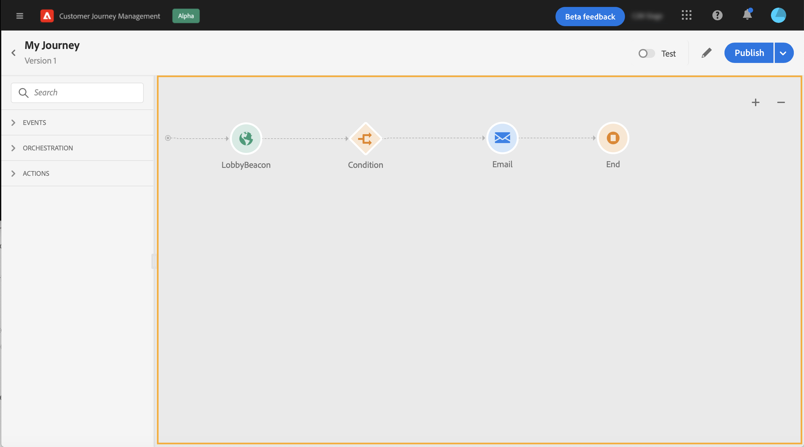
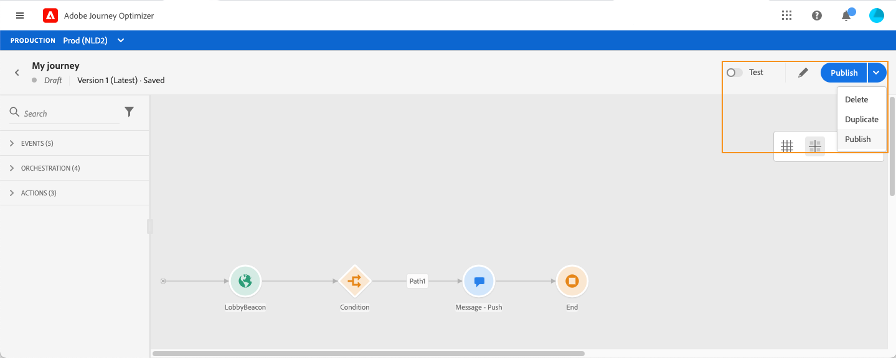
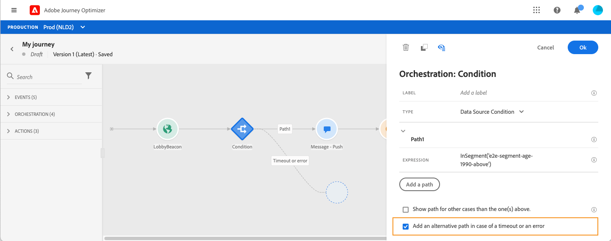
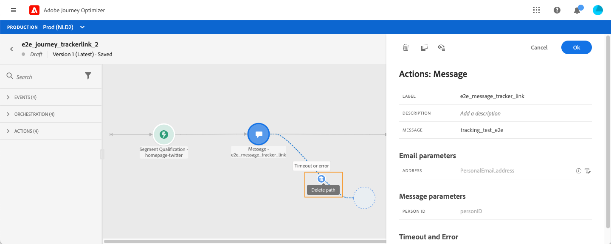
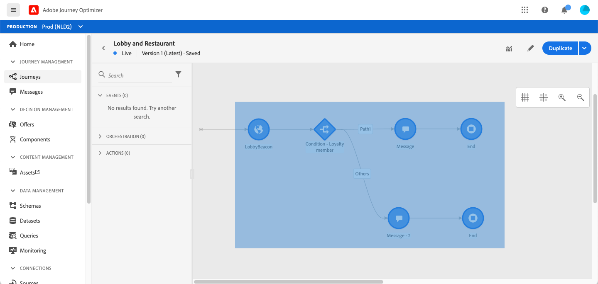
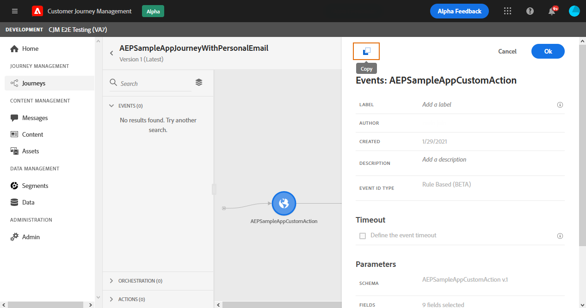

# Design your journey

The journey interface allows you to easily drag and drop activities from the palette into the canvas. You can also double-click on an activity to add it in the canvas at the next step available. Each activity has a specific role and place in the process. The activities are sequenced. When an activity is finished, the flow continues and processes the next activity, and so on. 

## Get started with journey design 

The **palette** is on the left-hand side of the screen. All available activities are sorted into several categories: **[!UICONTROL Events]**, **[!UICONTROL Orchestration]** and **[!UICONTROL Actions]**. You can expand/collapse the different categories by clicking on their name. To use an activity in your journey, drag and drop it from the palette into your canvas. 

When starting a new journey, elements that cannot be dropped in the canvas as the first step are hidden. This concerns all actions, the condition activity, the wait and the reaction.

The **[!UICONTROL Filter items]** icon in the top left corner allows you to display the following filters:

* **Show only available items**: hide or display unavailable elements in the palette, for example the events that use a different namespace than the ones used in your journey. By default, unavailable items are hidden. If you choose to display them, they will appear greyed out. 

* **Show only recent items**: this filter allows you to only display the last five events and actions used, in addition to out-of-the-box ones. This is specific to each user. By default, all items are displayed.

You can also use the **[!UICONTROL Search]** field.

The **canvas** is the central zone in the journey designer. It is in this zone that you can drop your activities and configure them. Click on an activity in the canvas to configure it. This opens the activity configuration pane on the right-hand side. 

The **activity configuration pane** appears when you click on an activity in the palette. Fill in the required fields. Click on the **[!UICONTROL Delete]** icon to delete the activity. Click on **[!UICONTROL Cancel]** to cancel the modifications or **[!UICONTROL Ok]** to confirm. To delete activities, you can also select one activity (or several) and press the backspace key. Pressing the escape key will close the activity configuration pane. 

By default, read-only fields are hidden. To display them, click the **Show read-only fields** icon in the top left of the activity configuration pane.

Depending on the journey's status, you can perform different actions on your journey using the buttons available in the top right corner: **[!UICONTROL Publish]**, **[!UICONTROL Duplicate]**, **[!UICONTROL Delete]**, **[!UICONTROL Journey properties]**, **[!UICONTROL Test]**. These buttons appear when no activity is selected. Some buttons will appear contextually. The test mode log button appears when test mode is activated. 

## Starting your journey

When you design your journey, the first question you want to ask is how profiles will enter the journey. There are two possibilities:

**Start with an event**: when a journey is set to listen to events, individuals enter the journey **unitarily** in real-time. Messages included in your journey are sent to the person currently flowing into the journey. [Learn more about events](../event/about-events.md)

**Start with a Read segment**: you can set your journey to listen to Adobe Experience Platform segments. In this case, all individuals belonging to the specified segment enter the journey. Messages included in your journey are sent to the individuals belonging to the segment. [Learn more about reading segments](read-segment.md).

## Define the next steps

After your first event or Read segment, you can combine the different activities to build your multi-step cross-channel scenarios. Choose, from the palette, the steps you need.

**Events**

When you start your journey with an event, the journey will be triggered when the event is received. The person will then follow, individually, the next steps defined in your journey. 

You can add **several events** in your journey, as long as they use the same namespace. Events are configured beforehand. [Learn more about events](about-journey-activities.md#event-activities)

You can also add a **Reaction** event after a message to react to tracking data related to the message. This allows you, for example, to send another message if the individual opened the previous message or clicked inside it. Learn more in this [section](reaction-events.md).

The **Segment qualification** event activity allows you to make individuals enter or move forward in a journey based on Adobe Experience Platform segment entrances and exits. You can make all new silver customers enter a journey and send personalized messages. Learn more in this [section](segment-qualification-events.md).

**Orchestration**

In the orchestration activities, you'll find the **Read segment** activity which allows you to set your journey to listen to an Adobe Experience Platform segment. [Learn more about the Read segment activity](read-segment.md).

The other activities allow you to add conditions to your journey to define several paths, set a waiting time before executing the next activity, or end your journey. Learn more in this [section](about-journey-activities.md#orchestration-activities).

**Actions**

You will find here the **Message** activity which allows you to include a message designed in [!DNL Journey Optimizer]. [Learn more about the Message activity](journeys-message.md)

You will also find the custom actions that you've configured to send messages with third-party systems. Learn more in this [section](about-journey-activities.md#action-activities).

## The use of paths in the canvas {#paths}

Several activities (**[!UICONTROL Condition]**, **[!UICONTROL Action]** activities) allow you to define a fallback action in case of an error or timeout. In the activity configuration pane, check the box: **[!UICONTROL Add an alternative path in case of a timeout or an error]**. Another path is added after the activity. The timeout duration is defined in the journey's properties (see [this page](../building-journeys/journey-gs.md#change-properties) by an admin user. For example, if an email takes too long to be sent or is in error, you can decide to send an SMS.

 

Various activities (event, action, wait) allow you to add several paths after them. To do this, place your cursor on the activity and click on the "+" symbol. Only event and wait activities can be set in parallel. If several events are set in parallel, the chosen path will be the one of the first event happening. 

When listening to an event, we recommend that you do not wait for the event indefinitely. It is not mandatory, just a best practice. If you want to listen to one or several events only during a certain time, you will place one or several events and a wait activity in parallel. See [this section](../building-journeys/general-events.md#events-specific-time).

To delete the path, place your cursor on it and click the **[!UICONTROL Delete arrow]** icon.

 

In the canvas, when two activities are disconnected, a warning is displayed. Place your cursor on the warning icon to display the error message. To fix the issue, simply move the disconnected activity and connect it to the previous activity.

 

## Copying and pasting activities {#copy-paste}

You can copy one or several activities of a journey and paste them either in the same journey or a different one. This allows you to save time if you want to reuse numerous activities that have been already configured in a previous journey. 

**Important notes**

* You can copy/paste across different tabs and browsers. You can only copy/paste activities within the same instance. 
* You can not copy/paste an event if the destination journey has an event that uses a different namespace.
* Pasted activities may reference data that do not exist in the destination journey, for example if you copy/paste across different sandboxes. Always check for errors and make the required adjustments. 
* Be aware that you cannot undo an action. To delete pasted activities, you will need to select and delete them. Therefore, make sure you only select the activities you need before copying them.
* You can copy activities from any journey, even ones that are in read-only.
* You can select any activity, even ones that are not linked. Linked activities will stay linked after being pasted.

Here are the steps to copy/paste activities:

1. Open a journey.
1. Select the activities you want to copy by moving your mouse while clicking. You can also click on each activity while pressing the **Ctrl/Command** key. Use **Ctrl/Command + A** if you want to select all activities.
    
1. Press **Ctrl/Command + C**. 
    If you want to only copy one activity, you can click on it and use the **Copy** icon in the top left of the activity configuration pane.
    
1. In any journey, press **Ctrl/Command + V** to paste the activities without linking them to an existing node. Pasted activities are placed in the same order. After being pasted, activities stay selected so you can easily move them. You can also place the cursor on an empty place holder and hit **Ctrl/Command + V**. Pasted activities will be linked to the node. 
    
