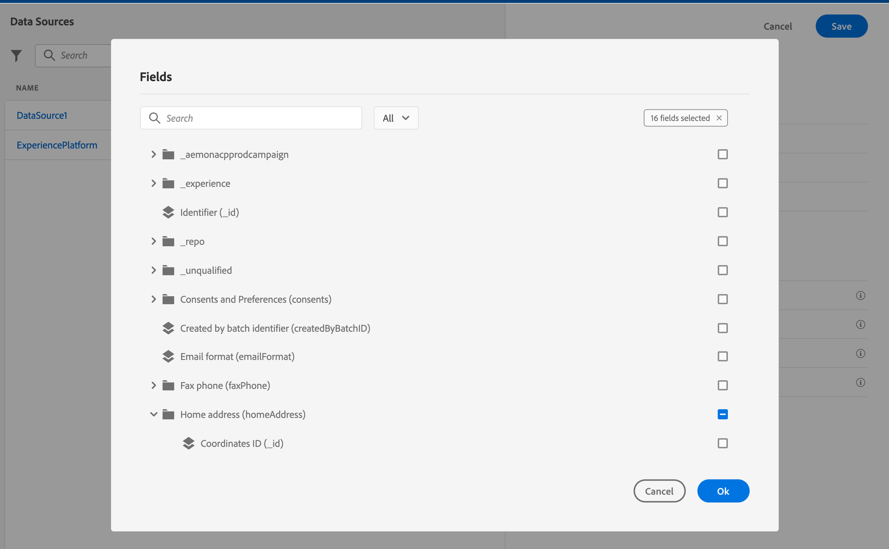

# Configure journeys

In order to send messages with journeys, you need to configure **[!UICONTROL Data Sources]**, **[!UICONTROL Events]** and **[!UICONTROL Actions]**.

## Data Sources

The Data Source configuration allows you to define a connection to a system to retrieve additional information that will be used in your journeys. [Learn more](../../using/datasource/about-data-sources.md)

## Events 

Events allow you to trigger your journeys unitarily to send messages, in real-time, to the individual flowing into the journey.

In the event configuration, you configure the events expected in the journeys. The incoming events’ data is normalized following the Adobe Experience Data Model (XDM). Events come from Streaming Ingestion APIs for authenticated and unauthenticated events (such as Adobe Mobile SDK events). [Learn more](../../using/event/about-events.md)
 
## Actions 

Journey Optimizer message capabilities are built-in: you only need to design your content and publish your message. If you are using a third-party system to send your messages, you can create a custom action. [Learn more](../../using/action/action.md)

## Browse through Adobe Experience Platform fields {#friendly-names-display}

When defining [event payload](../event/about-creating.md#define-the-payload-fields), [field group payload](../datasource/configure-data-sources.md#define-field-groups) and selecting fields in the [expression editor](https://experienceleague.adobe.com/docs/journeys/using/building-advanced-conditions-journeys/expressionadvanced.html), the display name is displayed in addition to the field name. This information is retrieved from the schema definition in the Experience Data Model.

If descriptors such as "xdm:alternateDisplayInfo" are provided while setting up schemas, the user-friendly names will replace display names. It is especially useful when working with “eVars” and generic fields. You can configure friendly name descriptors via an API call. For more information, see the [Schema Registry developer guide](https://experienceleague.adobe.com/docs/experience-platform/xdm/api/getting-started.html).

 

If a friendly name is available, then the field will be displayed as `<friendly-name>(<name>)`. If no friendly name is available, the display name will appear, for example `<display-name>(<name>)`. If none of them are defined, only the technical name of the field will be displayed `<name>`.

>[!NOTE]
>
>Friendly names are not retrieved when you select fields from a union of schemas.