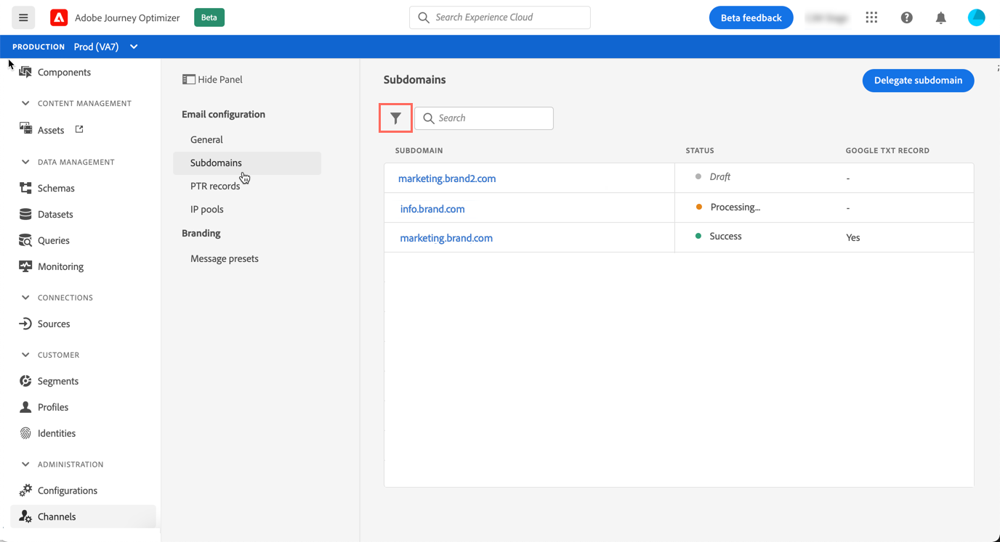

# Access delegated subdomains

All your delegated subdomains display in the **[!UICONTROL Channels]** / **[!UICONTROL Subdomains]** menu.

Several filters are available to help you refine the list (delegation date, user or status).

The **[!UICONTROL Status]** column provides information on the subdomain delegation process:

* **[!UICONTROL Draft]**: The subdomain delegation has been saved as a draft. Click the subdomain name to resume the delegation process,

* **[!UICONTROL Processing]**: The subdomain is going through several configuration checks before it can be used,

* **[!UICONTROL Success]**: The subdomain has gone through the checks successfully and can be used to deliver messages,

* **[!UICONTROL Failed]**: One or several checks have failed after the subdomain delegation was submitted.
