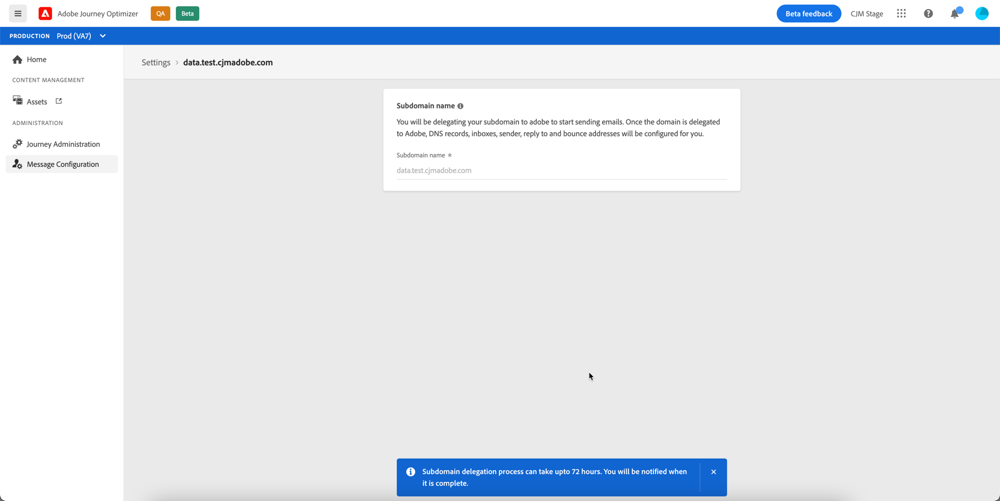

# Delegate a subdomain

To delegate a new subdomain, follow the steps below.

>[!NOTE]
>
>Note that you can delegate up to 10 subdomains (!!to confirm)

1. Access the **[!UICONTROL Message Configuration]** / **[!UICONTROL Subdomain delegation]** menu, then click **[!UICONTROL Delegate subdomain]**.

    

1. Specify the name of the subdomain to delegate.

1. The list of records to be placed in your DNS servers displays. Copy these records, either one by one, or by downloading a CSV file, then navigate to your domain hosting solution to generate the matching DNS records.

    Make sure that all the DNS records have been generated into your domain hosting solution. If everything is configured properly, confirm the statement then click **[!UICONTROL Submit]**.

    

    >[!NOTE]
    >
    >You can create the records and submit the subdomain configuration later on using the **[!UICONTROL Save as draft]** button. You will then be able to resume the subdomain delegation by opening it from the subdomains list.

1. Once the subdomain delegation has been subdmitted, the subdomain displays in the list with the **[!UICONTROL Processing]** status.

    

    The configuration checks below will be performed until the subdomain is verified and can be used to deliver messages:

    1. xxx
    1. xxx
    1. xxx
    1. xxx

    You can follow the validation progress for a subdomain at any time by opening it from the list.

    

1. Once the checks are successfull, you will be notified xxxxx (!!where are users notified: need to manually check the page or emailed/notified in pulse?).

    The subdomain gets the **[!UICONTROL Success]** (!!or Verified?) status and is now ready to be used to deliver messages.

    You can access detailed information by opening the subdomain from the list:
    
    * Retrieve the subdomain name (read-only) configured during the delegation process, as well as the generated URLs (resources, mirror page, tracking URLs),
    * Add a Google site verification TXT record to your subdomain to ensure that it is verified (see [Add a Google TXT record to a subdomain](google-txt.md)). 
    
    
