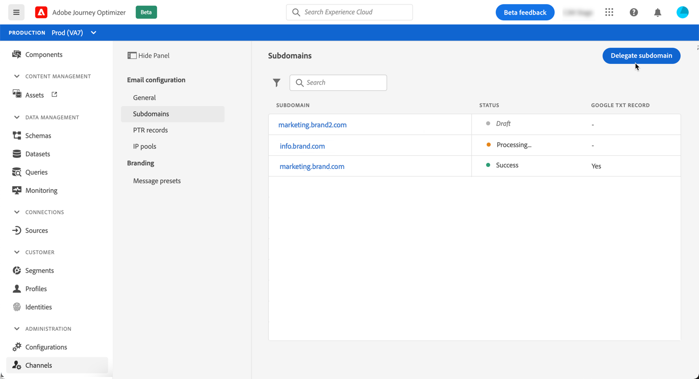
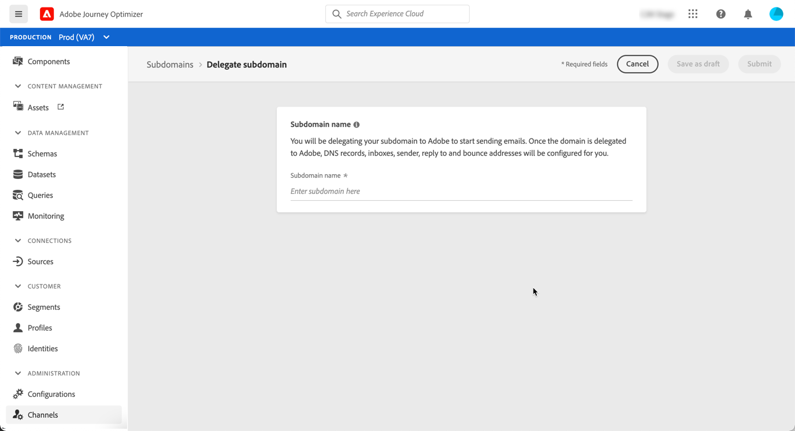
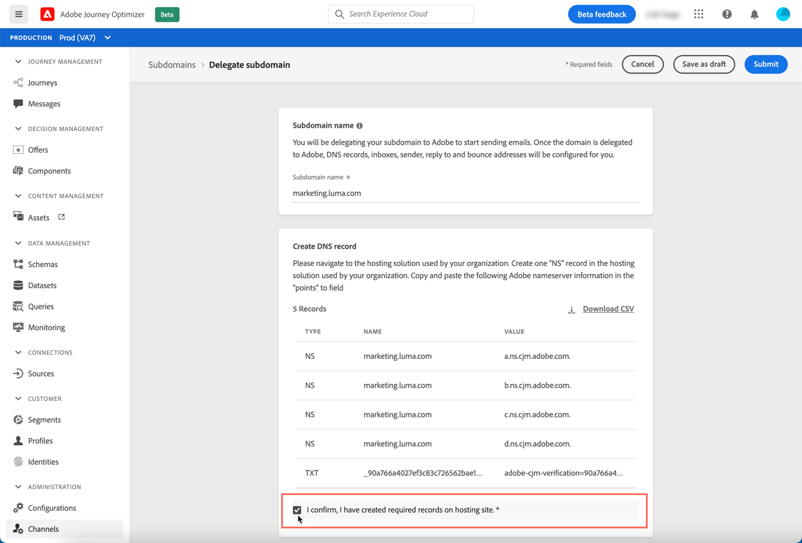
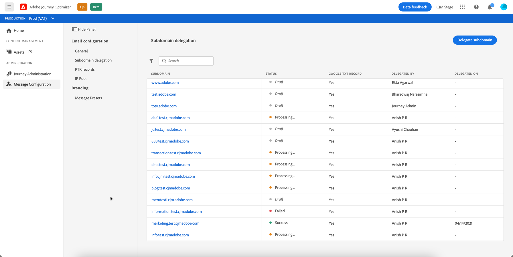
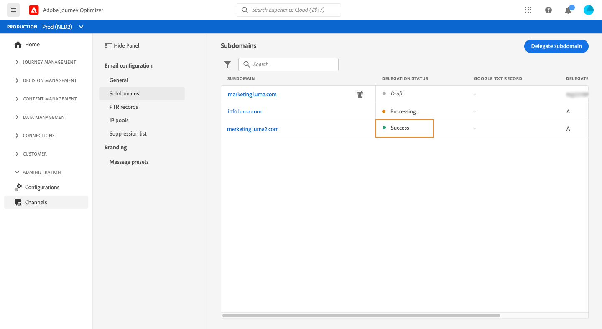
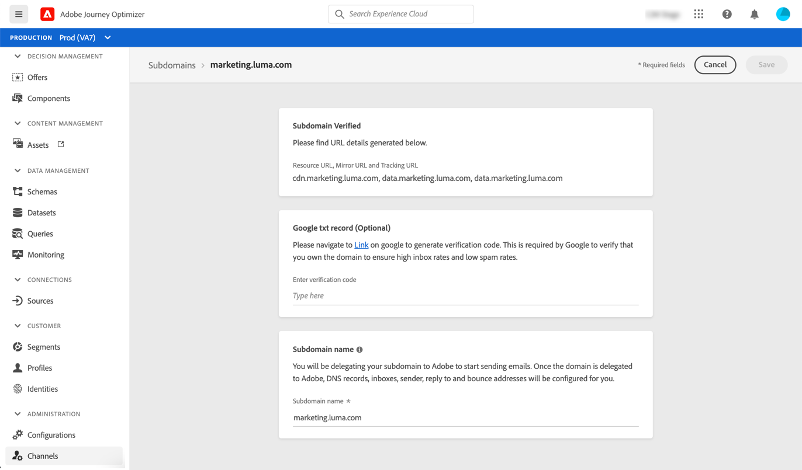

# Delegate a subdomain

Journey Optimizer allows you to fully delegate your subdomains to Adobe. By doing so, Adobe will be able to deliver messages as a managed service by controlling and maintaining all aspects of DNS that are required for delivering, rendering and tracking of email campaigns.

>[!NOTE]
>
>You can delegate up to 10 subdomains.
>
>The use of CNAMEs for subdomain delegation is currently not supported by Journey Optimizer.

To delegate a new subdomain, follow the steps below:

1. Access the **[!UICONTROL Channels]** / **[!UICONTROL Subdomains]** menu, then click **[!UICONTROL Delegate subdomain]**.

    

1. Specify the name of the subdomain to delegate.

    

1. The list of records to be placed in your DNS servers displays. Copy these records, either one by one, or by downloading a CSV file, then navigate to your domain hosting solution to generate the matching DNS records.

    Make sure that all the DNS records have been generated into your domain hosting solution. If everything is configured properly, check the box "I confirm...", then click **[!UICONTROL Submit]**.

    

    >[!NOTE]
    >
    >You can create the records and submit the subdomain configuration later on using the **[!UICONTROL Save as draft]** button. You will then be able to resume the subdomain delegation by opening it from the subdomains list.

1. Once the subdomain delegation has been submitted, the subdomain displays in the list with the **[!UICONTROL Processing]** status. For more on subdomains' statuses, refer to [this section](access-subdomains.md).

    The configuration checks below will be performed until the subdomain is verified and can be used to configure message presets in order to send messages:

    1. NS records,
    1. DNS creation,
    1. URLs configuration,
    1. Deliverability audit.

    

1. Once the checks are successfull, you are informed via a **[!DNL Journey Optimizer]** notification, and the subdomain gets the **[!UICONTROL Success]** status. It is now ready to be used to deliver messages.

    For more on subdomains' statuses, refer to [this section](access-subdomains.md).

    

    You can access detailed information about the subdomain by opening it from the list. You can:
    
    * Retrieve the subdomain name (read-only) configured during the delegation process, as well as the generated URLs (resources, mirror page, tracking URLs),
    * Add a Google site verification TXT record to your subdomain to ensure that it is verified (see [Add a Google TXT record to a subdomain](google-txt.md)). 
    
    
