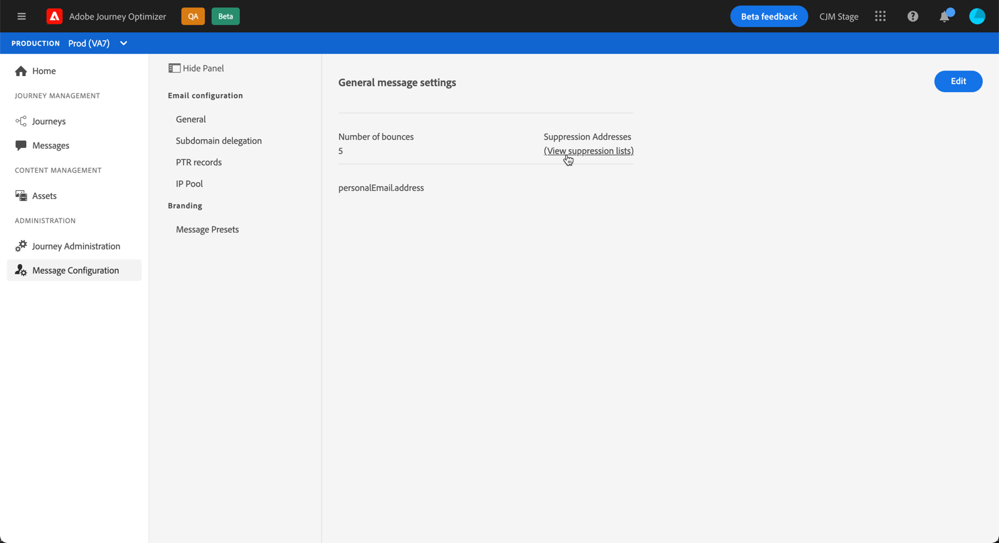

# Get started with suppression lists

With Journey Optimizer, you can monitor all the email addresses that are automatically excluded from the sending in a journey.

To access the detailed list of excluded email addresses, open the **[!UICONTROL Channels]** / **[!UICONTROL General]** menu, then click the **[!UICONTROL View suppression lists]** link.

Filters are available to help you browse through the list (suppression date,  category and reason). You can also download the list as a CSV file for analysis and reporting purposes. 

    !! on staging, only creation date filter is available
