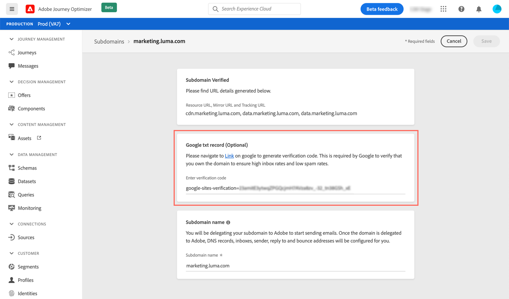

# Add a Google TXT record to a subdomain

TXT records are a type of DNS records used to provide text information about a domain, that can be read by external sources.

In order to ensure good deliverability and successful delivery of emails to Gmail addresses, Customer Journeys Management allows you to add special Google site verification TXT records to your subdomains to ensure that it is verified.

>[!NOTE]
>
> This operation can only be performed once a subdomain has the **[!UICONTROL Success]** status. For more on subdomains' statuses, refer to [this section](access-subdomains.md).

To add a Google TXT record to your subdomain, follow these steps:

1. Open the subdomain from the **[!UICONTROL Channels]** / **[!UICONTROL Subdomains]** menu.

1. In the Google txt record section, enter the verification code generated in [G Suite Admin tools](https://support.google.com/a/answer/183895), then click **[!UICONTROL Save]**.

    
    
1. Once the TXT record is added, you need to have it verified by Google. To do this, navigate to the G Suite Admin tools then launch the verification step.
