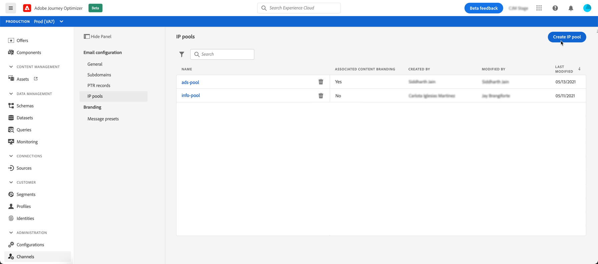
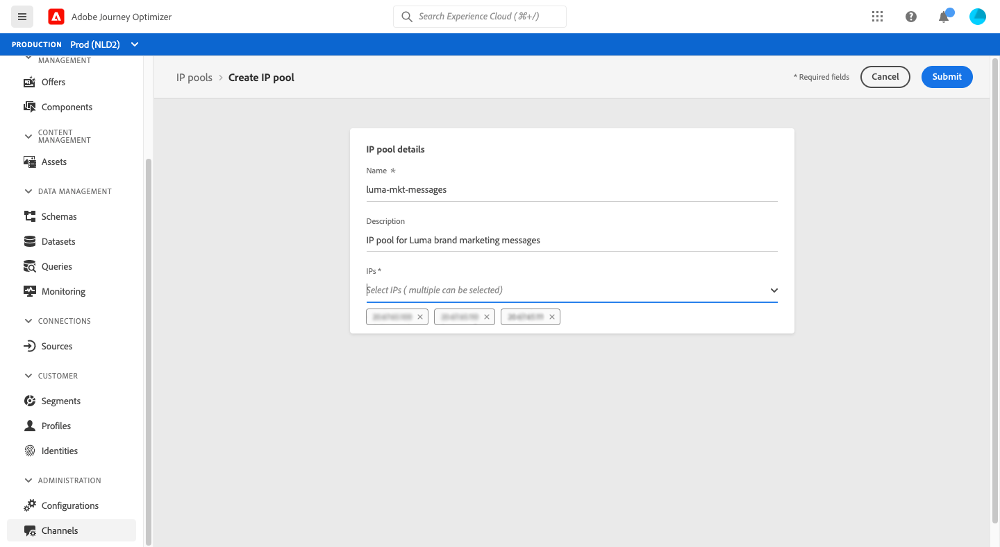
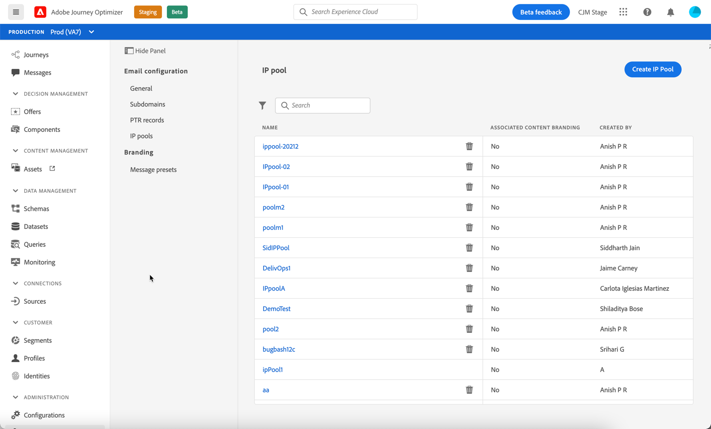

# Create IP pools

## About IP pools

With Journey Optimizer, you can create IP pools to group together the IP addresses of your subdomains.

Creating IP pools is strongly recommended for email deliverability. By doing so, you can prevent the reputation of a subdomain from impacting your other subdomains.

For example, one best practice is to have one IP pool for your marketing messages, and another one for your transactional messages. This way, if one of your marketing messages performs badly and is declared as spam by a customer, this will not affect the transactional messages sent to this same customer, who will still receive transactional messages (purchase confirmations, password recovery messages etc.).

## Create an IP pool

To create an IP pool, follow these steps:

1. Access the **[!UICONTROL Channels]** / **[!UICONTROL IP pools]** menu, then click **[!UICONTROL Create IP Pool]**.

    

1. Provide a name and a description (optional) for the IP pool.

1. Select the IP addresses to include in the pool from the drop-down list, then click **[!UICONTROL Submit]**.

     

    >[!NOTE]
    >
    >All the IP addresses provisioned with your instance are available in the list.
    
The IP pool is now created and displays in the list. You can select it to access its properties and display the associated message presets (see [Create a message preset](message-presets.md)).

To edit an IP pool, open it, then edit its properties as desired.

>[!NOTE]
>
>If a message preset has been associated to the IP pool, you first need to remove it before editing the IP pool. Once the your modifications have been done, you can associate the message preset again.
