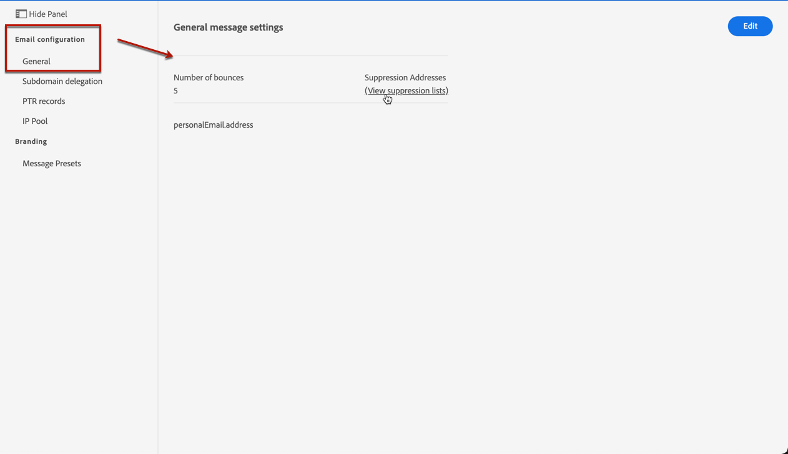
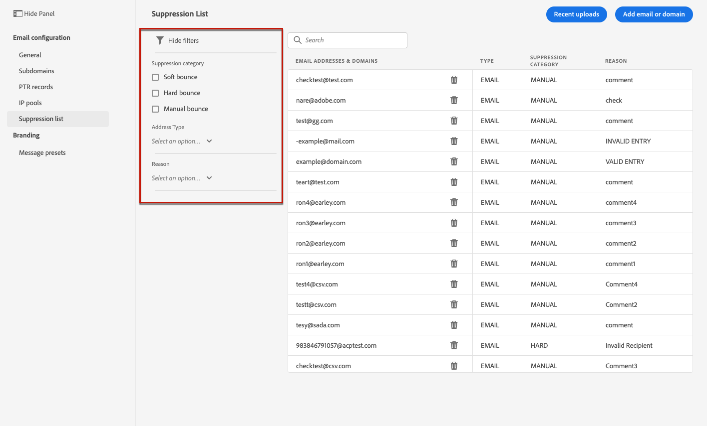
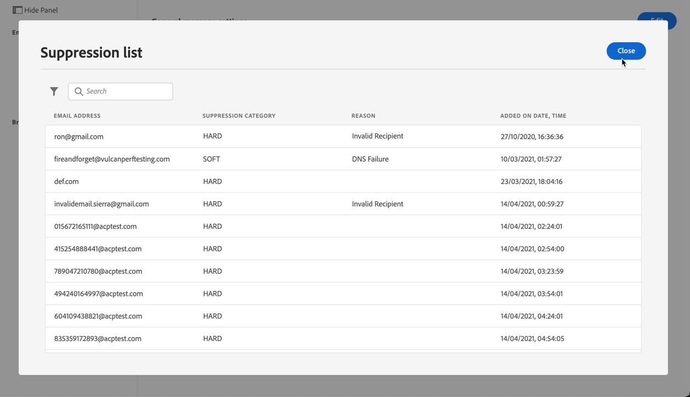

# Manage the suppression list {#manage-suppression-list}

With [!DNL Journey Optimizer], you can monitor all the email addresses that are automatically excluded from sending in a journey, such as:

* Addresses that are invalid (hard bounces), or that consistently soft-bounce, and could adversely affect your email reputation if you continue to include them in your deliveries.
* Recipients who issue a spam complaint of some kind against one of your email messages.

<!--Profiles who unsubscribe from your sendings. Learn more on [opting-out](../consent.md). NOT TRUE as confirmed by eng.: "Subscribe and Unsubscribe are handled by the Consent/Subscription service. A user that opts out will not make it to the suppression list – we won’t send them emails."-->

Such email addresses are automatically collected into the Journey Optimizer **suppression list**. Learn more in [this section](../suppression-list.md).

## Access the suppression list {#access-suppression-list}

To access the detailed list of excluded email addresses, open the **[!UICONTROL Channels]** > **[!UICONTROL Email configuration]** > **[!UICONTROL General]** menu, then click the **[!UICONTROL View suppression lists]** link.

Filters are available to help you browse through the list.

<!--suppression date,  category and reason, but on staging, only creation date filter is available-->

<!--You can also download the list as a CSV file for analysis and reporting purpose. Won't be available.-->

## Suppression categories and reasons {#suppression-categories-and-reasons}

When a message fails to be delivered to an email address, Journey Optimizer determines why the delivery failed and associates it with a suppression category.

The suppression categories are as follows:

* **Hard**: The email address is immediately sent to the suppression list.

* **Soft**: Soft errors send an address to the suppression list once the error counter reaches the limit threshold. [Learn more on retries](retries.md)

* **Ignored**:
    * When the error occurred for a valid email address but is known to be temporary, such as a failed connection attempt or a temporary technical issue, the email address is added to the suppression list once the error counter reaches the limit threshold. [Learn more on retries](retries.md).
    * When the error is the result of a spam complaint, the email address of the recipient who issued the complaint is immediately sent to the suppression list.

<!--**Manual**: You can also manually add an email address to the suppression list. => Manual category will be available when manually adding an address to the suppression list (via API)-->

>[!NOTE]
>
>Learn more on soft bounces and hard bounces in the [Delivery failure types](../suppression-list.md#delivery-failures) section.

For each email address that is listed, you can also check the **[!UICONTROL Reason]** for excluding it and the date/time it was added to the suppression list.

<!--to replace with suppression-list.png when Manual category is available (through API)-->

The possible reasons for a delivery failure are:

| Reason | Description | Suppression category |
| --- | --- | --- |
| **[!UICONTROL Undetermined]** | The bounce reason received from the recipient domain Message Transfer Agent (MTA) could not be identified. | Ignored |
| **[!UICONTROL Invalid Recipient]** | The recipient is invalid or does not exist. | Hard |
| **[!UICONTROL Soft Bounce]** | The message soft bounced for a reason other than the soft errors listed in this table, such as when sending over the allowed rate recommended by an ISP. | Soft |
| **[!UICONTROL DNS Failure]** | The message bounced due to a DNS failure. | Soft |
| **[!UICONTROL Mailbox Full]** | The message bounced due to the mailbox of the recipient being full and unable to accept more messages. | Soft |
| **[!UICONTROL Too Large]** | The message bounced because it was too large for the recipient. [Retries](retries.md) will be performed: you can edit the message size and re-inject it for delivery. | Ignored |
| **[!UICONTROL Timeout]** | The message timed out, meaning it soft bounced and reached the message retry limit (3.5 days). | Ignored |
| **[!UICONTROL Admin Failure]** | The message was failed according to the policies configured by the sending system administrator. <!--For example, if emails are blackholed at the global, domain or binding level using the "blackhole" directive, this bounce code is used.--> | Ignored |
| **[!UICONTROL Generic Bounce: No RCPT]** | No recipient could be determined for the message. | Ignored |
| **[!UICONTROL Generic Bounce]** | The message failed for unspecified reasons. | Ignored |
| **[!UICONTROL Mail Block]** | The message was blocked by the receiver (i.e. recipient MTA). | Ignored |
| **[!UICONTROL Spam Block]** | The message was blocked by the receiver as coming from a known spam source. It could be a sending IP block for example. | Ignored |
| **[!UICONTROL Spam Content]** | The message content was blocked by the receiver (recipient MTA) as spam. | Ignored |
| **[!UICONTROL Prohibited Attachment]** | The message was blocked by the receiver because it contained an attachment. | Ignored |
| **[!UICONTROL Relaying Denied]** | The message was blocked by the receiver because relaying is not allowed. | Soft |
| **[!UICONTROL Auto-Reply]** | The message is an auto-reply/vacation mail. | Ignored |
| **[!UICONTROL Transient Failure]** | Message transmission has been temporarily delayed. | Ignored |
| **[!UICONTROL Challenge-Response]** | The message is a challenge-response probe. | Soft |

>[!NOTE]
>
>Unsubscribed users are not receiving emails from [!DNL Journey Optimizer], therefore their email addresses cannot be sent to the suppression list. Their choice is handled at the Experience Platform level. Learn more on [opting-out](../consent.md).

<!--
Removed from the table provided by SparkPost/Momentum:
| **[!UICONTROL Subscribe]** | The message is a subscribe request. | Ignored |
| **[!UICONTROL Unsubscribe]** | The message is an unsubscribe request. | Hard |
-->

<!--Note to add eventually: If a user is subscribed and [!DNL Journey Optimizer] fails to send emails to their subscribed email address, they will get added to the suppression list. (not sure it's possible to subscribe through AJO or need to find reference to Experience Platform doc?)-->

