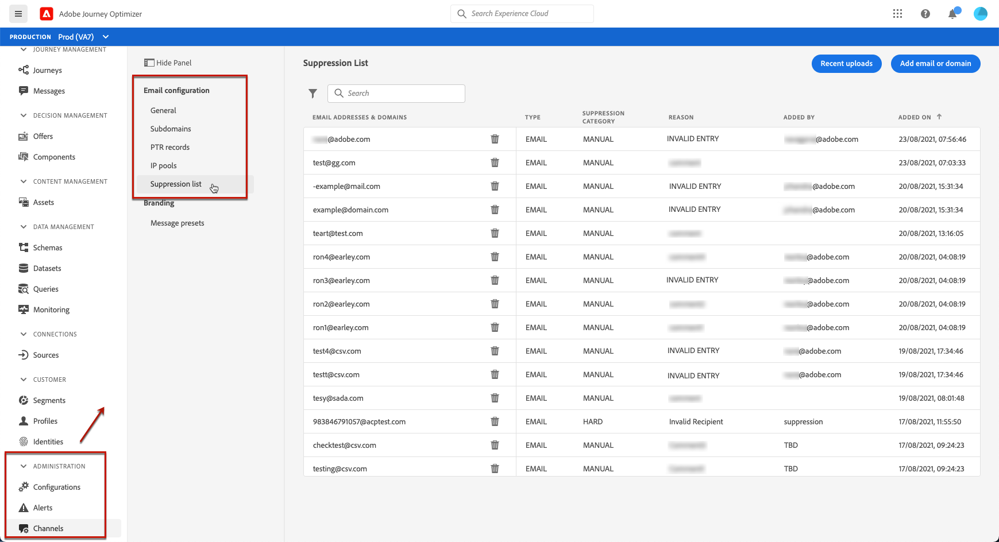
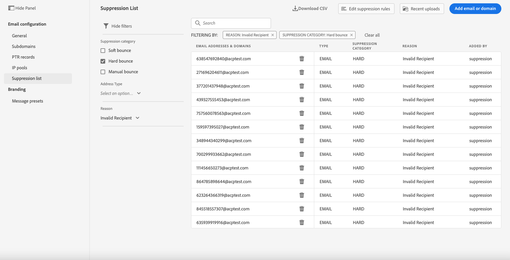
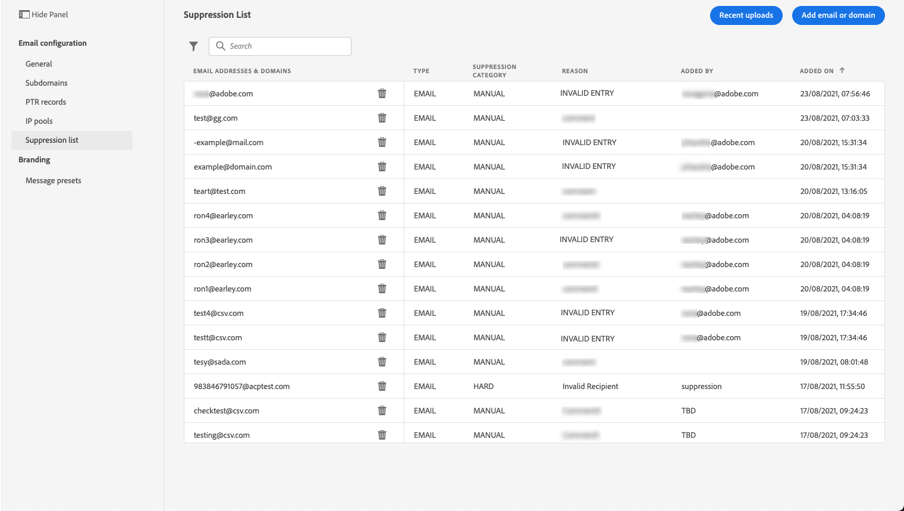
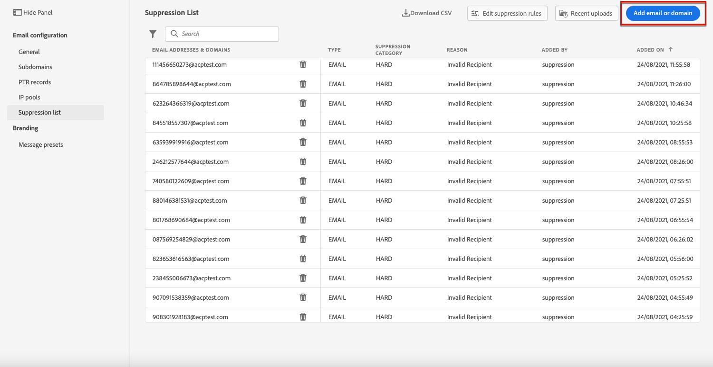
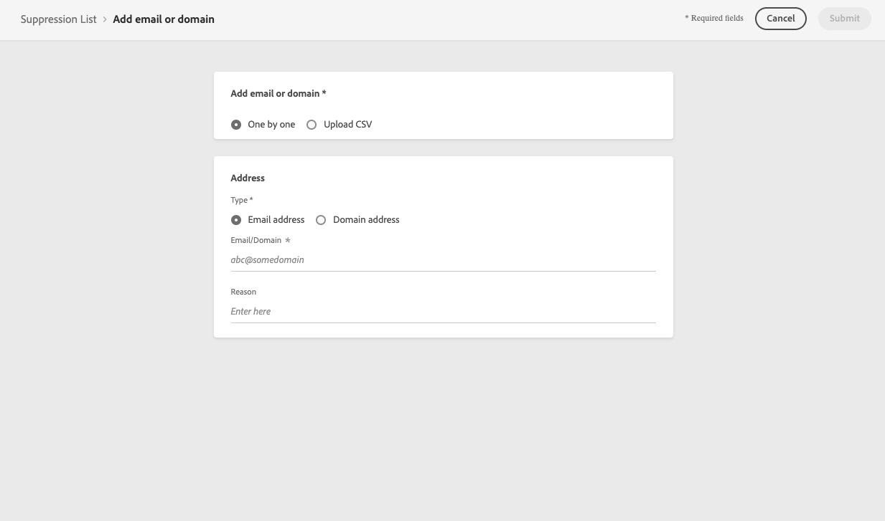
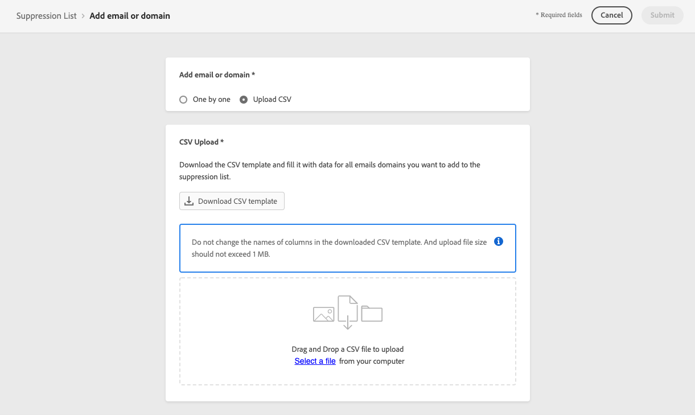
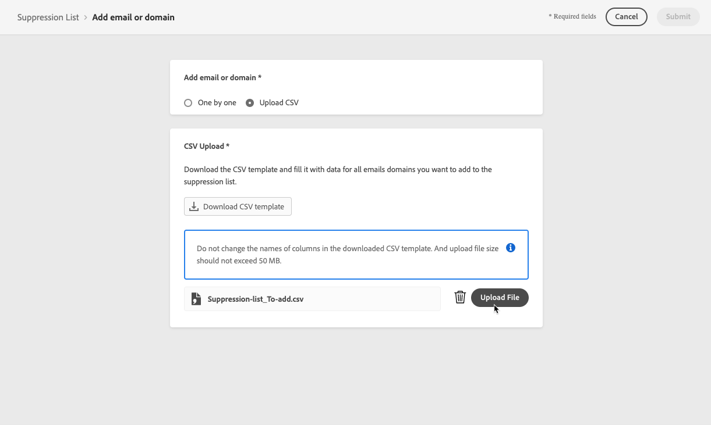
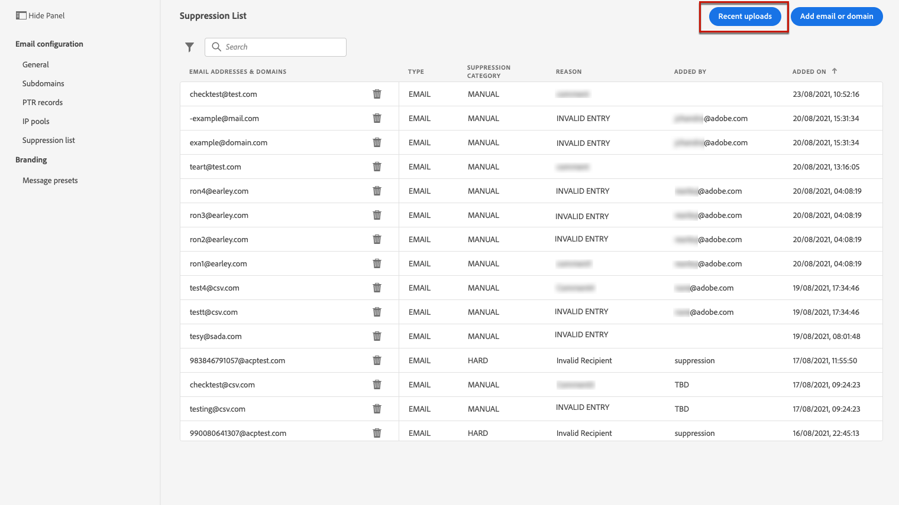
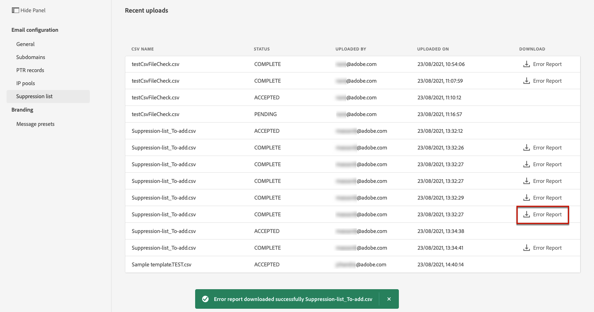

# Manage the suppression list {#manage-suppression-list}

With [!DNL Journey Optimizer], you can monitor all the email addresses that are automatically excluded from sending in a journey, such as:

* Addresses that are invalid (hard bounces), or that consistently soft-bounce, and could adversely affect your email reputation if you continue to include them in your deliveries.
* Recipients who issue a spam complaint of some kind against one of your email messages.

Such email addresses are automatically collected into the Journey Optimizer **suppression list**. Learn more in [this section](../suppression-list.md).

## Access the suppression list {#access-suppression-list}

To access the detailed list of excluded email addresses, go to **[!UICONTROL Administration]** > **[!UICONTROL Channels]** > **[!UICONTROL Email configuration]**, and select **[!UICONTROL Suppression list]**.



Filters are available to help you browse through the list.


You can filter on the **[!UICONTROL Suppression category]**, **[!UICONTROL Address type]**, or **[!UICONTROL Reason]**. Select the option(s) of your choice for each criterion.



Once selected, you can clear each filter or all filters displayed on top of the list.

## Suppression categories and reasons {#suppression-categories-and-reasons}

When a message fails to be delivered to an email address, [!DNL Journey Optimizer] determines why the delivery failed and associates it with a **[!UICONTROL Suppression category]**.

The suppression categories are as follows:

* **Hard**: The email address is immediately sent to the suppression list.

* **Soft**: Soft errors send an address to the suppression list once the error counter reaches the limit threshold. [Learn more on retries](retries.md)

* **Ignored**:
    * When the error occurred for a valid email address but is known to be temporary, such as a failed connection attempt or a temporary technical issue, the email address is added to the suppression list once the error counter reaches the limit threshold. [Learn more on retries](retries.md).
    * When the error is the result of a spam complaint, the email address of the recipient who issued the complaint is immediately sent to the suppression list.

* **Manual**: You can also manually add an email address or a domain to the suppression list. [Learn more](#add-addresses-and-domains)

>[!NOTE]
>
>Learn more on soft bounces and hard bounces in the [Delivery failure types](../suppression-list.md#delivery-failures) section.

For each email address that is listed, you can also check the **[!UICONTROL Type]** (email or domain), **[!UICONTROL Reason]** for excluding it, who added it, and the date/time it was added to the suppression list.



The possible reasons for a delivery failure are:

| Reason | Description | Suppression category |
| --- | --- | --- |
| **[!UICONTROL Undetermined]** | The bounce reason received from the recipient domain Message Transfer Agent (MTA) could not be identified. | Ignored |
| **[!UICONTROL Invalid Recipient]** | The recipient is invalid or does not exist. | Hard |
| **[!UICONTROL Soft Bounce]** | The message soft bounced for a reason other than the soft errors listed in this table, such as when sending over the allowed rate recommended by an ISP. | Soft |
| **[!UICONTROL DNS Failure]** | The message bounced due to a DNS failure. | Soft |
| **[!UICONTROL Mailbox Full]** | The message bounced due to the mailbox of the recipient being full and unable to accept more messages. | Soft |
| **[!UICONTROL Too Large]** | The message bounced because it was too large for the recipient. [Retries](retries.md) will be performed: you can edit the message size and re-inject it for delivery. | Ignored |
| **[!UICONTROL Timeout]** | The message timed out, meaning it soft bounced and reached the message retry limit (3.5 days). | Ignored |
| **[!UICONTROL Admin Failure]** | The message was failed according to the policies configured by the sending system administrator. <!--For example, if emails are blackholed at the global, domain or binding level using the "blackhole" directive, this bounce code is used.--> | Ignored |
| **[!UICONTROL Generic Bounce: No RCPT]** | No recipient could be determined for the message. | Ignored |
| **[!UICONTROL Generic Bounce]** | The message failed for unspecified reasons. | Ignored |
| **[!UICONTROL Mail Block]** | The message was blocked by the receiver (i.e. recipient MTA). | Ignored |
| **[!UICONTROL Spam Block]** | The message was blocked by the receiver as coming from a known spam source. It could be a sending IP block for example. | Ignored |
| **[!UICONTROL Spam Content]** | The message content was blocked by the receiver (recipient MTA) as spam. | Ignored |
| **[!UICONTROL Prohibited Attachment]** | The message was blocked by the receiver because it contained an attachment. | Ignored |
| **[!UICONTROL Relaying Denied]** | The message was blocked by the receiver because relaying is not allowed. | Soft |
| **[!UICONTROL Auto-Reply]** | The message is an auto-reply/vacation mail. | Ignored |
| **[!UICONTROL Transient Failure]** | Message transmission has been temporarily delayed. | Ignored |
| **[!UICONTROL Challenge-Response]** | The message is a challenge-response probe. | Soft |

>[!NOTE]
>
>Unsubscribed users are not receiving emails from [!DNL Journey Optimizer], therefore their email addresses cannot be sent to the suppression list. Their choice is handled at the Experience Platform level. Learn more on [opting-out](../consent.md).

<!--
Removed from the table provided by SparkPost/Momentum:
| **[!UICONTROL Subscribe]** | The message is a subscribe request. | Ignored |
| **[!UICONTROL Unsubscribe]** | The message is an unsubscribe request. | Hard |
-->

<!--Note to add eventually: If a user is subscribed and [!DNL Journey Optimizer] fails to send emails to their subscribed email address, they will get added to the suppression list. (not sure it's possible to subscribe through AJO or need to find reference to Experience Platform doc?)-->

## Manually add addresses and domains {#add-addresses-and-domains}

When a message fails to be delivered to an email address, this address is automatically added to the suppression list.

However, you can also manually populate the [!DNL Journey Optimizer] suppression list to exclude specific email addresses and/or domains from your sending.

You may add email addresses or domains [one at a time](#add-one-address-or-domain), or [in bulk mode](#upload-csv-file) through a CSV file upload.

To do this, select the **[!UICONTROL Add email or domain]** button, then follow one of the methods below.



### Add one address or domain {#add-one-address-or-domain}

1. Select the **[!UICONTROL One by one]** option.

    

1. Choose the address type: **[!UICONTROL Email address]** or **[!UICONTROL Domain address]**.

1. Enter the email address or domain you want to exclude from your sending.

    >[!NOTE]
    >
    >Make sure you enter a valid email address (such as abc@company) or domain (such as abc.company.com).

1. Specify a reason if needed.

1. Click **[!UICONTROL Submit]**.

### Upload a CSV file {#upload-csv-file}

1. Select the **[!UICONTROL Upload CSV]** option.

    

1. Dowload the CSV template to use. You can also create your own CSV file, but it must have the columns and format below:

    ```
    TYPE,VALUE,COMMENT
    EMAIL,abc@somedomain.com,Comment
    DOMAIN,somedomain.com,Comment
    ```

    >[!CAUTION]
    >
    >Do not change the names of the columns in the CSV template.
    >
    >The file size should not exceed 50KB.

1. Fill in the CSV template with the email addresses and/or domains you want to add to the suppression list.

1. Once completed, drag and drop your CSV file, then click **[!UICONTROL Upload file]**.

    

1. Click **[!UICONTROL Submit]**.

### Check recent uploads status {#recent-uploads}

You can check the list of the latest CSV files you uploaded.

To do this, from the **[!UICONTROL Suppression list]** view, click the **[!UICONTROL Recent uploads]** button.



The latest uploads you submitted and their corresponding statuses are displayed.

If an error report is associated with a file, you can download it to check the errors encountered.




