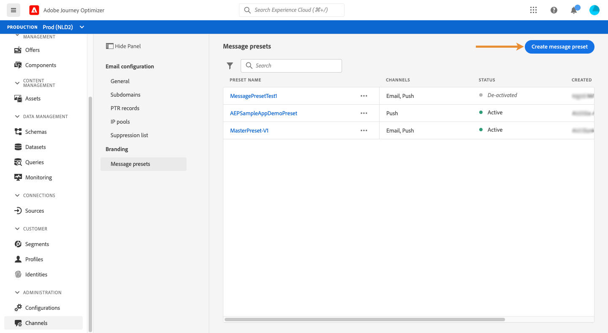
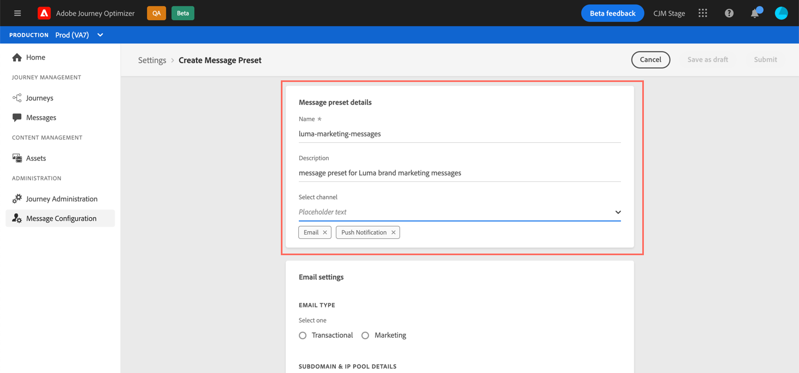
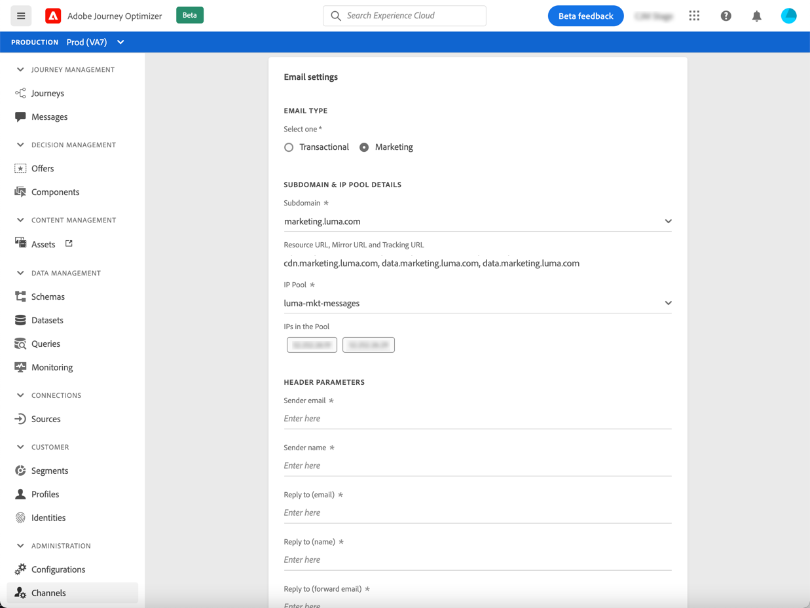
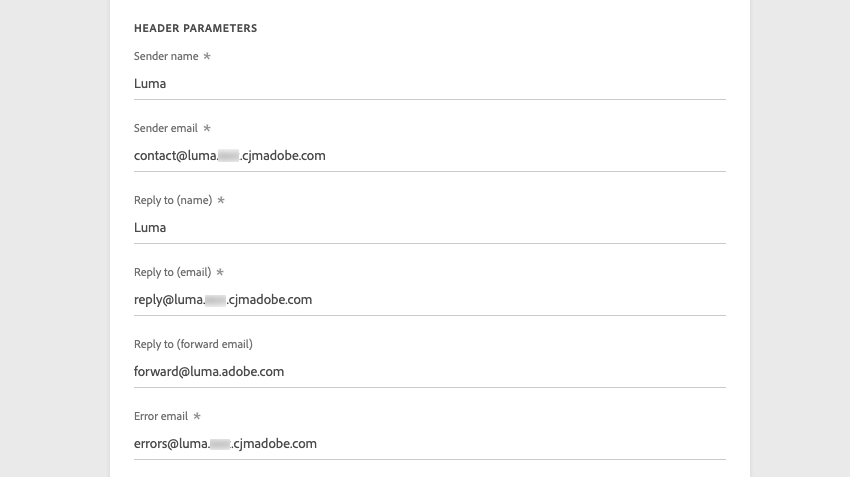
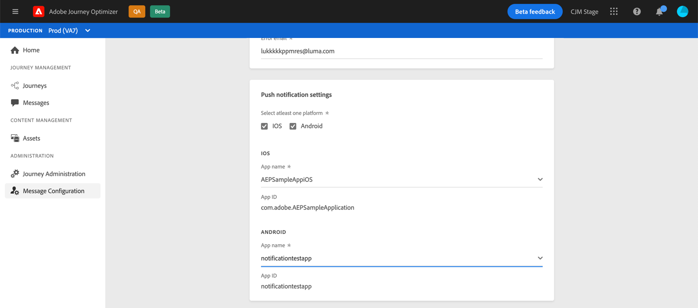
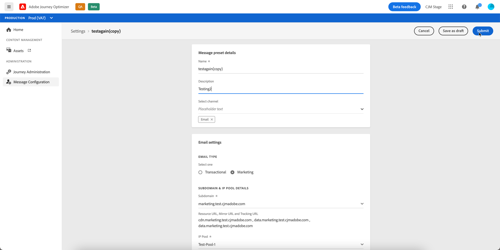
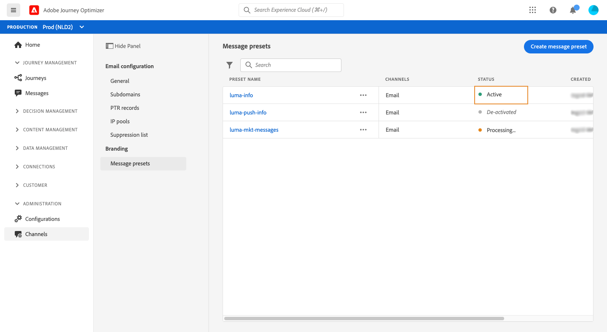
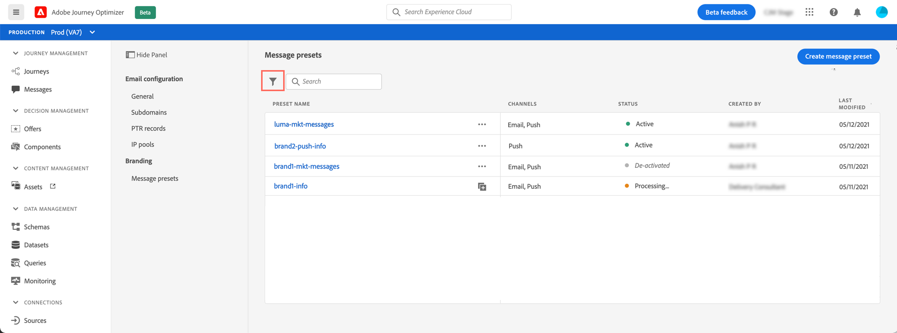
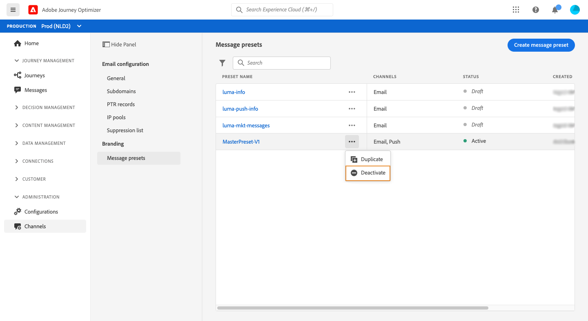
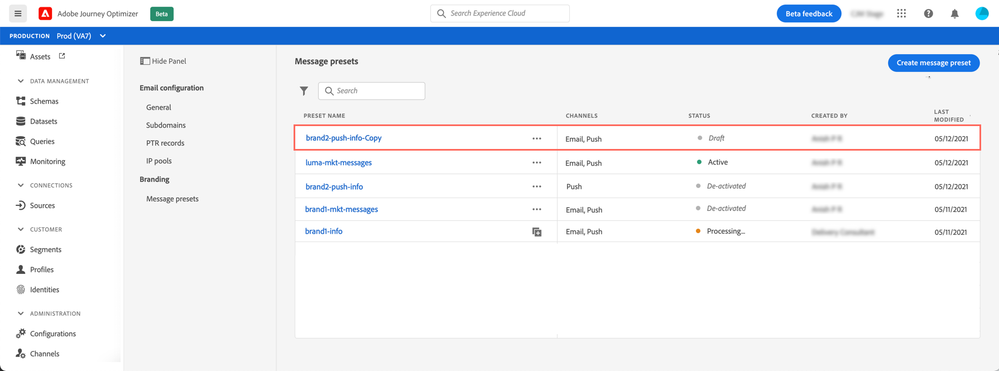

# Create message presets

With [!DNL Journey Optimizer], you can set up message presets that define all the technical parameters required for email and push notification message: email type, sender email and name, mobile apps, and more. 

>[!CAUTION]
>
> * Message presets configuration is restricted to Journey Administrators. [Learn more](../administration/ootb-product-profiles.md#journey-administrator)
>
> * You must perform Email and Push configuration steps before creating message presets.

Once message presets have been configured, you be able to select them when creating messages from the **[!UICONTROL Presets]** list.

 [Learn how to create and use email presets in this video](#video-presets)

## Create a message preset {#create-message-preset}

To create a message preset, follow these steps:

1. Access the **[!UICONTROL Channels]** / **[!UICONTROL Message presets]** menu, then click **[!UICONTROL Create Message preset]**.

    

1. Enter a name and a description (optional) for the preset, then select the channel(s) to configure.

    

    >[!NOTE]
    >
    > Names must begin with a letter (A-Z). It can only contain alpha-numeric characters. You can also use underscore `_`, dot`.` and hyphen `-` characters. 

1. Configure **email** settings.

    

    * Select the type of message that will be sent with the preset: **Transactional** or **Marketing**

        >[!CAUTION]
        >
        > **Transactional** messages can be sent to profiles who unsubscribed from marketing communications. These messages can only be sent in specific contexts, such as password reset, order status, delivery notification for example.
        >
    
    * Select the subdomain to use to send the emails. [Learn more](about-subdomain-delegation.md)
    * Select the IP pool to associate with the preset. [Learn more](ip-pools.md)
    * Enter the header parameters for the emails sent using the preset.

        >[!CAUTION]
        >
        >Except for the **Reply to (forward email)** field, email addresses domain must use the current selected [delegated subdomain](about-subdomain-delegation.md).

        * **[!UICONTROL Sender name]**: Name of the sender, such as your brand's name.

        * **[!UICONTROL Sender email]**: The email address you want to use for your communications. For example, if the delegated subdomain is *marketing.luma.com*, you can use *contact@marketing.luma.com*.

        * **[!UICONTROL Reply to (name)]**: The name that will be used when the recipient clicks the **Reply** button in their email client software.

        * **[!UICONTROL Reply to (email)]**: The email address that will be used when the recipient clicks the **Reply** button in their email client software. The emails sent to this address will be forwarded to the **[!UICONTROL Reply to (forward email)]** address provided below. You must use an address defined on the delegated subdomain (for example, *reply@marketing.luma.com*), otherwise the emails will be dropped.

        * **[!UICONTROL Reply to (forward email)]**: All emails received by [!DNL Journey Optimizer] for the delegated subdomain will be forwarded to this email address. You can specify any address, except an email address defined on the delegated subdomain. For example, if the delegated subdomain is *marketing.luma.com*, any address like *abc@marketing.luma.com* is prohibited.

        * **[!UICONTROL Error email]**: All errors generated by ISPs after a few days of mail being delivered (asynchronous bounces) are received on this address.

        

        >[!NOTE]
        >
        >Names must begin with a letter (A-Z). It can only contain alpha-numeric characters. You can also use underscore `_`, dot`.` and hyphen `-` characters.

1. Configure **push notification** settings.

     
   
    * Select at least one platform: **iOS** and/or **Android**
    
    * Select the mobile applications to use for each platform. 
        
      For more on how to configure your environment to send push notifications, refer to [this section](../push-gs.md).

1. Once all the parameters have been configured, click **[!UICONTROL Submit]** to confirm. You can also save the message preset as draft and resume its configuration later on.

    
    
1. Once the message preset has been created, it displays in the list with the **[!UICONTROL Processing]** status.

    During this step, several checks will be performed to verify that it has been configured properly. The processing time is around **48h-72h**, and can take up to **7-10 days**.

    These checks include deliverability tests that are performed by Adobe deliverability team:

    * SPF validation
    * DKIM validation
    * MX record validation
    * Check IPs denylisting
    * Helo host check
    * IP pool verification
    * A/PTR record, t/m/res subdomain verification

1. Once the checks are successfull, the message preset gets the **[!UICONTROL Active]** status. It is ready to be used to deliver messages.

    <!-- later on, users will be notified in Pulse -->

    

## Monitor message presets

All your message presets display in the **[!UICONTROL Channels]** / **[!UICONTROL Message presets]** menu. Filters are available to help you browse through the list (channel type, user, status).

Message presets can have the following statuses:

* **[!UICONTROL Draft]**: The message preset has been saved as a draft and has not been submitted yet. Open it to resume the configuration.
* **[!UICONTROL Processing]**: The message preset has been submitted and is going through several verifications steps.
* **[!UICONTROL Active]**: The message preset has been verified and can be selected to create messages.
* **[!UICONTROL Failed]**: One or several checks have failed during the message preset verification.
* **[!UICONTROL De-activated]**: The message preset is de-activated. It cannot be used to create new messages.

## Edit message presets

To edit a message preset, you first need to de-activate it to make it unavailable to create new messages (published messages using this preset will not be affected and will continue working). You then need to duplicate the message preset to create a new version that you will use to create new messages:

1. Access the message presets list, then deactivate the message preset that you want to edit.

    

1. Duplicate the de-activated message preset. A copy with the **[!UICONTROL Draft]** status is automatically added to the list.

    

1. Open the duplicated message preset, modify it according to your needs, then submit your changes. The message preset will go through the same validation cycle as during the [creation step](#create-message-preset).

1. Once validated, it gets the **[!UICONTROL Active]** status and is ready to be used to create new messages.

    >[!NOTE]
    >
    >Deactivated message presets cannot be deleted to avoid any issue in journeys using these presets to send messages.

## How-to video{#video-presets}

Learn how to create message presets, how to use them and how to delegate a subdomain and create an IP pool.

>[!VIDEO](https://video.tv.adobe.com/v/334343?quality=12)
