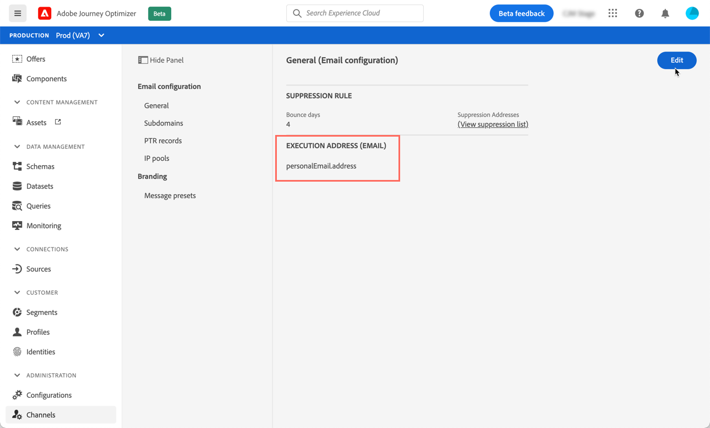
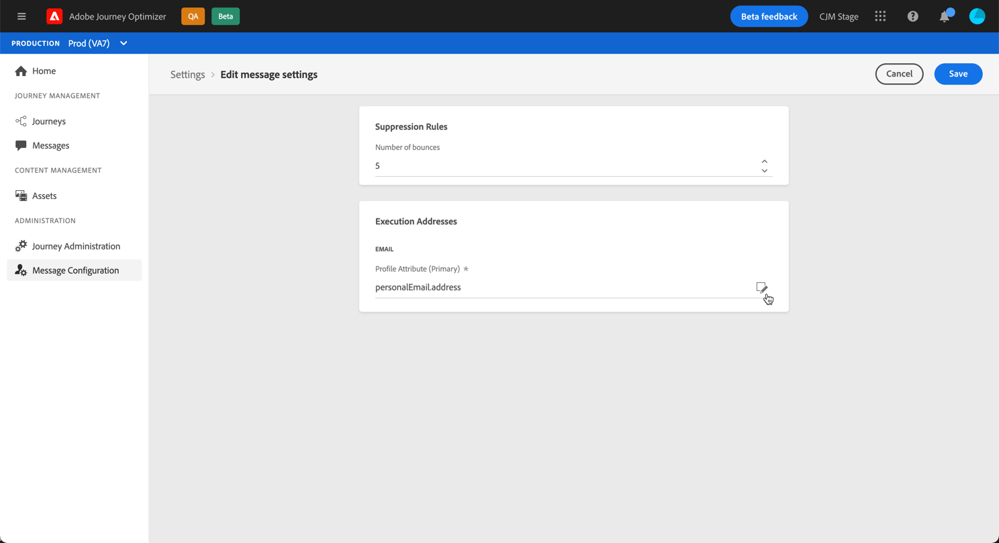
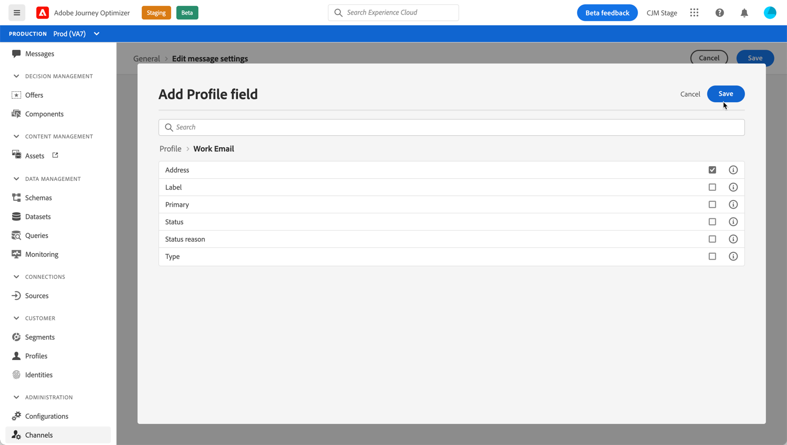

# Determine profiles' primary addresses

When you target a profile, several email addresses may be available in the database (personal, professional email address, etc.).

With Journey Optimizer, you can determine which email address to use from the profile service and prioritize when several addresses are available. To do this, follow these steps:

1. Access the  **[!UICONTROL Channels]** / **[!UICONTROL General]** menu.
1. The field that is currently used by default to determine the profiles' email addresses displays in this screen. Click **[!UICONTROL Edit]** to change it.

1. Click the modify button to select the new field to use as primary email address.

1. The list of available XDM fields displays. Select the field to use, then click **[!UICONTROL Save]**.

    

<!--1. You can also select an additional field to use as secondary email address. This allows you to determine which field to use if the primary field is empty for a profile.-->
