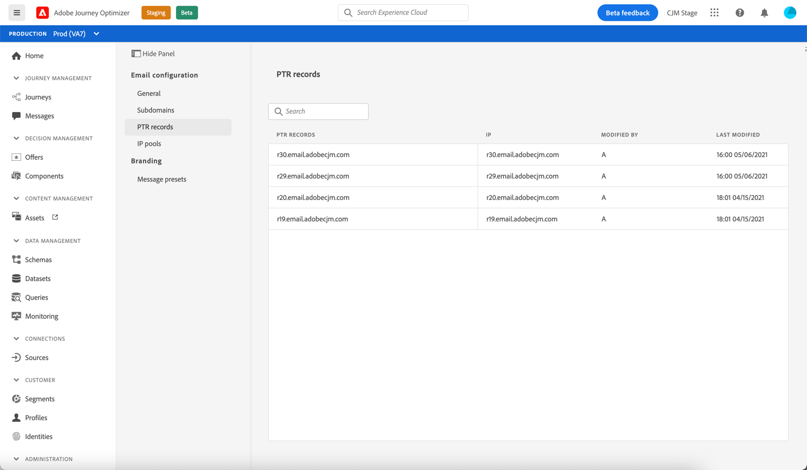

# PTR records

## About PTR records

A pointer record (PTR) is a type of Domain Name System (DNS) record that provides the domain name linked to an IP address.

With PTR records, receiving mail servers can check the authenticity of sending mail servers by identifying whether their IP addresses correspond to the names with which the servers connect.

## Access your subdomains' PTR records

Once a subdomain is delegated in Customer Jourrney Management, a PTR record is automatically created and associated with this subdomain. You can access it from the **[!UICONTROL Channels]** `>` **[!UICONTROL PTR records]** menu.

The list shows the PTR records generated for each delegated subdomain, using the syntax below:

* "r" for record,
* "xx" for the two last figures of the IP address,
* subdomain name.

You can open a PTR record from the list to display the associated subdomain name and IP address.

>[!NOTE]
>
>Note that the PTR records are read-only and that you cannot modify the subdomain associated to an IP address.
