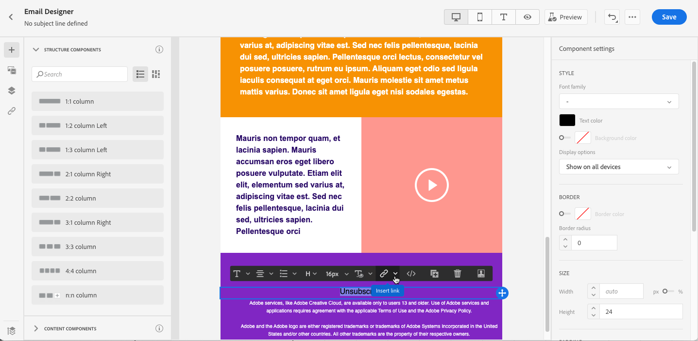
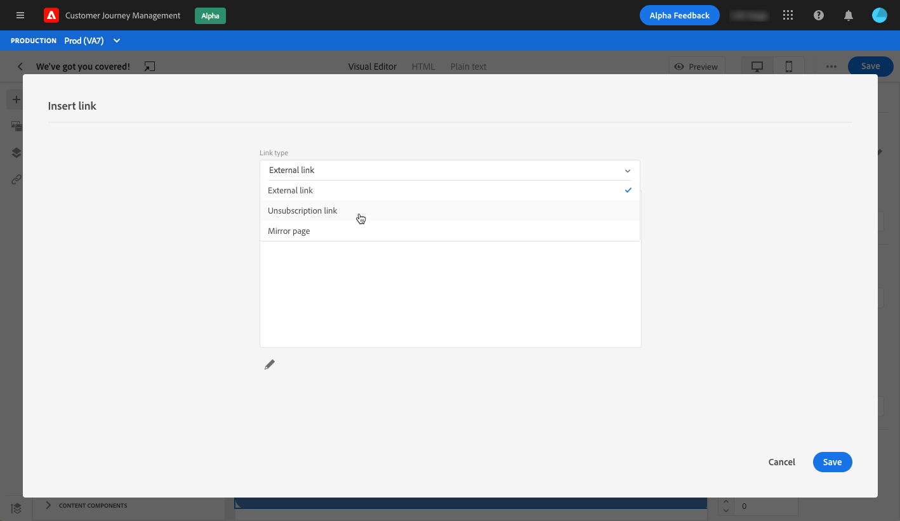
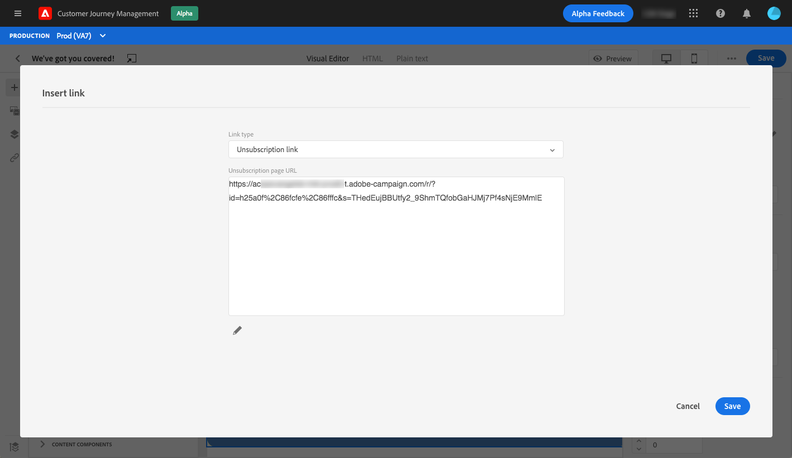
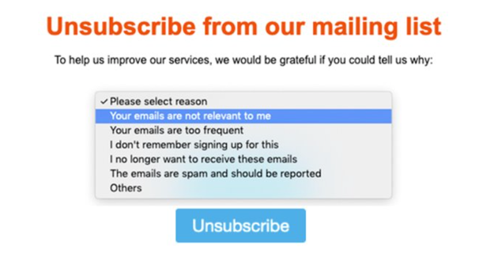
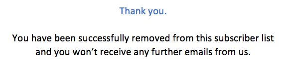
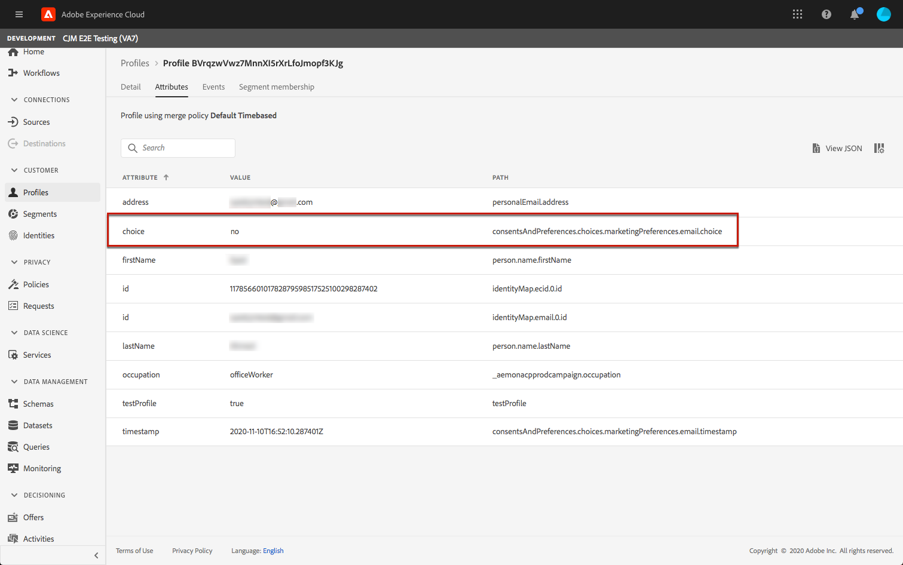
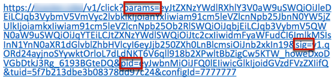

# Manage opt-out {#consent}


Use [!DNL Journey Optimizer] to track your recipients' consent for communication and understand how they want to engage with your brand by managing their preferences and subscriptions. <!--Their preferences and subscriptions are handled through Consent management.-->

Regulations such as GDPR state that you must comply with specific requirements before being able to use information from Data Subjects. Moreover, Data Subjects should be able to modify their consent at any time.

**Why is it important?**

* Failing to comply with these regulations introduces regulatory legal risks for your brand.
* It helps you avoid sending unsolicited communications to your recipients, which could make them mark your messages as spam and harm your reputation.

Learn more on managing Privacy and the applicable regulations in the [Experience Platform documentation](https://experienceleague.adobe.com/docs/experience-platform/privacy/home.html?lang=en).

<!--* Recipients should be able to opt-in/opt-out from receiving electronic communication through one or more channel
* Recipients expect the brand to offer preference centre capability that controls how brand should engage with them (example: channel of communication, invasive and non-invasive tracking etc). This helps to fulfil regulatory obligations and also facilitates quality engagement with recipient. 
* The third category is the capability to offer subscription to recipients (newsletter, etc)-->

## Opt-out management {#opt-out-management}

Providing the capability to recipients to unsubscribe from receiving communications from a brand is a legal requirement. Learn more about the applicable legislation in the [Experience Platform documentation](https://experienceleague.adobe.com/docs/experience-platform/privacy/regulations/overview.html?lang=en#regulations).

Therefore, you must always include an **unsubscribe link** in every email sent out to recipients:
* Upon clicking this link, the recipients will be directed to a landing page including a button to confirm opting out.
* Upon clicking the opt-out button, an Adobe I/O call will be made to update the profile data with this information. [Learn more about this](#consent-service-api).

To add an unsubscribe link, follow the steps below:

1. Build your unsubscription landing page.
1. Host your landing page on the third-party system of your choice.
1. [Create a message](../../help/using/create-message.md) in [!DNL Journey Optimizer].

    <!--The link to your landing page should contain a static URL and the profile ID.-->

1. Select text in your content and insert a link using the contextual toolbar.

    

1. Select **[!UICONTROL Unsubscription link]** from the **[!UICONTROL Link type]** drop-down list.

    

1. In the **[!UICONTROL Unsubscription page URL]** frame, copy the link to your landing page.

    

1. Click **[!UICONTROL Save]**.

1. Save your content and [publish your message](../../help/using/publish-manage-message.md).

    >[!NOTE]
    >
    >Your third-party landing page URL will include three parameters that will be used to update the profiles' preferences through an Adobe I/O call.​ [Learn more in this section](#consent-service-api).

1. Send your message with the link to your landing page through a [journey](building-journeys/journey.md).

1. Once the message is received, if the recipient clicks the unsubscribe link, your landing page is displayed.

    

1. If the recipient clicks the opt-out button in the landing page (here, the **Unsubscribe** button), the profile data is updated through an [Adobe I/O call](#opt-out-api).

    The opted-out recipient is then redirected to a confirmation message screen indicating that opting out was successful.

    

    As a result, this user will not receive communication from your brand unless subscribed again.

To check that the corresponding profile's choice has been updated, go to Experience Platform and access the profile by selecting an identity namespace and a corresponding identity value. Learn more in the [Experience Platform documentation](https://experienceleague.adobe.com/docs/experience-platform/profile/ui/user-guide.html?lang=en#getting-started).



In the **[!UICONTROL Attributes]** tab, you can see the value for **[!UICONTROL choice]** has changed to **[!UICONTROL no]**.

<!--The opt-out URL is resolved upon each recipient receiving the message. It is then personalized with the relevant encrypted parameters (profile ID, profile name, journey ID, sandbox ID, and message execution ID).-->

## Opt-out API call {#opt-out-api}

Once the recipient has opted out by clicking the unsubscribe link, an Adobe I/O API <!--Consent service API to capture the encrypted data and-->is called to update the corresponding profile's preference.

This Adobe I/O POST call is as follows:

Endpoint: cjm.adobe.io/imp/consent/preferences

Query parameters:
* **params**: contains the encrypted payload
* **sig**: signature <!--which signature?-->
* **pid**: encrypted profile ID

These parameters are available from the unsubscribe link sent to your recipient, i.e. the URL that will open your third-party landing page for a given recipient:



<!--QUESTION: How do you get the URL built for each recipient? Do you have to wait until each targeted recipient receives the unsubscribe link or can you deduce it in advance? Is it done automatically upon the API call or do you have to do something manually for each profile? In other words will the LP automatically include the 3 parameters or do you have to insert something manually? Still not completely clear-->

Header requirements:
* x-api-key
* x-gw-ims-org-id
* x-sandbox-name 
* authorization (user token from your technical account) <!--How do you find this information? And other header elements?-->

Request body:

```
{
   "marketing": [
       {
            "type": "email",           
            "choice": "no",          
            "scope": "channel"       
        }
    ],
 
}
```

<!--The Consent service /-->Adobe Customer Management will <!--decrypt and-->use these parameters to update the corresponding profile's choice. <!--and provide an answer back to the landing page.-->

## Push opt-out management {#push-opt-out-management}

Push recipients can unsubscribe through their devices themselves.

For example, upon downloading or when using your app, they can select to stop notifications. Similarly, they can change the notification settings through the mobile operating system.
