# Use the Email designer content components {#content-components}

>[!CONTEXTUALHELP]
>id="ac_content_components"
>title="About Content components"
>abstract="Content components are empty content placeholders that you can use to create the layout of an email."

When creating your email content from scratch, **[!UICONTROL Content components]** allows you to further personalize your email with raw, empty components that you can use once placed in an email.
You can add as many **[!UICONTROL Content components]** as you need inside a **[!UICONTROL Structure component]** which defines the layout of your email.

## Button {#buttons}

Use the **[!UICONTROL Button]** component to insert multiple buttons in your email and redirect your email audience to another page.

1. From **[!UICONTROL Content components]**, drag and drop **[!UICONTROL Button]** in a **[!UICONTROL Structure component]**.

    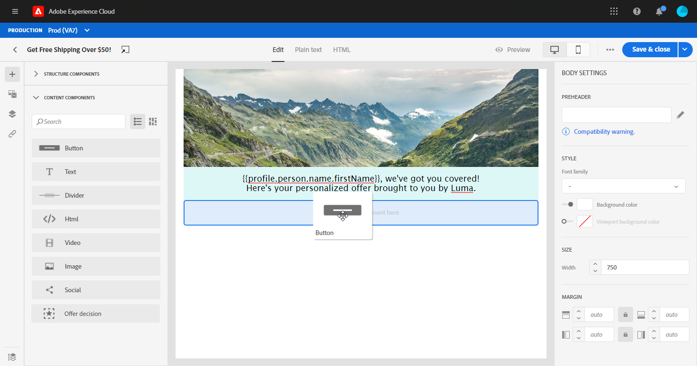

1. Click on your newly added button to personalize the text and to have access to the **[!UICONTROL Components Settings]** in the right pane of the email designer.

    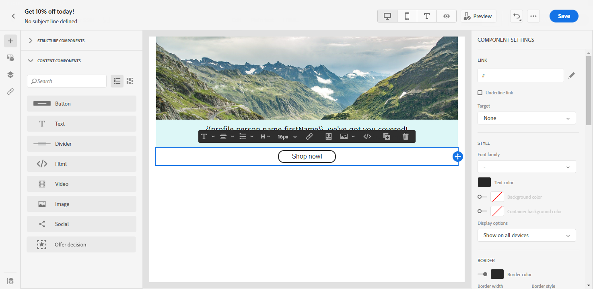

1. In the **[!UICONTROL Link]** field of the **[!UICONTROL Components Settings]**, add the URL you want your audience to be redirected to when clicking the button.

1. Choose how your audience will be redirected with the **[!UICONTROL Target]** drop-down:

    * **[!UICONTROL None]**: opens the link in the same frame as it was clicked (default).
    * **[!UICONTROL Blank]**: opens the link in a new window or tab.
    * **[!UICONTROL Self]**: opens the link in the same frame as it was clicked.
    * **[!UICONTROL Parent]**: opens the link in the parent frame.
    * **[!UICONTROL Top]**: opens the link in the full body of the window.

    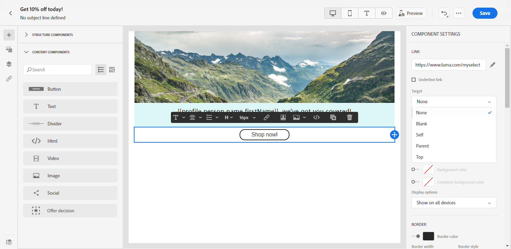

1. You can now further personalize your button by changing the **[!UICONTROL Style]**, **[!UICONTROL Margin]** and **[!UICONTROL Border]** for example.

## Text {#text}

Use the **[!UICONTROL Text]** component to insert text in your email. You can adjust the color, style and size of your text in **[!UICONTROL Component Settings]**.

1. In **[!UICONTROL Content Components]**, drag and drop **[!UICONTROL Text]** in a **[!UICONTROL Structure component]**.

    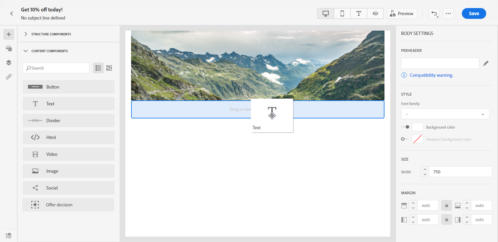

1. Click on your newly added component to personalize the text and to have access to the **[!UICONTROL Components Settings]** in the right pane of the email designer.

1. Change your text with the following options available in the toolbar:

    

    * **[!UICONTROL Change text style]**: apply bold, italic, underline or strike through to your text.
    * **Change alignment**: choose between left, right, center or justified alignment for your text.
    * **[!UICONTROL Create list]**: add bullet or number list to your text.
    * **[!UICONTROL Set heading]**: add up to six heading levels to your text.
    * **Font size**: select the font size of your text in pixels.
    * **[!UICONTROL Edit image]**: add an image or an asset to your text component. [Learn more about asset management](assets-essentials.md).
    * **[!UICONTROL Show the source code]**: display the source code of your text. It cannot be modified.
    * **[!UICONTROL Duplicate]**: add a copy of your text component.
    * **[!UICONTROL Delete]**: delete the selected text component from your email.
    * **[!UICONTROL Add personalization]**: add personalization fields to customize the content from your profiles data. [Learn more about content personalization](personalization/personalize.md).

1. For a better user experience, you can add personalization fields to target your audience. For more on this, refer to this [section](personalization/personalize.md).

1. Adjust the **[!UICONTROL Text color]**, **[!UICONTROL Font family]** and **[!UICONTROL Size]** in the **[!UICONTROL Components Settings]**.

    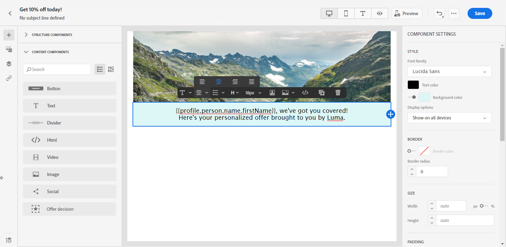

## Divider {#divider}

Use the **[!UICONTROL Divider]** component to insert a dividing line to organize the layout and content of your email.
You can select the color, style and size of the breaking line in **[!UICONTROL Component Settings]**.

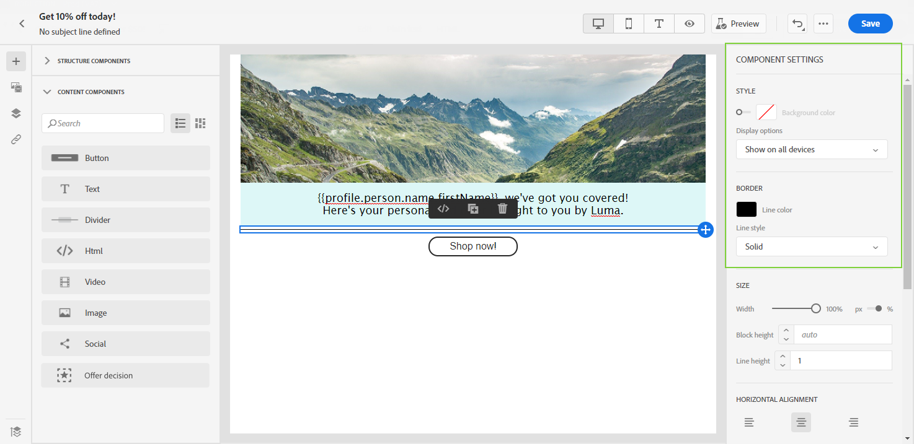

## HTML {#HTML}

Use the **[!UICONTROL HTML]** to copy-paste the different parts of your existing HTML. This enables you to create free modular HTML components.

To simply make an external content compliant with the Email Designer, Adobe recommends creating a message from scratch and copy the content from your existing email into components.

1. In **[!UICONTROL Content Components]**, drag and drop **[!UICONTROL HTML]** in a **[!UICONTROL Structure component]**.

    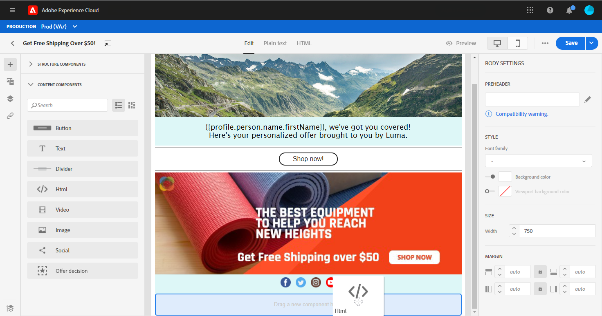

1. Click on your newly added component then **[!UICONTROL Show the source code]** to add your HTML.

    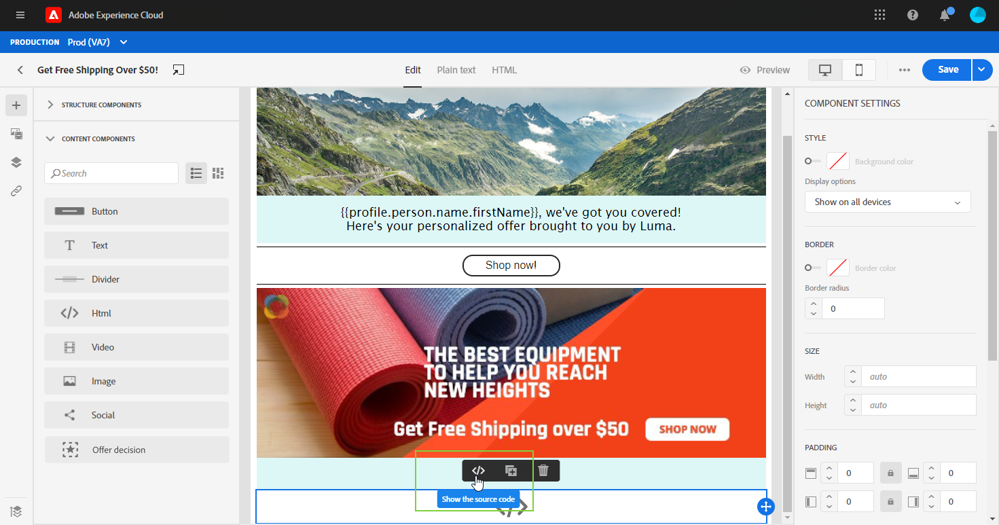

1. Copy-paste the HTML code you want to add to your email and click **[!UICONTROL Save]**.

1. You can now further personalize your HTML by changing the **[!UICONTROL Style]**, **[!UICONTROL Margin]** and **[!UICONTROL Border]** for example or adding a link to redirect your audience to another content.

## Image {#image}

Use the **[!UICONTROL Image]** component to insert an image file from your computer in your email.

1. In **[!UICONTROL Content Components]**, drag and drop **[!UICONTROL Image]** in a **[!UICONTROL Structure component]**.

    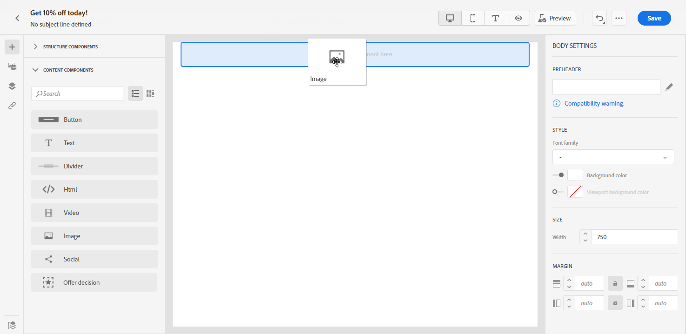

1. Click **[!UICONTROL Browse]** to choose an image file from your assets.

   To learn more on [!DNL Assets Essentials], refer to [Adobe Experience Manager Assets Essentials documentation](https://experienceleague.adobe.com/docs/experience-manager-assets-essentials/help/introduction.html){target="_blank"}.

1. Click on your newly added component to start configuring your **[!UICONTROL Content Components]** and to have access to the **[!UICONTROL Components Settings]** in the right pane of the email designer.

1. Set up your image properties:

    * **[!UICONTROL Image Title]** lets you define a title to your image.
    * **[!UICONTROL Alt text]** lets you define the caption linked to your image. This corresponds to the alt HTML attribute.

    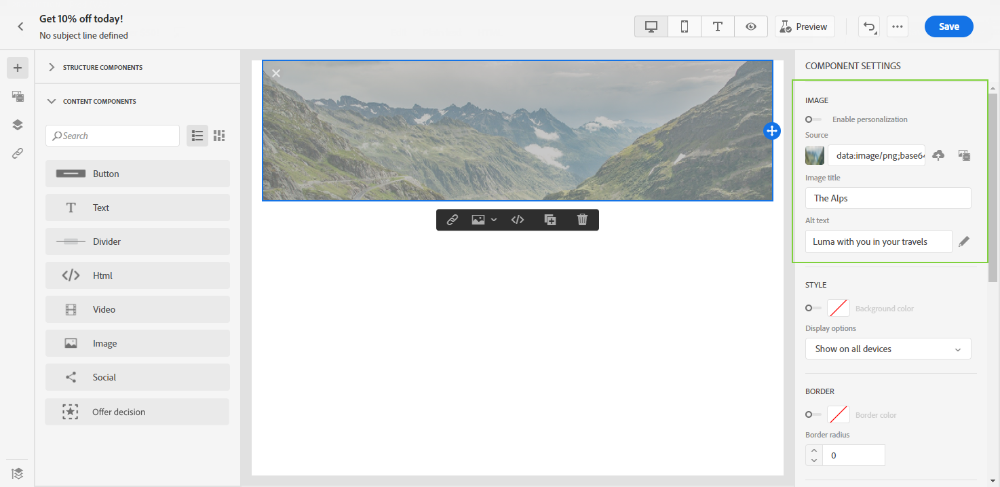

1. You can now further personalize your image by changing the **[!UICONTROL Style]**, **[!UICONTROL Margin]** and **[!UICONTROL Border]** for example or adding a link to redirect your audience to another content.

## Video {#Video}

>[!CONTEXTUALHELP]
>id="ac_edition_video"
>title="Video settings"
>abstract="Use this component to insert a video in your email. Note that videos do not work on all email clients. We advise to set a fallback image."
>additional-url="https://www.emailonacid.com/blog/article/email-development/a_how_to_guide_to_embedding_html5_video_in_email/" text="Additional info"

Use the **[!UICONTROL Video]** component to insert a video in your email through an URL link.

1. In **[!UICONTROL Content Components]**, drag and drop **[!UICONTROL Video]** in a **[!UICONTROL Structure component]**.

    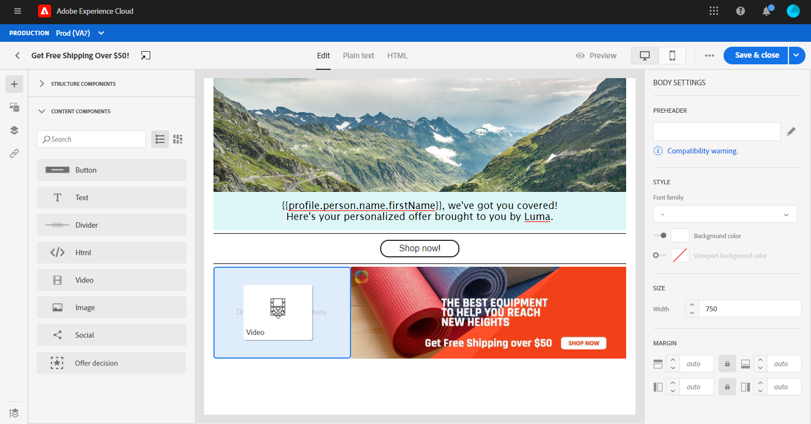

1. Click on your newly added component to start configuring your **[!UICONTROL Content Components]** and to have access to the **[!UICONTROL Components Settings]** in the right pane of the email designer.

1. In the **[!UICONTROL Video link]** field of the **[!UICONTROL Components Settings]**, add your video URL.

    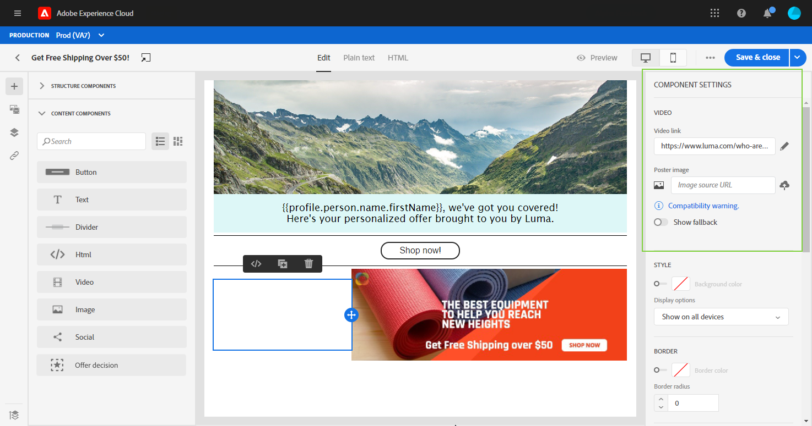

1. You can add a **[!UICONTROL Poster image]** to your video to specify an image to be shown until your audience click the play button.

1. You can now further personalize your image by changing the **[!UICONTROL Style]**, **[!UICONTROL Margin]** and **[!UICONTROL Border]** for example.

## Social {#social}

Use the **[!UICONTROL Social]** component to insert links to social media pages in your email.

1. In **[!UICONTROL Content Components]**, drag and drop **[!UICONTROL Social]** in a **[!UICONTROL Structure component]**.

    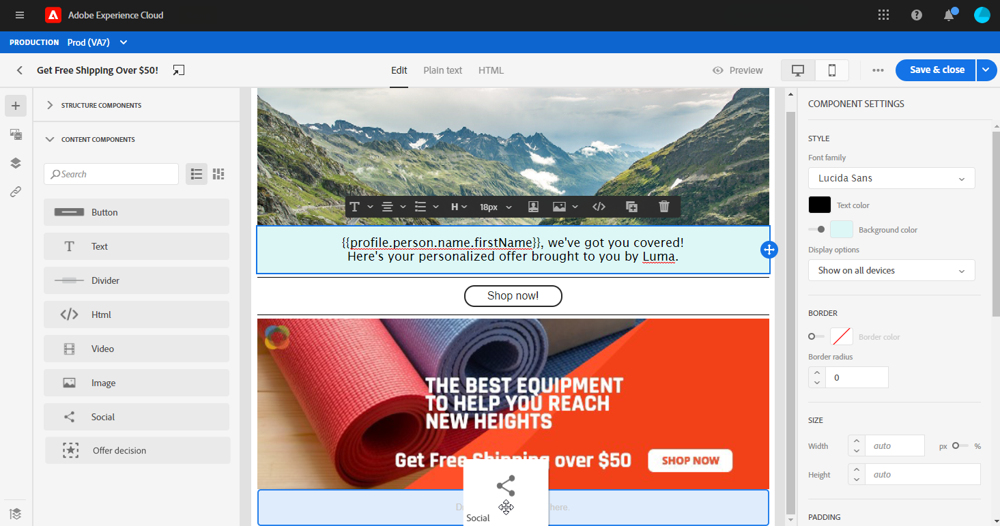

1. Click on your newly added component to start configuring your **[!UICONTROL Content Components]** and to have access to the **[!UICONTROL Components Settings]** in the right pane of the email designer.

1. In the **[!UICONTROL Social]** field of the **[!UICONTROL Components Settings]**, choose which social media you want to add or remove.

    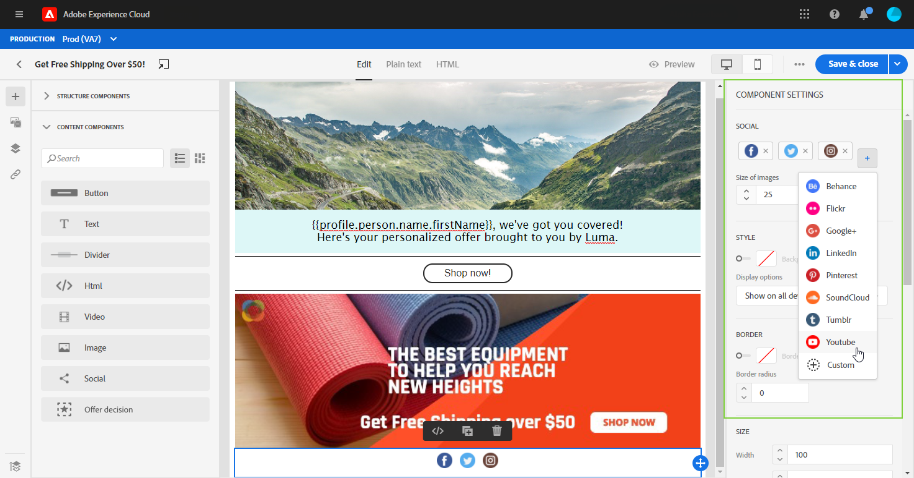

1. Choose the size of your icons in the **[!UICONTROL Size of images]** field.

1. Click on each of your social media icons to configure the **[!UICONTROL URL]** to which your audience will be redirected.

    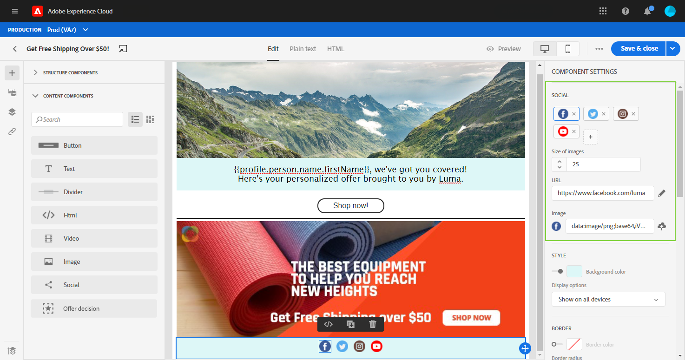

1. You can also change the icons of each of your social media if needed in the **[!UICONTROL Image]** field.

1. You can now further personalize your social media icons by changing the **[!UICONTROL Style]**, **[!UICONTROL Margin]** and **[!UICONTROL Border]**.

## Offer Decision {#offer-decision}

Use the **[!UICONTROL Offer decision]** component to insert decisions (previously known as offer activities) into your messages. Decisions will leverage Decision Management to pick the best offer to deliver to your customers.

Related topics:

* [Get started with Decision Management](offers/get-started/starting-offer-decisioning.md).
* [Add personalized offers into messages](deliver-personalized-offers.md).
