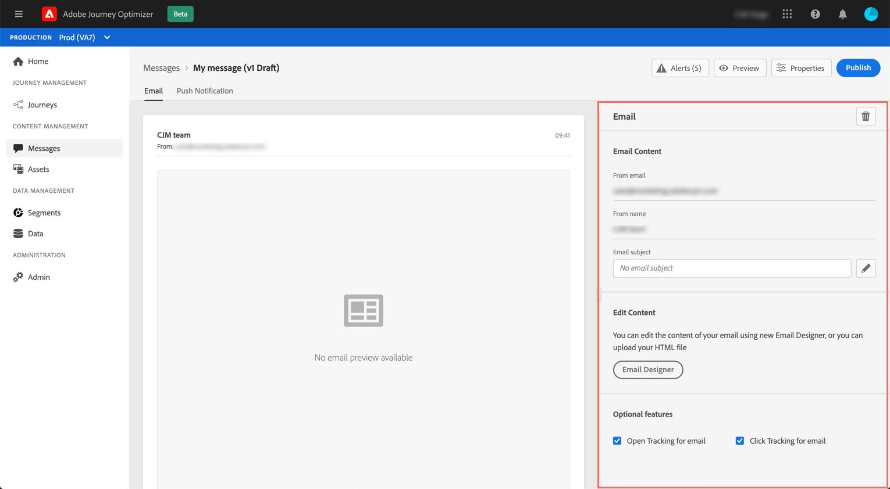

# Create an email {#configure-email}

Once you [created a message](create-message.md), use the **[!UICONTROL Email]** tab to define the settings and content for the email channel.

>[!NOTE]
>
>The **[!UICONTROL From email]** and **[!UICONTROL From name]** are read-only and determined by the **[!UICONTROL Preset]** that has been selected when [creating the message](create-message.md).

The steps to configure an email are as follows:

1. Specify the **[!UICONTROL Email subject]**. To do this, click the button on the right-hand side to open the Expression editor and compose the email subject. Learn how to add personalization in [this section](personalization/personalization-aeras.md)

1. Click the **[!UICONTROL Email Designer]** button to design your email. Learn how to design emails in [this section](design-emails.md)).

1. If you want to track the behavior of your recipients through openings and/or clicks on links, make sure that the **[!UICONTROL Open Tracking for email]** and **[!UICONTROL Click Tracking for email]** options are enabled. Learn more about tracking in [this section](message-tracking.md).
