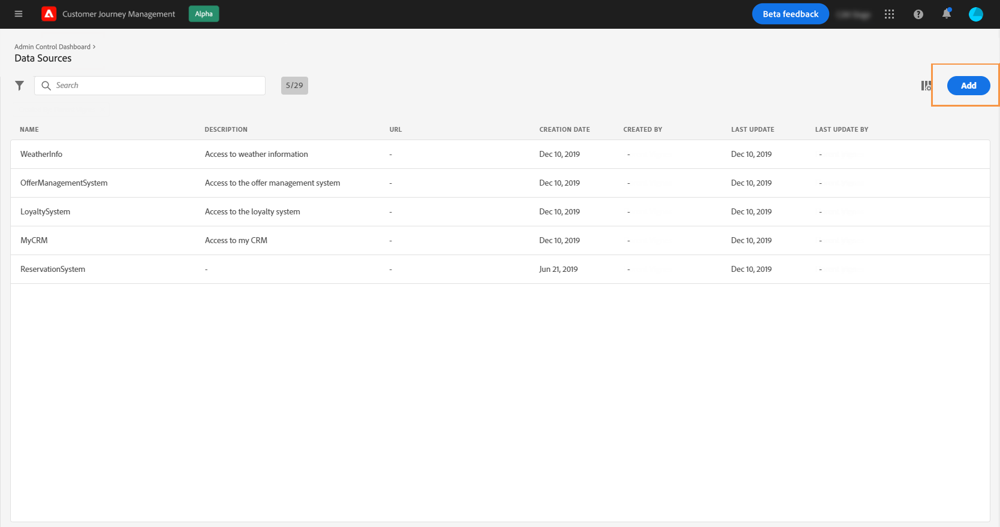
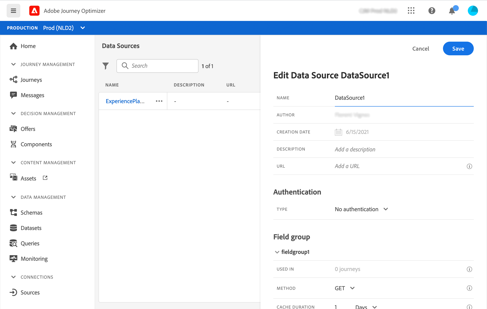
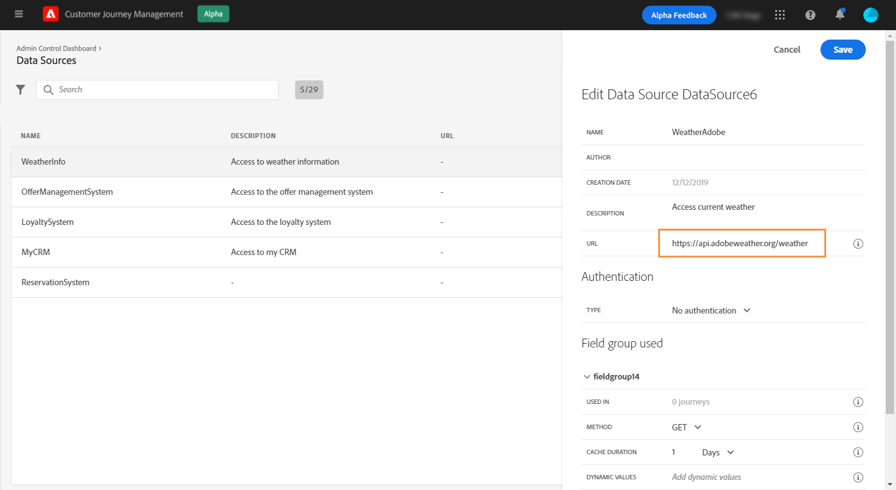
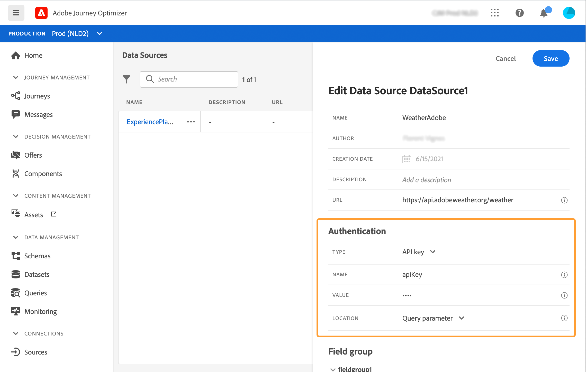
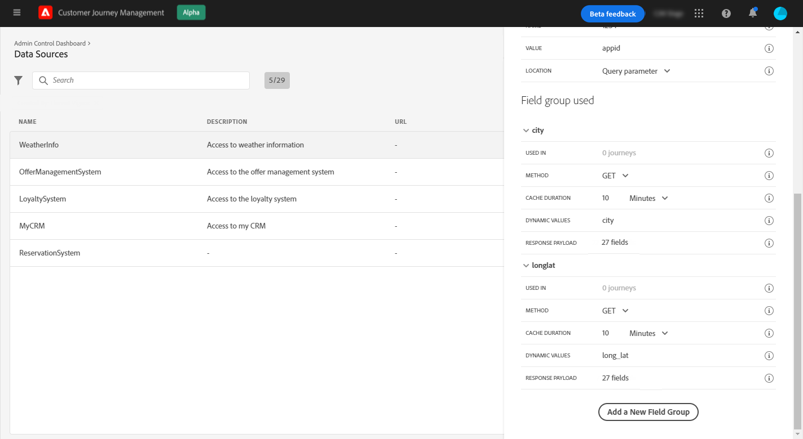
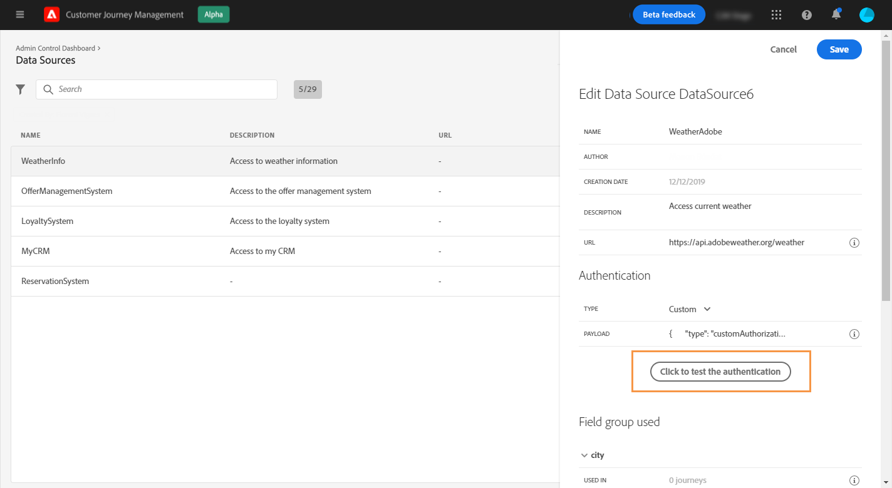
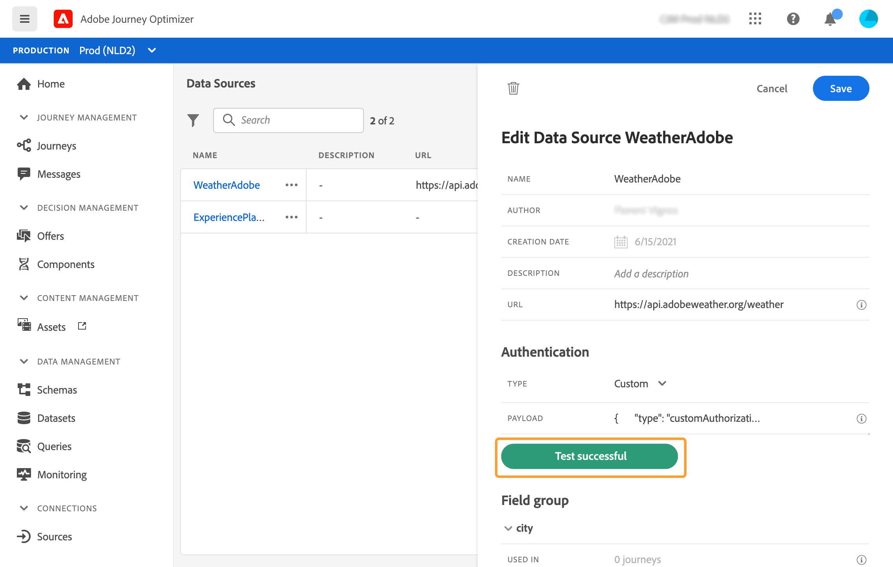

# External data sources {#concept_t2s_kqt_52b}

External data sources allow you to define a connection to third-party systems, for example if you're using a hotel booking system to check if the person has registered a room. As opposed to the build-in Adobe Experience Platform data source, you can create as many external data sources as you need.

REST APIs using POST or GET and returning JSON are supported. API Key, basic and custom authentication modes are supported.

Let's take the example of a weather API service that I want to use to customize my journey's behaviors according to real-time weather data.

Here are two examples of the API call:

* _https://api.adobeweather.org/weather?city=London,uk&amp;appid=1234_
* _https://api.adobeweather.org/weather?lat=35&amp;lon=139&amp;appid=1234_

The call is composed of a main URL (_https://api.adobeweather.org/weather_), two parameter sets ("city" for the city and "lat/long" for the latitude and longitude) and the API key (appid).

Here are the main steps to create and configure a new external data source:

1. From the list of data sources, Click **[!UICONTROL Create Data Source]** to create a new external data source.

    

    This opens the data source configuration pane on the right-hand side of the screen.

    

1. Enter a name for your data source.

    >[!NOTE]
    >
    >Do not use spaces or special characters. Do not use more than 30 characters.

1. Add a description to your data source. This step is optional.
1. Add the URL of the external service. In our example: _https://api.adobeweather.org/weather_.

    >[!CAUTION]
    >
    >We strongly recommend using HTTPS for security reasons. Also note that we don't allow the use of Adobe addresses that are not publicly available and the use of IP addresses.

    

1. Configure the authentication depending on the external service configuration: **[!UICONTROL No authentication]**, **[!UICONTROL Basic]**, **[!UICONTROL Custom]** or **[!UICONTROL API key]**. For more information on the custom authentication mode, see [this section](../datasource/external-data-sources.md#section_wjp_nl5_nhb). In our example, we choose:

    * **[!UICONTROL Type]**: "API key"
    * **[!UICONTROL Name]**: "appid" (this is the API key parameter name)
    * **[!UICONTROL Value]**: "1234" (this is the value of our API key)
    * **[!UICONTROL Location]**: "Query parameter" (the API key is located in the URL)

    

1. Add a new field group for each API parameter set by clicking **[!UICONTROL Add a New Field Group]**. Do not use spaces or special characters in the field group name. In our example, we need to create two field groups, one for each parameter set (city and long/lat). 

For the "long/lat" parameter set, we create a field group with the following information:

* **[!UICONTROL Used in]**: displays the number of journeys that use a field group. You can click the **[!UICONTROL View journeys]** icon to display the list of journeys using this field group.
* **[!UICONTROL Method]**: select the POST or GET method. In our case, we select the GET method.
* **[!UICONTROL Dynamic Values]**: enter the different parameters separated by a coma, "long,lat" in our example. Since the parameter values depend on the execution context, they will be defined in the journeys. See [Journey Orchestration documentation](https://experienceleague.adobe.com/docs/journeys/using/building-advanced-conditions-journeys/expressionadvanced.html){target="_blank"}.
* **[!UICONTROL Response Payload]**: click inside the **[!UICONTROL Payload]** field and paste an example of the payload returned by the call. For our example, we used a payload found on a weather API website. Verify that the field types are correct. Each time the API is called, the system will retrieve all the fields included in the payload example. Note that you can click on **[!UICONTROL Paste a new payload]** if you want to change the payload currently passed.
* **[!UICONTROL Sent Payload]**: this field does not appear in our example. It is only available if you select the POST method. Paste the payload that will be sent to the third-party system.

In case of a GET call requiring parameter(s), you enter the parameter(s) in the **[!UICONTROL Dynamic Values]** field and they are automatically added at the end of the call. In case of a POST call, you need to:

* list the parameters to be passed at call time in the **[!UICONTROL Dynamic Values]** field (in the example below: “identifier”).
* specify them also with the exact same syntax in the body of the sent payload. To do so, you need to add: "param": “name of your parameter” (in the example below: “identifier”). Follow the syntax below:

    ```
    {"id":{"param":"identifier"}}
    ```



Click **[!UICONTROL Save]**.

The data source is now configured and ready to be used in your journeys, for example in your conditions or to personalize an email. If the temperature is above 30°C, you can decide to send a specific communication.

## Custom authentication mode{#section_wjp_nl5_nhb}

>[!CONTEXTUALHELP]
>id="jo_authentication_payload"
>title="About custom authentication"
>abstract="The custom authentication mode is used for complex authentication to call API wrapping protocols such as OAuth2. The action execution is a two-step process. First, a call to the endpoint is performed to generate the access token. Then, the access token is injected in the the HTTP request of the action."

This authentication mode is used for complex authentication, frequently used to call API wrapping protocols such as OAuth2, to retrieve an access token to be injected in the real HTTP request for the action.

When you configure the custom authentication, you can click on the button below to check if the custom authentication payload is correctly configured.



If the test is successful, the button turns green.



With this authentication, the action execution is a two-step process:

1. Call the endpoint to generate the access token.
1. Call the REST API by injecting in the proper way the access token.

This authentication has two parts.

The definition of the endpoint to be called to generate the access token:

* endpoint: URL to use to generate the endpoint
* method of the HTTP request on the endpoint (GET or POST)
* headers: key-value pairs to be injected as headers in this call if required
* body: describes the body of the call if the method is POST. We support a limited body structure, defined in the bodyParams (key-value pairs). The bodyType describes the format and encoding of the body in the call: 
    * 'form': meaning that the content type will be application/x-www-form-urlencoded (charset UTF-8) and the key-value pairs will be serialized as is: key1=value1&amp;key2=value2&amp;...
    * 'json': meaning that the content type will be application/json (charset UTF-8) and the key-value pairs will be serialized as a json object as is: _{ "key1": "value1", "key2": "value2", ...}_

The definition of the way the access token must be injected in the HTTP request of the action:

* authorizationType: defines how the generated access token must be injected in the HTTP call for the action. The possible values are:

    * bearer: indicates that the access token must be injected in the Authorization header, such as: _Authorization: Bearer &lt;access token>_
    * header: indicates that the access token must be injected as a header, the header name defined by the property tokenTarget. For instance, if the tokenTarget is myHeader, the access token will be injected as a header as: _myHeader: &lt;access token>_
    * queryParam: indicates that the access token must be injected as a queryParam, the query param name defined by the property tokenTarget. For instance, if the tokenTarget is myQueryParam, the URL of the action call will be: _&lt;url>?myQueryParam=&lt;access token>_

* tokenInResponse: indicates how to extract the access token from the authentication call. This property can be:
    * 'response': indicates that the HTTP response is the access token
    * a selector in a json (assuming that the response is a json, we don't support other formats such as XML). The format of this selector is _json://&lt;path to the access token property>_. For instance, if the response of the call is: _{ "access_token": "theToken", "timestamp": 12323445656 }_, the tokenInResponse will be: _json: //access_token_

The format of this authentication is:

```
{
    "type": "customAuthorization",
    "authorizationType": "<value in 'bearer', 'header' or 'queryParam'>",
    (optional, mandatory if authorizationType is 'header' or 'queryParam') "tokenTarget": "<name of the header or queryParam if the authorizationType is 'header' or 'queryParam'>",
    "endpoint": "<URL of the authentication endpoint>",
    "method": "<HTTP method to call the authentication endpoint, in 'GET' or 'POST'>",
    (optional) "headers": {
        "<header name>": "<header value>",
        ...
    },
    (optional, mandatory if method is 'POST') "body": {
        "bodyType": "<'form'or 'json'>,
        "bodyParams": {
            "param1": value1,
            ...

        }
    },
    "tokenInResponse": "<'response' or json selector in format 'json://<field path to access token>'"
}
```

You can change the cache duration of the token for a custom authentication data source. Below is an example of a custom authentication payload. The cache duration is defined in the "cacheDuration" parameter. It specifies the retention duration of the generated token in the cache. The unit can be milliseconds, seconds, minutes, hours, days, months, years.

```
"authentication": {
    "type":"customAuthorization",
    "authorizationType":"Bearer",
    "endpoint":"http://localhost:${port}/epsilon/oauth2/access_token",
    "method":"POST",
    "headers": {
        "Authorization":"Basic EncodeBase64(${epsilonClientId}:${epsilonClientSecret})"
        },
    "body": {
        "bodyType":"form",
        "bodyParams": {
             "scope":"cn mail givenname uid employeeNumber",
             "grant_type":"password",
             "username":"${epsilonUserName}",
             "password":"${epsilonUserPassword}"
             }
        },
    "tokenInResponse":"json://access_token",
    "cacheDuration":
             { "duration":5, "timeUnit":"seconds" }
    }
```

>[!NOTE]
>
>Cache duration helps to avoid too many calls to the authentication endpoints. Authentication token retention is cached in services, there is no persistence. If a service is restarted, it starts with a clean cache. The cache duration by default is 1 hour. In the custom action payload, it can be adapted by specifying another retention duration.