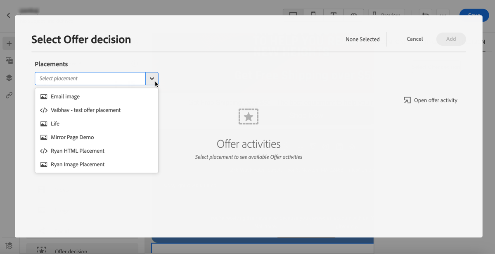
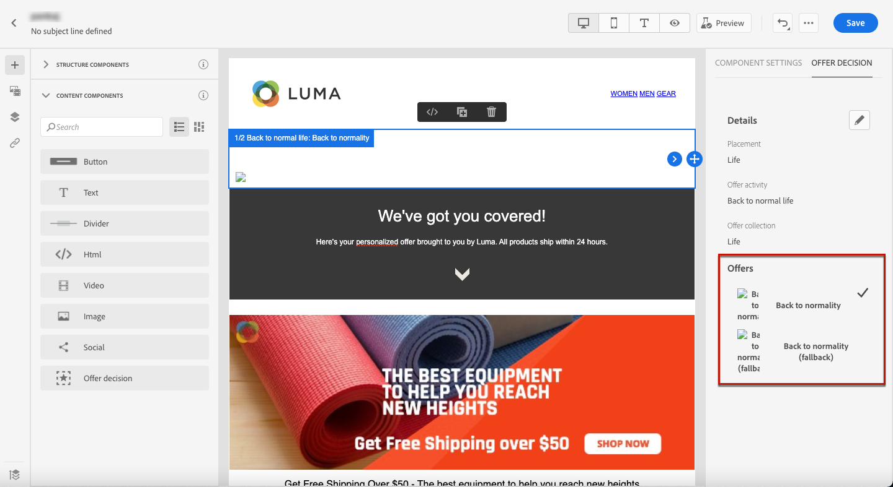
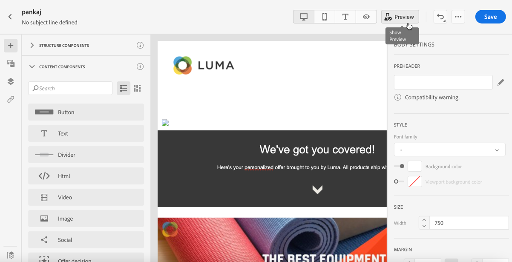
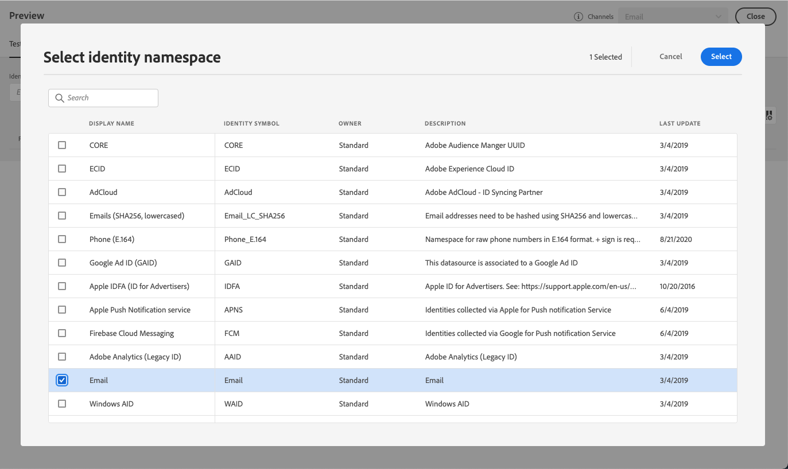
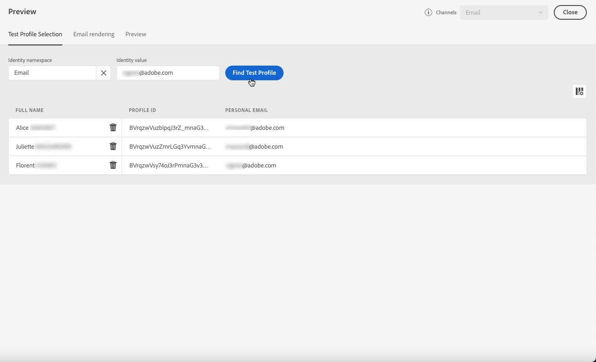
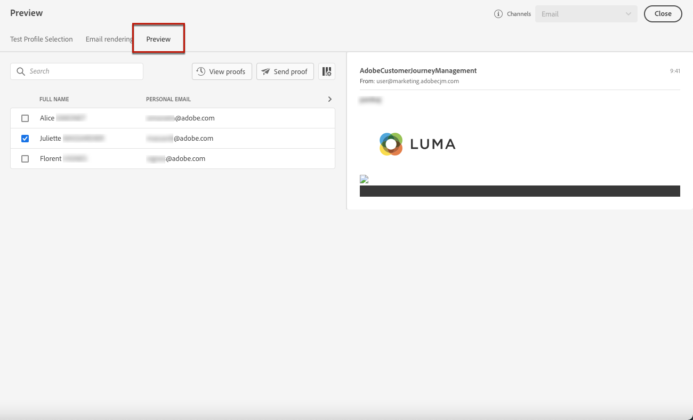

# Add personalized offers {#deliver-personalized-offers}

## About Decision Management {#about-offer-decisioning}

With [!DNL Journey Optimizer], you can insert in your email messages decisions (previously known as offer activities) that will leverage the Offer Decision Engine in order to pick the best offer to deliver to your customers.

For example, you can add a decision that will display in your email a special discount offer that will vary according to the recipient's loyalty level.

For more on how to create and manage offers, refer to [this section](offers/get-started/starting-offer-decisioning.md).

## Insert a decision in an email {#insert-offers}

To insert a decision into an email message, follow the steps below:

1. Create your email, then open the Email Designer to configure its content.

1. Add an **[!UICONTROL Offer decision]** content component (see [Use content components](content-components.md)).

    

1. An **[!UICONTROL Offer decision]** tab is added to the component. Click **[!UICONTROL Add personalization - Offer decision]** to add an offer activity.

    

1. Select the placement corresponding to the offers that you want to display.

    Placements are containers that are used to showcase your offers. In this example, we will use the "email top image" placement. This placement has been created in the Offer Library to display image-type offers situated to the top of messages.

1. Select the offer activity to use in the content component, then click **[!UICONTROL Add]**.

    >[!NOTE]
    >
    >Only decisions that are compatible with the selected placement display in the list. In this example, only one offer activity matches the "email top image" placement.

    

1. The offer activity is now added to the component. You can preview the different offers that are part of the decision using the **[!UICONTROL Offers]** section or the content components arrows.

    

## Example

In this exercise you’ll improve your newsletter email message with a personalized offer based on a decision you previously created. 

>[!CAUTION]
>
>You need to first define an offer decision. Learn how to create decisions in [this section](../../using/offers/offer-activities/create-offer-activities.md).

To create an offer decision, follow the main steps below:

1. Start by creating placements for your offers. You will then use these placements to define where the resulting offer will appear when defining your offer decision. Learn more on placements in [this section](). In this example, create three placements:

    * Web - Image placement
    * Email - Image placement
    * Non-digital - Text placement

1. Create decision rules, that will provide the best offer to a profile in the Adobe Experience Platform. Let's configure two simple rules by using the **[!UICONTROL XDM Individual Profile > Person > Gender]** attribute:

    * Male Customers
    * Female Customers

    Learn more on rules in [this section]().

1. Create an offer and create three representations (combinations of a placement that you created earlier and an asset) inside this offer:

    * One corresponding to the Web - Image placement
    * One corresponding to the Email - Image placement
    * One corresponding to the Non-digital - Text placement

    Select an appropriate image for the first two placements and enter custom text for the last placement. Learn more on representations in [this section]().

    In the Offer eligiblity section, select By defined decision rule and click the + icon to add the rule Female Customers.

    Fill out the priority.

1. Click Save and approve.

1. Create three more offers with the same representations but with different assets. Assign them one of the two rules and define a different priority for each one.

1. Create a fallback offer.

1. Create your collection to speed up the decision process. Select the four Personalized Offers you created in the previous exercises.

1. Create your decision: select the Placements Web - Image, Email - Image and Non-digital - Text by clicking the + icon on the Placement. For each placement, add the collection you just created. Select the fallback offer that you created.

1. Save and activate.

You’ve now successfully configured your Decision. Your Decision is now live, and can be used to deliver optimized and personalized offers to your customers, in real-time.

To insert a decision into an email message, follow the steps below:

1. Create your email, then open the [Email Designer](design-emails.md) to configure its content.

1. Add a structure component from the left palette.

1. Add an **[!UICONTROL Offer decision]** content component (see [Use content components](content-components.md)).

    

1. Select it and in the right palette, click **[!UICONTROL Select offer decision]** to add an offer activity.

    

1. Select the placement corresponding to the offers that you want to display.

    Placements are containers that are used to showcase your offers. In this example, select **Email - Image** from the **[!UICONTROL Placements]** dropdown menu. This placement has been created in the Offer Library to display image-type offers in emails. Learn more on [creating placements](../../using/offers/offer-library/creating-placements.md).

    

    Decisions matching the the "email image" placement are displayed.

    >[!NOTE]
    >
    >Only decisions that are compatible with the selected placement display in the list.
    
1. Select the decision to use in the content component, then click **[!UICONTROL Add]**.

    

1. You can now see all personalized offers and the fallback offer being visualized in the Email Designer.

    

1. Use the **[!UICONTROL Offers]** section or the content components arrows (right and left arrows) to browse data.

    

1. To display the different offers that are part of the decision with a customer profile, click **[!UICONTROL Preview]**.

    

    >[!NOTE]
    >
    >You need to have test profiles available to be able to preview your messages. Learn how to [create test profiles](create-test-profile.md).

1. To choose the namespace to use to identify test profiles, select **[!UICONTROL Email]** from the **[!UICONTROL Identity namespace]** field.

    

    >[!NOTE]
    >
    >In this example, we will use the **Email** namespace. Learn more about Adobe Experience Platform identity namespaces [in this section](https://experienceleague.adobe.com/docs/experience-platform/identity/namespaces.html?lang=en#getting-started).

1. In the list of identity namespaces, select **[!UICONTROL Email]**. Click **[!UICONTROL Select]**.

    

1. In the **[!UICONTROL Identity value]** field, enter the value to identify the test profile. In this example, enter the email address of a test profile.

    For example enter smith@adobe.com and click the **[!UICONTROL Add profile]** button.

    Add other profiles so that you can test different variants of the message depending on the profile data.

    

1. Click the **[!UICONTROL Preview]** tab to test your message.

1. Select a test profile. You can check the values available in the columns.

    

1. Select other test profiles to preview the email content for each variant of your message.

    In the message content, the offer corresponding to the selected test profile is displayed.

After saving your changes and once the message is published, your offers are ready to be displayed to the relevant profiles when sending the message as part of a journey.

Learn how to publish messages in [this section](publish-manage-message.md).

Learn how messages are triggered by one or more journeys in [this section](building-journeys/journey.md).

