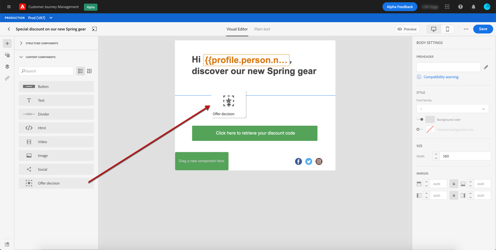
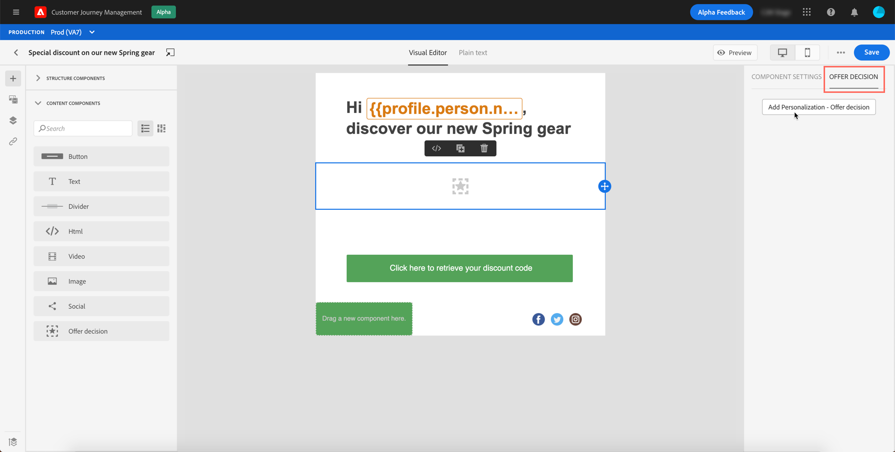
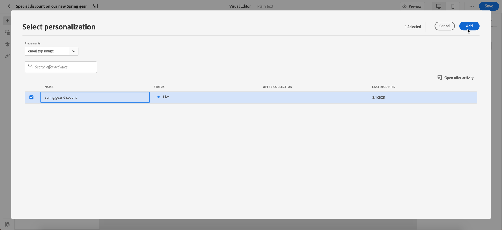
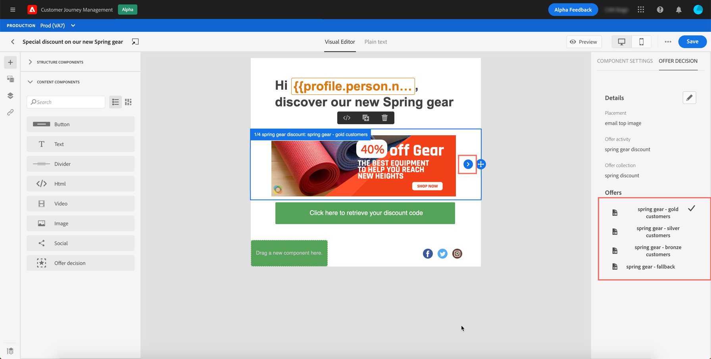

# Add personalized offers {#deliver-personalized-offers}

## About Decision Management {#about-offer-decisioning}

With [!DNL Journey Optimizer], you can insert in your email messages decisions (previously known as offer activities) that will leverage the Offer Decision Engine in order to pick the best offer to deliver to your customers.

For example, you can add a decision that will display in your email a special discount offer that will vary according to the recipient's loyalty level.

For more on how to create and manage offers, refer to [this section](offers/get-started/starting-offer-decisioning.md).

## Insert a decision in an email {#insert-offers}

To insert a decision into an email message, follow the steps below:

1. Create your email, then open the Email Designer to configure its content.

1. Add an **[!UICONTROL Offer decision]** content component (see [Use content components](content-components.md)).

    

1. An **[!UICONTROL Offer decision]** tab is added to the component. Click **[!UICONTROL Add personalization - Offer decision]** to add an offer activity.

    

1. Select the placement corresponding to the offers that you want to display.

    Placements are containers that are used to showcase your offers. In this example, we will use the "email top image" placement. This placement has been created in the Offer Library to display image-type offers situated to the top of messages.

1. Select the offer activity to use in the content component, then click **[!UICONTROL Add]**.

    >[!NOTE]
    >
    >Note that only decisions that are compatible with the selected placement display in the list. In this example, only one offer activity matches the "email top image" placement.

    

1. The offer activity is now added to the component. You can preview the different offers that are part of the decision using the **[!UICONTROL Offers]** section or the content components arrows.

    

## Use case

Luma, a fictitious retail company, has recently launched a new line of athletic gear and aims to promote it using different offers depending on its audiences.

Let’s see how Luma creates an Offer Catalog to promote its athletic gear to its most loyal customers.

1. After providing an offer name, Luma can determine its start and end date, tags, and any attributes related tothe business scopeofthe offer.

1. Next is to define the offer representations which correspond to where/how the offer will be displayed. A representation is a combination of a channel (email, mobile, web, and others) and a placement within a channel (this could be an image, html, JSON, or any other format the business needs).

1. Next is to select the right assets and assign them to their representations. Since offers can be used across different channels and placements, this process can be repeated as many times as required.

1. Brands can also add offer constraints using decision rules -in this case, Luma may want to limit this offer to its most loyal customers and who have recently expressed interest in its equipment gear.

1. Constraints also mean either setting an offer priority in case the business needs to decide between several conflicting offers, or capping the offer to limit the number of times it is presented to every customer. Now the offer is ready for review and can be published for immediate use.

1. Offer activities enable brands to package multiple offers and make them ready for consumption through channels and placements.  Here’s an example of an Offer Activity for Mobile where Luma has selected promotional offers in addition to a fallback offer in case none of the offerconstraints are met.

## Example

In this exercise you’ll improve your newsletter email message with a personalized offer based on a decision you previously created. Learn more on creating decisions in [this section](../../using/offers/offer-activities/create-offer-activities.md).

>[!CAUTION]
>
>You need to have test profiles available to be able to preview your messages. [Learn more](building-journeys/testing-the-journey.md#create-test-profile).

1. Create your email, then open the Email Designer to configure its content.

1. Add an **[!UICONTROL Offer decision]** content component (see [Use content components](content-components.md)).

    

1. In the right palette, click **[!UICONTROL Add personalization - Offer decision]** to add an offer activity.

    

1. Select the placement corresponding to the offers that you want to display.  In the **[!UICONTROL Placements]** dropdown menu select **Email - Image**. This placement has been created in the Offer Library to display image-type offers. Learn more in [this section](../../using/offers/offer-library/creating-placements.md).

1. Decisions that are compatible with the selected placement now display in the list. In this example, only decisions matching the "email image" placement are displayed. Select the decision to use in the content component, then click **[!UICONTROL Add]**.

    

1. You can now see all personalized offers and the fallback offer being visualized in the Email Designer.

1. You can now preview the different offers that are part of the decision with a real customer profile.

1. To do so, click **[!UICONTROL Preview]**.

1. Start by identifying which profile you want to use for the preview. Select the **[!UICONTROL Email]** namespace from the **[!UICONTROL Identity namespace]** field.

    >[!NOTE]
    >
    >Learn more about Adobe Experience Platform identity namespaces [in this section](https://experienceleague.adobe.com/docs/experience-platform/identity/namespaces.html?lang=en#getting-started).
    >
    >In the example below, we will use the **Email** namespace.

1. In the list of identity namespaces, select the **[!UICONTROL Email]** namespace. Click **[!UICONTROL Select]**.

1. In the **[!UICONTROL Identity value]** field, enter the email address of a test profile that is already stored in the **Real-time Customer Profile**.

    For example enter smith@adobe.com and click the **[!UICONTROL Add profile]** button.

1. Add another profiles so that you can test different variants of the message depending on the profile data.

1. Once test profiles are selected, you can preview your messages and check content.

1. Click the **[!UICONTROL Preview]** tab to test your message.

1. Select a test profile. You can check the values available in the columns.

1. Use the **[!UICONTROL Offers]** section or the content components arrows (right and left arrows) to browse data.

    

    In the message preview, personalized elements are replaced by the selected test profile data.

1. Select another test profile to preview the email content for each variant of your message.

