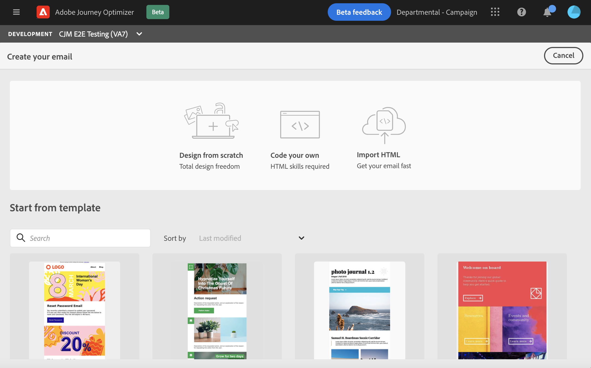

# Get started with email design {#get-started-content-design}

When creating email content with [!DNL Journey Optimizer], you can:

* **Design your email from scratch** through the email designer's interface and leverage images from [Adobe Experience Manager Assets Essentials](assets-essentials.md). Learn how to design your email content or use built-in templates [in this section](create-email-content.md).

* **Code or paste raw HTML** directly in the email designer. Learn how to code your own content [in this section](existing-content.md#import-raw-html-code).

* **Import existing HTML content** from a file or a .zip folder. Learn how to import an email content [in this section](existing-content.md#import-html-content-from-file).

These features are all available when accessing the Email Designer from the message creation screen. [Learn more about message creation](create-message.md).

>[!NOTE]
>
>Note that the templates in the lower area are static and cannot be edited. These are only available for illustration purpose.
